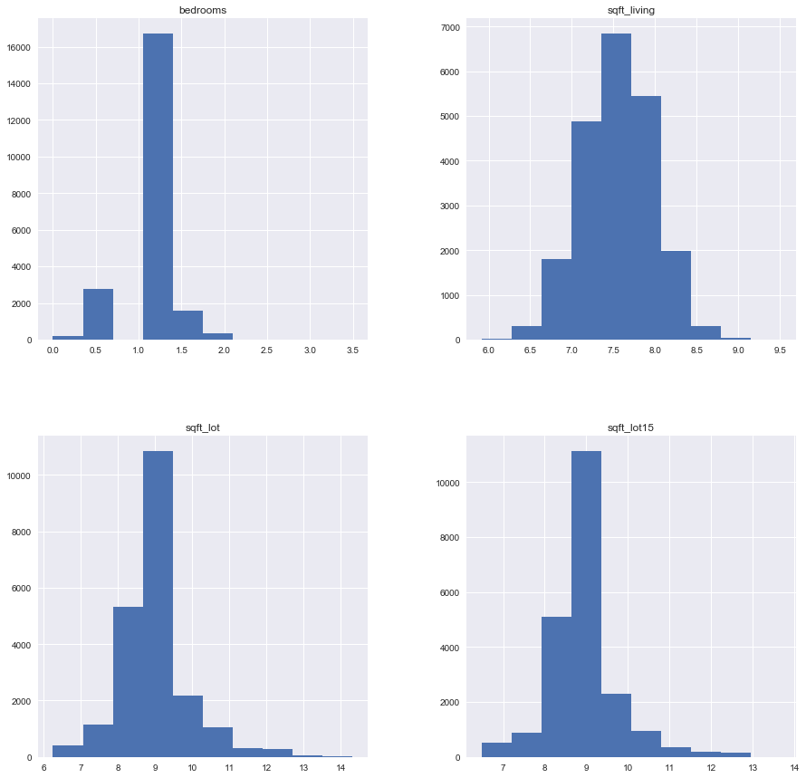
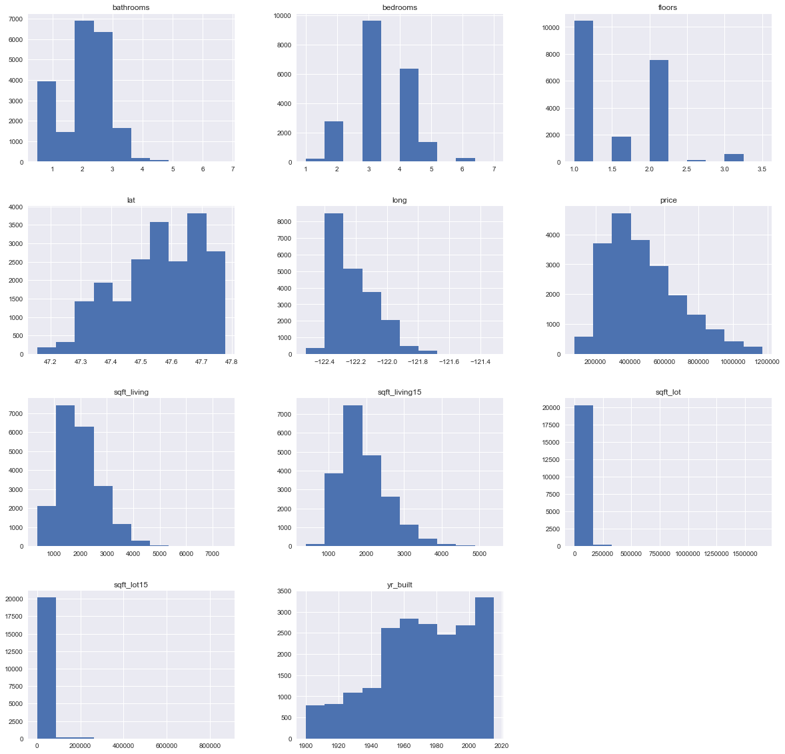
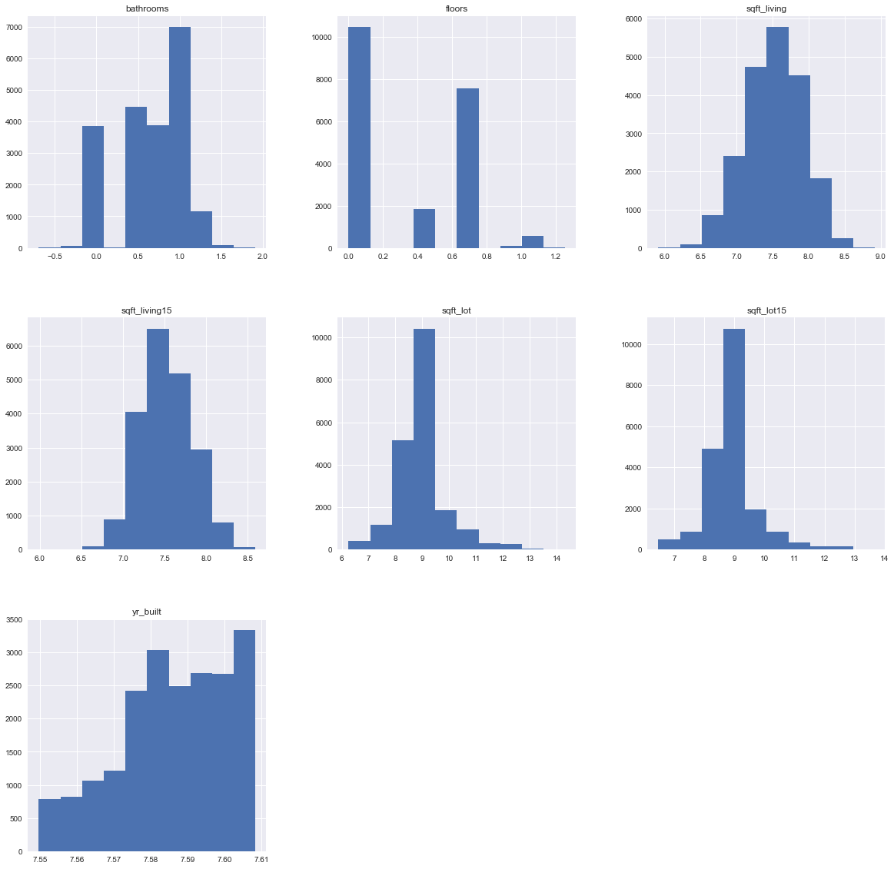
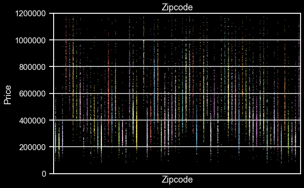
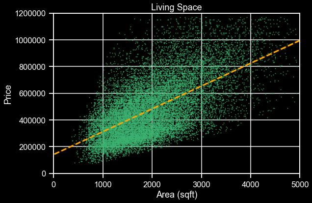
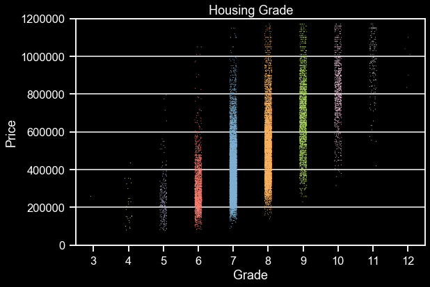
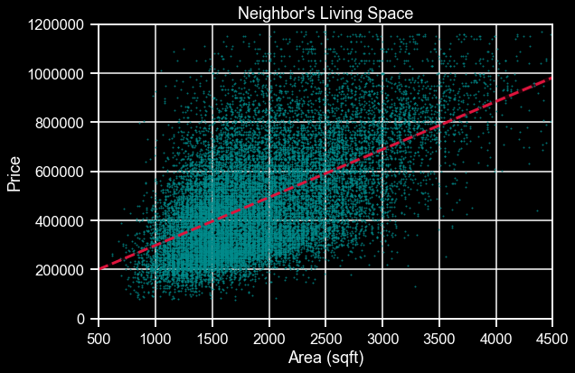

## Final Project Submission

Please fill out:
* Student name: Devin Belden
* Student pace: full time
* Scheduled project review date/time: Tue, Oct 29, 2019, 3:30 PM - 4:15 PM
* Instructor name: James Irving, Ph.D
* Blog post URL: Unknown

# Business Case

The purpose of this technical notebook is to explore the housing market in King County, Washington, so as to provide a healthy amount of information to prospective investors before or after they've invested in a property in the area. In short, the goal is to answer the question: "What features of a property can be manipulated such that the selling price is increased, and the investor's profit is maximized?" 

## Obtaining/Exploring Data
* As always, we must import packages before loading in the dataset


```python
import pandas as pd
import matplotlib.pyplot as plt
import matplotlib as mpl
import seaborn as sns
import numpy as np
%matplotlib inline
inline_rc = dict(mpl.rcParams)

plt.style.use('seaborn')

import statsmodels.api as sm
import statsmodels.formula.api as smf
from scipy.stats import normaltest as normtest # D'Agostino and Pearson's omnibus test

from collections import Counter
from sklearn.preprocessing import RobustScaler
from sklearn.preprocessing import MinMaxScaler
from sklearn.preprocessing import StandardScaler
```

    C:\Users\Devin\Anaconda3\envs\learn-env\lib\site-packages\ipykernel_launcher.py:7: MatplotlibDeprecationWarning: 
    The examples.directory rcparam was deprecated in Matplotlib 3.0 and will be removed in 3.2. In the future, examples will be found relative to the 'datapath' directory.
      import sys
    


```python
df = pd.read_csv('kc_house_data.csv')
display(df.head())
display(df.info())
```


<div>
<style scoped>
    .dataframe tbody tr th:only-of-type {
        vertical-align: middle;
    }

    .dataframe tbody tr th {
        vertical-align: top;
    }

    .dataframe thead th {
        text-align: right;
    }
</style>
<table border="1" class="dataframe">
  <thead>
    <tr style="text-align: right;">
      <th></th>
      <th>id</th>
      <th>date</th>
      <th>price</th>
      <th>bedrooms</th>
      <th>bathrooms</th>
      <th>sqft_living</th>
      <th>sqft_lot</th>
      <th>floors</th>
      <th>waterfront</th>
      <th>view</th>
      <th>...</th>
      <th>grade</th>
      <th>sqft_above</th>
      <th>sqft_basement</th>
      <th>yr_built</th>
      <th>yr_renovated</th>
      <th>zipcode</th>
      <th>lat</th>
      <th>long</th>
      <th>sqft_living15</th>
      <th>sqft_lot15</th>
    </tr>
  </thead>
  <tbody>
    <tr>
      <td>0</td>
      <td>7129300520</td>
      <td>10/13/2014</td>
      <td>221900.0</td>
      <td>3</td>
      <td>1.00</td>
      <td>1180</td>
      <td>5650</td>
      <td>1.0</td>
      <td>NaN</td>
      <td>0.0</td>
      <td>...</td>
      <td>7</td>
      <td>1180</td>
      <td>0.0</td>
      <td>1955</td>
      <td>0.0</td>
      <td>98178</td>
      <td>47.5112</td>
      <td>-122.257</td>
      <td>1340</td>
      <td>5650</td>
    </tr>
    <tr>
      <td>1</td>
      <td>6414100192</td>
      <td>12/9/2014</td>
      <td>538000.0</td>
      <td>3</td>
      <td>2.25</td>
      <td>2570</td>
      <td>7242</td>
      <td>2.0</td>
      <td>0.0</td>
      <td>0.0</td>
      <td>...</td>
      <td>7</td>
      <td>2170</td>
      <td>400.0</td>
      <td>1951</td>
      <td>1991.0</td>
      <td>98125</td>
      <td>47.7210</td>
      <td>-122.319</td>
      <td>1690</td>
      <td>7639</td>
    </tr>
    <tr>
      <td>2</td>
      <td>5631500400</td>
      <td>2/25/2015</td>
      <td>180000.0</td>
      <td>2</td>
      <td>1.00</td>
      <td>770</td>
      <td>10000</td>
      <td>1.0</td>
      <td>0.0</td>
      <td>0.0</td>
      <td>...</td>
      <td>6</td>
      <td>770</td>
      <td>0.0</td>
      <td>1933</td>
      <td>NaN</td>
      <td>98028</td>
      <td>47.7379</td>
      <td>-122.233</td>
      <td>2720</td>
      <td>8062</td>
    </tr>
    <tr>
      <td>3</td>
      <td>2487200875</td>
      <td>12/9/2014</td>
      <td>604000.0</td>
      <td>4</td>
      <td>3.00</td>
      <td>1960</td>
      <td>5000</td>
      <td>1.0</td>
      <td>0.0</td>
      <td>0.0</td>
      <td>...</td>
      <td>7</td>
      <td>1050</td>
      <td>910.0</td>
      <td>1965</td>
      <td>0.0</td>
      <td>98136</td>
      <td>47.5208</td>
      <td>-122.393</td>
      <td>1360</td>
      <td>5000</td>
    </tr>
    <tr>
      <td>4</td>
      <td>1954400510</td>
      <td>2/18/2015</td>
      <td>510000.0</td>
      <td>3</td>
      <td>2.00</td>
      <td>1680</td>
      <td>8080</td>
      <td>1.0</td>
      <td>0.0</td>
      <td>0.0</td>
      <td>...</td>
      <td>8</td>
      <td>1680</td>
      <td>0.0</td>
      <td>1987</td>
      <td>0.0</td>
      <td>98074</td>
      <td>47.6168</td>
      <td>-122.045</td>
      <td>1800</td>
      <td>7503</td>
    </tr>
  </tbody>
</table>
<p>5 rows × 21 columns</p>
</div>


    <class 'pandas.core.frame.DataFrame'>
    RangeIndex: 21597 entries, 0 to 21596
    Data columns (total 21 columns):
    id               21597 non-null int64
    date             21597 non-null object
    price            21597 non-null float64
    bedrooms         21597 non-null int64
    bathrooms        21597 non-null float64
    sqft_living      21597 non-null int64
    sqft_lot         21597 non-null int64
    floors           21597 non-null float64
    waterfront       19221 non-null float64
    view             21534 non-null float64
    condition        21597 non-null int64
    grade            21597 non-null int64
    sqft_above       21597 non-null int64
    sqft_basement    21597 non-null object
    yr_built         21597 non-null int64
    yr_renovated     17755 non-null float64
    zipcode          21597 non-null int64
    lat              21597 non-null float64
    long             21597 non-null float64
    sqft_living15    21597 non-null int64
    sqft_lot15       21597 non-null int64
    dtypes: float64(8), int64(11), object(2)
    memory usage: 3.5+ MB
    


    None


```python
df.isna().sum()
```


    id                  0
    date                0
    price               0
    bedrooms            0
    bathrooms           0
    sqft_living         0
    sqft_lot            0
    floors              0
    waterfront       2376
    view               63
    condition           0
    grade               0
    sqft_above          0
    sqft_basement       0
    yr_built            0
    yr_renovated     3842
    zipcode             0
    lat                 0
    long                0
    sqft_living15       0
    sqft_lot15          0
    dtype: int64


```python
df['sqft_basement'].value_counts()
```


    0.0       12826
    ?           454
    600.0       217
    500.0       209
    700.0       208
              ...  
    2350.0        1
    4130.0        1
    1525.0        1
    2300.0        1
    1481.0        1
    Name: sqft_basement, Length: 304, dtype: int64


## Data Cleaning
* There are nan's and '?' placeholders in certain columns
* We'll transform yr_renovated into a categorical column while we're at it


```python
df_temp = df.copy()
df_temp['yr_renovated'].fillna(0, inplace=True)
df_temp['is_renovated'] = df_temp['yr_renovated'].map(lambda x: x!=0)
df_temp['waterfront'].fillna(0, inplace=True)
df_temp['waterfront'] = df_temp['waterfront'].astype(int)
df_temp['view'].fillna(0., inplace=True)
df_temp['view'] = df_temp['view'].astype(int)
df_temp.isna().sum()
```


    id               0
    date             0
    price            0
    bedrooms         0
    bathrooms        0
    sqft_living      0
    sqft_lot         0
    floors           0
    waterfront       0
    view             0
    condition        0
    grade            0
    sqft_above       0
    sqft_basement    0
    yr_built         0
    yr_renovated     0
    zipcode          0
    lat              0
    long             0
    sqft_living15    0
    sqft_lot15       0
    is_renovated     0
    dtype: int64


### Next we'll drop some columns that will clearly not help us in our search for price factors 
* We'll drop 'date' and 'id', as well as 'yr_renovated' due to our transform in the previous cell
* We'll drop 'sqft_basement' due to the high amount of placeholders. Additionally, 'sqft_basement' is just 'sqft_living' - 'sqft_above', so they're very highly correlated


```python
df_temp.drop(['date','id','yr_renovated','sqft_basement'], axis=1, inplace=True)
```

### Let's remove some known outliers. 
* The vast majority (>95%) of the data sold for less than $1.17M and has fewer than 8 bedrooms


```python
df_temp = df_temp[df_temp['price'] <= 1170000]
df_temp = df_temp[df_temp['bedrooms'] < 8].reset_index()
df_temp.drop(['index'], axis=1, inplace=True)
```

Let's make sure we didn't delete too much data.


```python
display(df_temp.head())
len(df_temp)/len(df)
```


<div>
<style scoped>
    .dataframe tbody tr th:only-of-type {
        vertical-align: middle;
    }

    .dataframe tbody tr th {
        vertical-align: top;
    }

    .dataframe thead th {
        text-align: right;
    }
</style>
<table border="1" class="dataframe">
  <thead>
    <tr style="text-align: right;">
      <th></th>
      <th>price</th>
      <th>bedrooms</th>
      <th>bathrooms</th>
      <th>sqft_living</th>
      <th>sqft_lot</th>
      <th>floors</th>
      <th>waterfront</th>
      <th>view</th>
      <th>condition</th>
      <th>grade</th>
      <th>sqft_above</th>
      <th>yr_built</th>
      <th>zipcode</th>
      <th>lat</th>
      <th>long</th>
      <th>sqft_living15</th>
      <th>sqft_lot15</th>
      <th>is_renovated</th>
    </tr>
  </thead>
  <tbody>
    <tr>
      <td>0</td>
      <td>221900.0</td>
      <td>3</td>
      <td>1.00</td>
      <td>1180</td>
      <td>5650</td>
      <td>1.0</td>
      <td>0</td>
      <td>0</td>
      <td>3</td>
      <td>7</td>
      <td>1180</td>
      <td>1955</td>
      <td>98178</td>
      <td>47.5112</td>
      <td>-122.257</td>
      <td>1340</td>
      <td>5650</td>
      <td>False</td>
    </tr>
    <tr>
      <td>1</td>
      <td>538000.0</td>
      <td>3</td>
      <td>2.25</td>
      <td>2570</td>
      <td>7242</td>
      <td>2.0</td>
      <td>0</td>
      <td>0</td>
      <td>3</td>
      <td>7</td>
      <td>2170</td>
      <td>1951</td>
      <td>98125</td>
      <td>47.7210</td>
      <td>-122.319</td>
      <td>1690</td>
      <td>7639</td>
      <td>True</td>
    </tr>
    <tr>
      <td>2</td>
      <td>180000.0</td>
      <td>2</td>
      <td>1.00</td>
      <td>770</td>
      <td>10000</td>
      <td>1.0</td>
      <td>0</td>
      <td>0</td>
      <td>3</td>
      <td>6</td>
      <td>770</td>
      <td>1933</td>
      <td>98028</td>
      <td>47.7379</td>
      <td>-122.233</td>
      <td>2720</td>
      <td>8062</td>
      <td>False</td>
    </tr>
    <tr>
      <td>3</td>
      <td>604000.0</td>
      <td>4</td>
      <td>3.00</td>
      <td>1960</td>
      <td>5000</td>
      <td>1.0</td>
      <td>0</td>
      <td>0</td>
      <td>5</td>
      <td>7</td>
      <td>1050</td>
      <td>1965</td>
      <td>98136</td>
      <td>47.5208</td>
      <td>-122.393</td>
      <td>1360</td>
      <td>5000</td>
      <td>False</td>
    </tr>
    <tr>
      <td>4</td>
      <td>510000.0</td>
      <td>3</td>
      <td>2.00</td>
      <td>1680</td>
      <td>8080</td>
      <td>1.0</td>
      <td>0</td>
      <td>0</td>
      <td>3</td>
      <td>8</td>
      <td>1680</td>
      <td>1987</td>
      <td>98074</td>
      <td>47.6168</td>
      <td>-122.045</td>
      <td>1800</td>
      <td>7503</td>
      <td>False</td>
    </tr>
  </tbody>
</table>
</div>


    0.9503634764087605


We deleted less than 5% of our total data. Not bad! Let's check again for nan's


```python
df_temp.isna().sum()
```


    price            0
    bedrooms         0
    bathrooms        0
    sqft_living      0
    sqft_lot         0
    floors           0
    waterfront       0
    view             0
    condition        0
    grade            0
    sqft_above       0
    yr_built         0
    zipcode          0
    lat              0
    long             0
    sqft_living15    0
    sqft_lot15       0
    is_renovated     0
    dtype: int64


### Next, let's locate categorical variables


```python
df_temp.describe()
```


<div>
<style scoped>
    .dataframe tbody tr th:only-of-type {
        vertical-align: middle;
    }

    .dataframe tbody tr th {
        vertical-align: top;
    }

    .dataframe thead th {
        text-align: right;
    }
</style>
<table border="1" class="dataframe">
  <thead>
    <tr style="text-align: right;">
      <th></th>
      <th>price</th>
      <th>bedrooms</th>
      <th>bathrooms</th>
      <th>sqft_living</th>
      <th>sqft_lot</th>
      <th>floors</th>
      <th>waterfront</th>
      <th>view</th>
      <th>condition</th>
      <th>grade</th>
      <th>sqft_above</th>
      <th>yr_built</th>
      <th>zipcode</th>
      <th>lat</th>
      <th>long</th>
      <th>sqft_living15</th>
      <th>sqft_lot15</th>
    </tr>
  </thead>
  <tbody>
    <tr>
      <td>count</td>
      <td>2.052500e+04</td>
      <td>20525.000000</td>
      <td>20525.000000</td>
      <td>20525.000000</td>
      <td>2.052500e+04</td>
      <td>20525.000000</td>
      <td>20525.000000</td>
      <td>20525.000000</td>
      <td>20525.000000</td>
      <td>20525.000000</td>
      <td>20525.000000</td>
      <td>20525.000000</td>
      <td>20525.000000</td>
      <td>20525.000000</td>
      <td>20525.000000</td>
      <td>20525.000000</td>
      <td>20525.000000</td>
    </tr>
    <tr>
      <td>mean</td>
      <td>4.799598e+05</td>
      <td>3.329354</td>
      <td>2.055530</td>
      <td>1982.328234</td>
      <td>1.466668e+04</td>
      <td>1.476906</td>
      <td>0.002680</td>
      <td>0.175493</td>
      <td>3.406772</td>
      <td>7.540999</td>
      <td>1714.063727</td>
      <td>1970.855542</td>
      <td>98078.486918</td>
      <td>47.557096</td>
      <td>-122.213107</td>
      <td>1927.918831</td>
      <td>12469.191328</td>
    </tr>
    <tr>
      <td>std</td>
      <td>2.126331e+05</td>
      <td>0.873324</td>
      <td>0.711512</td>
      <td>783.170129</td>
      <td>4.016837e+04</td>
      <td>0.536708</td>
      <td>0.051697</td>
      <td>0.647841</td>
      <td>0.647125</td>
      <td>1.046212</td>
      <td>734.612284</td>
      <td>29.160295</td>
      <td>53.346286</td>
      <td>0.140862</td>
      <td>0.142287</td>
      <td>621.067891</td>
      <td>26534.467170</td>
    </tr>
    <tr>
      <td>min</td>
      <td>7.800000e+04</td>
      <td>1.000000</td>
      <td>0.500000</td>
      <td>370.000000</td>
      <td>5.200000e+02</td>
      <td>1.000000</td>
      <td>0.000000</td>
      <td>0.000000</td>
      <td>1.000000</td>
      <td>3.000000</td>
      <td>370.000000</td>
      <td>1900.000000</td>
      <td>98001.000000</td>
      <td>47.155900</td>
      <td>-122.519000</td>
      <td>399.000000</td>
      <td>651.000000</td>
    </tr>
    <tr>
      <td>25%</td>
      <td>3.150000e+05</td>
      <td>3.000000</td>
      <td>1.500000</td>
      <td>1400.000000</td>
      <td>5.000000e+03</td>
      <td>1.000000</td>
      <td>0.000000</td>
      <td>0.000000</td>
      <td>3.000000</td>
      <td>7.000000</td>
      <td>1180.000000</td>
      <td>1951.000000</td>
      <td>98033.000000</td>
      <td>47.461100</td>
      <td>-122.330000</td>
      <td>1470.000000</td>
      <td>5060.000000</td>
    </tr>
    <tr>
      <td>50%</td>
      <td>4.390000e+05</td>
      <td>3.000000</td>
      <td>2.000000</td>
      <td>1860.000000</td>
      <td>7.504000e+03</td>
      <td>1.000000</td>
      <td>0.000000</td>
      <td>0.000000</td>
      <td>3.000000</td>
      <td>7.000000</td>
      <td>1520.000000</td>
      <td>1974.000000</td>
      <td>98065.000000</td>
      <td>47.567100</td>
      <td>-122.231000</td>
      <td>1800.000000</td>
      <td>7560.000000</td>
    </tr>
    <tr>
      <td>75%</td>
      <td>6.050000e+05</td>
      <td>4.000000</td>
      <td>2.500000</td>
      <td>2440.000000</td>
      <td>1.035000e+04</td>
      <td>2.000000</td>
      <td>0.000000</td>
      <td>0.000000</td>
      <td>4.000000</td>
      <td>8.000000</td>
      <td>2110.000000</td>
      <td>1996.000000</td>
      <td>98118.000000</td>
      <td>47.679700</td>
      <td>-122.122000</td>
      <td>2280.000000</td>
      <td>9900.000000</td>
    </tr>
    <tr>
      <td>max</td>
      <td>1.170000e+06</td>
      <td>7.000000</td>
      <td>6.750000</td>
      <td>7480.000000</td>
      <td>1.651359e+06</td>
      <td>3.500000</td>
      <td>1.000000</td>
      <td>4.000000</td>
      <td>5.000000</td>
      <td>12.000000</td>
      <td>7320.000000</td>
      <td>2015.000000</td>
      <td>98199.000000</td>
      <td>47.777600</td>
      <td>-121.315000</td>
      <td>5380.000000</td>
      <td>871200.000000</td>
    </tr>
  </tbody>
</table>
</div>


We have some categorical variables for sure. Just by eyeballing it, 'waterfront', 'view', condition', 'grade', 'is_renovated', and 'zipcode' could all be categorical. 


```python
df_temp[['waterfront', 'view', 'condition', 'grade', 'is_renovated', 'zipcode']].nunique()
```


    waterfront       2
    view             5
    condition        5
    grade           10
    is_renovated     2
    zipcode         70
    dtype: int64


We can one-hot encode these in one step when creating the initial model, but let's create a list anyway. It might come in handy later on.


```python
one_hot_columns = ['waterfront','view','condition','grade','is_renovated','zipcode']
```

### Checking for multicollinearity


```python
plt.figure(figsize=(20,20))
sns.heatmap(abs(df_temp.corr()), annot=True);
```





It looks like sqft_above is unacceptably highly correlated (>0.75) with sqft_living, which makes sense. We will drop 'sqft_above' as we've already dropped 'sqft_basement', and 'sqft_living' gives more information. In hindsight, we could have dropped this column when dropping 'sqft_basement', but then we wouldn't have this pretty graph!


```python
df_temp.drop(['sqft_above'], axis=1, inplace=True)
```

### Transforming features

Let's check the distribution of the variables to see what's normally distributed and what isn't. Anything not normally distributed will be log transformed. After the log transform, every variable will be scaled, whether the transformation worked or not. 

nb: we don't need the one-hot columns, as those will be transformed differently.


```python
df_temp.drop(one_hot_columns, axis=1).hist(figsize=(20,20));
```





Looks like almost everything has a positive skew. We'll log transform 'bathrooms', 'floors', 'sqft_living', 'sqft_living15', 'sqft_lot', 'sqft_lot15', and 'yr_built'.

Note: The reason we're not transforming 'price' is because it's our target variable. Again, in hindsight, we should have temporarily dropped it from this dataframe.


```python
log_variables = ['bathrooms', 'floors', 'sqft_living', 'sqft_living15', 'sqft_lot', 'sqft_lot15', 'yr_built']
df_temp_log = pd.DataFrame([])
for variable in log_variables:
    df_temp_log[variable] = np.log(df_temp[variable])
df_temp_log.hist(figsize=(20,20));
```





Looks like we were successful for 'bathrooms', 'sqft_living', 'sqft_living15', 'sqft_lot', and 'sqft_lot15'. We'll keep 'floors' and 'yr_built' untransformed since log transforming did not improve the skew.


```python
df_temp_log.drop(['floors','yr_built'], axis=1, inplace=True)
```

The columns that were transformed still exist in an untransformed state in 'df_temp', so we need to drop those columns from 'df_temp' so our final, concatenated dataframe will make sense.


```python
df_temp.drop(['bathrooms','sqft_living','sqft_living15','sqft_lot','sqft_lot15'], axis=1, inplace=True)
```

Now we can concatenate 'df_temp' with 'df_temp_log' so we can scale all of them at once.


```python
df_to_scale = pd.concat([df_temp, df_temp_log], axis=1)
df_to_scale.head()
```


<div>
<style scoped>
    .dataframe tbody tr th:only-of-type {
        vertical-align: middle;
    }

    .dataframe tbody tr th {
        vertical-align: top;
    }

    .dataframe thead th {
        text-align: right;
    }
</style>
<table border="1" class="dataframe">
  <thead>
    <tr style="text-align: right;">
      <th></th>
      <th>price</th>
      <th>bedrooms</th>
      <th>floors</th>
      <th>waterfront</th>
      <th>view</th>
      <th>condition</th>
      <th>grade</th>
      <th>yr_built</th>
      <th>zipcode</th>
      <th>lat</th>
      <th>long</th>
      <th>is_renovated</th>
      <th>bathrooms</th>
      <th>sqft_living</th>
      <th>sqft_living15</th>
      <th>sqft_lot</th>
      <th>sqft_lot15</th>
    </tr>
  </thead>
  <tbody>
    <tr>
      <td>0</td>
      <td>221900.0</td>
      <td>3</td>
      <td>1.0</td>
      <td>0</td>
      <td>0</td>
      <td>3</td>
      <td>7</td>
      <td>1955</td>
      <td>98178</td>
      <td>47.5112</td>
      <td>-122.257</td>
      <td>False</td>
      <td>0.000000</td>
      <td>7.073270</td>
      <td>7.200425</td>
      <td>8.639411</td>
      <td>8.639411</td>
    </tr>
    <tr>
      <td>1</td>
      <td>538000.0</td>
      <td>3</td>
      <td>2.0</td>
      <td>0</td>
      <td>0</td>
      <td>3</td>
      <td>7</td>
      <td>1951</td>
      <td>98125</td>
      <td>47.7210</td>
      <td>-122.319</td>
      <td>True</td>
      <td>0.810930</td>
      <td>7.851661</td>
      <td>7.432484</td>
      <td>8.887653</td>
      <td>8.941022</td>
    </tr>
    <tr>
      <td>2</td>
      <td>180000.0</td>
      <td>2</td>
      <td>1.0</td>
      <td>0</td>
      <td>0</td>
      <td>3</td>
      <td>6</td>
      <td>1933</td>
      <td>98028</td>
      <td>47.7379</td>
      <td>-122.233</td>
      <td>False</td>
      <td>0.000000</td>
      <td>6.646391</td>
      <td>7.908387</td>
      <td>9.210340</td>
      <td>8.994917</td>
    </tr>
    <tr>
      <td>3</td>
      <td>604000.0</td>
      <td>4</td>
      <td>1.0</td>
      <td>0</td>
      <td>0</td>
      <td>5</td>
      <td>7</td>
      <td>1965</td>
      <td>98136</td>
      <td>47.5208</td>
      <td>-122.393</td>
      <td>False</td>
      <td>1.098612</td>
      <td>7.580700</td>
      <td>7.215240</td>
      <td>8.517193</td>
      <td>8.517193</td>
    </tr>
    <tr>
      <td>4</td>
      <td>510000.0</td>
      <td>3</td>
      <td>1.0</td>
      <td>0</td>
      <td>0</td>
      <td>3</td>
      <td>8</td>
      <td>1987</td>
      <td>98074</td>
      <td>47.6168</td>
      <td>-122.045</td>
      <td>False</td>
      <td>0.693147</td>
      <td>7.426549</td>
      <td>7.495542</td>
      <td>8.997147</td>
      <td>8.923058</td>
    </tr>
  </tbody>
</table>
</div>


Whoops! We forgot to set aside the columns we were saving for one-hot encoding. Let's do that now.


```python
df_to_scale.drop(one_hot_columns, axis=1, inplace=True)
df_to_scale.drop(['price'], axis=1, inplace=True)
df_to_scale.head()
```


<div>
<style scoped>
    .dataframe tbody tr th:only-of-type {
        vertical-align: middle;
    }

    .dataframe tbody tr th {
        vertical-align: top;
    }

    .dataframe thead th {
        text-align: right;
    }
</style>
<table border="1" class="dataframe">
  <thead>
    <tr style="text-align: right;">
      <th></th>
      <th>bedrooms</th>
      <th>floors</th>
      <th>yr_built</th>
      <th>lat</th>
      <th>long</th>
      <th>bathrooms</th>
      <th>sqft_living</th>
      <th>sqft_living15</th>
      <th>sqft_lot</th>
      <th>sqft_lot15</th>
    </tr>
  </thead>
  <tbody>
    <tr>
      <td>0</td>
      <td>3</td>
      <td>1.0</td>
      <td>1955</td>
      <td>47.5112</td>
      <td>-122.257</td>
      <td>0.000000</td>
      <td>7.073270</td>
      <td>7.200425</td>
      <td>8.639411</td>
      <td>8.639411</td>
    </tr>
    <tr>
      <td>1</td>
      <td>3</td>
      <td>2.0</td>
      <td>1951</td>
      <td>47.7210</td>
      <td>-122.319</td>
      <td>0.810930</td>
      <td>7.851661</td>
      <td>7.432484</td>
      <td>8.887653</td>
      <td>8.941022</td>
    </tr>
    <tr>
      <td>2</td>
      <td>2</td>
      <td>1.0</td>
      <td>1933</td>
      <td>47.7379</td>
      <td>-122.233</td>
      <td>0.000000</td>
      <td>6.646391</td>
      <td>7.908387</td>
      <td>9.210340</td>
      <td>8.994917</td>
    </tr>
    <tr>
      <td>3</td>
      <td>4</td>
      <td>1.0</td>
      <td>1965</td>
      <td>47.5208</td>
      <td>-122.393</td>
      <td>1.098612</td>
      <td>7.580700</td>
      <td>7.215240</td>
      <td>8.517193</td>
      <td>8.517193</td>
    </tr>
    <tr>
      <td>4</td>
      <td>3</td>
      <td>1.0</td>
      <td>1987</td>
      <td>47.6168</td>
      <td>-122.045</td>
      <td>0.693147</td>
      <td>7.426549</td>
      <td>7.495542</td>
      <td>8.997147</td>
      <td>8.923058</td>
    </tr>
  </tbody>
</table>
</div>


Great! Let's try standardizing. We'll use sklearn's MinMaxScaler for now, and we can change it later if it makes sense to do so.


```python
scaled_data = pd.DataFrame([])
for col in df_to_scale.columns:
    scaled_data[col] = (df_to_scale[col] - min(df_to_scale[col])) / (max(df_to_scale[col]) - min(df_to_scale[col]))
scaled_data.head()
```


<div>
<style scoped>
    .dataframe tbody tr th:only-of-type {
        vertical-align: middle;
    }

    .dataframe tbody tr th {
        vertical-align: top;
    }

    .dataframe thead th {
        text-align: right;
    }
</style>
<table border="1" class="dataframe">
  <thead>
    <tr style="text-align: right;">
      <th></th>
      <th>bedrooms</th>
      <th>floors</th>
      <th>yr_built</th>
      <th>lat</th>
      <th>long</th>
      <th>bathrooms</th>
      <th>sqft_living</th>
      <th>sqft_living15</th>
      <th>sqft_lot</th>
      <th>sqft_lot15</th>
    </tr>
  </thead>
  <tbody>
    <tr>
      <td>0</td>
      <td>0.333333</td>
      <td>0.0</td>
      <td>0.478261</td>
      <td>0.571498</td>
      <td>0.217608</td>
      <td>0.266320</td>
      <td>0.385755</td>
      <td>0.465682</td>
      <td>0.295858</td>
      <td>0.300162</td>
    </tr>
    <tr>
      <td>1</td>
      <td>0.333333</td>
      <td>0.4</td>
      <td>0.443478</td>
      <td>0.908959</td>
      <td>0.166113</td>
      <td>0.577893</td>
      <td>0.644659</td>
      <td>0.554885</td>
      <td>0.326644</td>
      <td>0.342058</td>
    </tr>
    <tr>
      <td>2</td>
      <td>0.166667</td>
      <td>0.0</td>
      <td>0.286957</td>
      <td>0.936143</td>
      <td>0.237542</td>
      <td>0.266320</td>
      <td>0.243769</td>
      <td>0.737820</td>
      <td>0.366664</td>
      <td>0.349544</td>
    </tr>
    <tr>
      <td>3</td>
      <td>0.500000</td>
      <td>0.0</td>
      <td>0.565217</td>
      <td>0.586939</td>
      <td>0.104651</td>
      <td>0.688426</td>
      <td>0.554534</td>
      <td>0.471377</td>
      <td>0.280700</td>
      <td>0.283185</td>
    </tr>
    <tr>
      <td>4</td>
      <td>0.333333</td>
      <td>0.0</td>
      <td>0.756522</td>
      <td>0.741354</td>
      <td>0.393688</td>
      <td>0.532639</td>
      <td>0.503261</td>
      <td>0.579124</td>
      <td>0.340224</td>
      <td>0.339562</td>
    </tr>
  </tbody>
</table>
</div>


### One-hot encoding

We'll be doing this part by hand, just to keep in touch with what's going on under the hood. Let's remind ourselves of the variables we set aside for encoding.


```python
one_hot_columns
```


    ['waterfront', 'view', 'condition', 'grade', 'is_renovated', 'zipcode']


```python
waterfront_dummies = pd.get_dummies(df_temp['waterfront'], prefix='wat', drop_first=True)
view_dummies = pd.get_dummies(df_temp['view'], prefix='view', drop_first=True)
condition_dummies = pd.get_dummies(df_temp['condition'], prefix='con', drop_first=True)
grade_dummies = pd.get_dummies(df_temp['grade'], prefix='grad', drop_first=True)
is_renovated_dummies = pd.get_dummies(df_temp['is_renovated'], prefix='ren', drop_first=True)
zipcode_dummies = pd.get_dummies(df_temp['zipcode'], prefix='zip', drop_first=True)
```

Now that we've got our continuous variables standardized, and our categorical dummies encoded, let's concatenate everything with our 'price' column.


```python
data = pd.concat([df_temp['price'], scaled_data, waterfront_dummies, view_dummies, condition_dummies, grade_dummies, 
                  is_renovated_dummies, zipcode_dummies], axis=1)

data.head()
```


<div>
<style scoped>
    .dataframe tbody tr th:only-of-type {
        vertical-align: middle;
    }

    .dataframe tbody tr th {
        vertical-align: top;
    }

    .dataframe thead th {
        text-align: right;
    }
</style>
<table border="1" class="dataframe">
  <thead>
    <tr style="text-align: right;">
      <th></th>
      <th>price</th>
      <th>bedrooms</th>
      <th>floors</th>
      <th>yr_built</th>
      <th>lat</th>
      <th>long</th>
      <th>bathrooms</th>
      <th>sqft_living</th>
      <th>sqft_living15</th>
      <th>sqft_lot</th>
      <th>...</th>
      <th>zip_98146</th>
      <th>zip_98148</th>
      <th>zip_98155</th>
      <th>zip_98166</th>
      <th>zip_98168</th>
      <th>zip_98177</th>
      <th>zip_98178</th>
      <th>zip_98188</th>
      <th>zip_98198</th>
      <th>zip_98199</th>
    </tr>
  </thead>
  <tbody>
    <tr>
      <td>0</td>
      <td>221900.0</td>
      <td>0.333333</td>
      <td>0.0</td>
      <td>0.478261</td>
      <td>0.571498</td>
      <td>0.217608</td>
      <td>0.266320</td>
      <td>0.385755</td>
      <td>0.465682</td>
      <td>0.295858</td>
      <td>...</td>
      <td>0</td>
      <td>0</td>
      <td>0</td>
      <td>0</td>
      <td>0</td>
      <td>0</td>
      <td>1</td>
      <td>0</td>
      <td>0</td>
      <td>0</td>
    </tr>
    <tr>
      <td>1</td>
      <td>538000.0</td>
      <td>0.333333</td>
      <td>0.4</td>
      <td>0.443478</td>
      <td>0.908959</td>
      <td>0.166113</td>
      <td>0.577893</td>
      <td>0.644659</td>
      <td>0.554885</td>
      <td>0.326644</td>
      <td>...</td>
      <td>0</td>
      <td>0</td>
      <td>0</td>
      <td>0</td>
      <td>0</td>
      <td>0</td>
      <td>0</td>
      <td>0</td>
      <td>0</td>
      <td>0</td>
    </tr>
    <tr>
      <td>2</td>
      <td>180000.0</td>
      <td>0.166667</td>
      <td>0.0</td>
      <td>0.286957</td>
      <td>0.936143</td>
      <td>0.237542</td>
      <td>0.266320</td>
      <td>0.243769</td>
      <td>0.737820</td>
      <td>0.366664</td>
      <td>...</td>
      <td>0</td>
      <td>0</td>
      <td>0</td>
      <td>0</td>
      <td>0</td>
      <td>0</td>
      <td>0</td>
      <td>0</td>
      <td>0</td>
      <td>0</td>
    </tr>
    <tr>
      <td>3</td>
      <td>604000.0</td>
      <td>0.500000</td>
      <td>0.0</td>
      <td>0.565217</td>
      <td>0.586939</td>
      <td>0.104651</td>
      <td>0.688426</td>
      <td>0.554534</td>
      <td>0.471377</td>
      <td>0.280700</td>
      <td>...</td>
      <td>0</td>
      <td>0</td>
      <td>0</td>
      <td>0</td>
      <td>0</td>
      <td>0</td>
      <td>0</td>
      <td>0</td>
      <td>0</td>
      <td>0</td>
    </tr>
    <tr>
      <td>4</td>
      <td>510000.0</td>
      <td>0.333333</td>
      <td>0.0</td>
      <td>0.756522</td>
      <td>0.741354</td>
      <td>0.393688</td>
      <td>0.532639</td>
      <td>0.503261</td>
      <td>0.579124</td>
      <td>0.340224</td>
      <td>...</td>
      <td>0</td>
      <td>0</td>
      <td>0</td>
      <td>0</td>
      <td>0</td>
      <td>0</td>
      <td>0</td>
      <td>0</td>
      <td>0</td>
      <td>0</td>
    </tr>
  </tbody>
</table>
<p>5 rows × 99 columns</p>
</div>


Whew! That's a lot of work just to get the data into a form that will make linear regression possible. 

### Preliminary model

Let's create a preliminary model using OLS and every single column we've got. This will obviously sacrifice lots of interpretability for accuracy, but we just want a benchmark for how high our R-squared value is, just to ensure that we don't lose too much accuracy after whittling the list down to 4-7 features.


```python
data.columns
```


    Index(['price', 'bedrooms', 'floors', 'yr_built', 'lat', 'long', 'bathrooms',
           'sqft_living', 'sqft_living15', 'sqft_lot', 'sqft_lot15', 'wat_1',
           'view_1', 'view_2', 'view_3', 'view_4', 'con_2', 'con_3', 'con_4',
           'con_5', 'grad_4', 'grad_5', 'grad_6', 'grad_7', 'grad_8', 'grad_9',
           'grad_10', 'grad_11', 'grad_12', 'ren_True', 'zip_98002', 'zip_98003',
           'zip_98004', 'zip_98005', 'zip_98006', 'zip_98007', 'zip_98008',
           'zip_98010', 'zip_98011', 'zip_98014', 'zip_98019', 'zip_98022',
           'zip_98023', 'zip_98024', 'zip_98027', 'zip_98028', 'zip_98029',
           'zip_98030', 'zip_98031', 'zip_98032', 'zip_98033', 'zip_98034',
           'zip_98038', 'zip_98039', 'zip_98040', 'zip_98042', 'zip_98045',
           'zip_98052', 'zip_98053', 'zip_98055', 'zip_98056', 'zip_98058',
           'zip_98059', 'zip_98065', 'zip_98070', 'zip_98072', 'zip_98074',
           'zip_98075', 'zip_98077', 'zip_98092', 'zip_98102', 'zip_98103',
           'zip_98105', 'zip_98106', 'zip_98107', 'zip_98108', 'zip_98109',
           'zip_98112', 'zip_98115', 'zip_98116', 'zip_98117', 'zip_98118',
           'zip_98119', 'zip_98122', 'zip_98125', 'zip_98126', 'zip_98133',
           'zip_98136', 'zip_98144', 'zip_98146', 'zip_98148', 'zip_98155',
           'zip_98166', 'zip_98168', 'zip_98177', 'zip_98178', 'zip_98188',
           'zip_98198', 'zip_98199'],
          dtype='object')


```python
from statsmodels.formula.api import ols

outcome = 'price'
x_cols = data.drop(['price'], axis=1)
predictors = '+'.join(x_cols)
formula = outcome + '~' + predictors
model = ols(formula=formula, data=data).fit()
model.summary()
```


<table class="simpletable">
<caption>OLS Regression Results</caption>
<tr>
  <th>Dep. Variable:</th>          <td>price</td>      <th>  R-squared:         </th>  <td>   0.834</td>  
</tr>
<tr>
  <th>Model:</th>                   <td>OLS</td>       <th>  Adj. R-squared:    </th>  <td>   0.834</td>  
</tr>
<tr>
  <th>Method:</th>             <td>Least Squares</td>  <th>  F-statistic:       </th>  <td>   1050.</td>  
</tr>
<tr>
  <th>Date:</th>             <td>Sun, 27 Oct 2019</td> <th>  Prob (F-statistic):</th>   <td>  0.00</td>   
</tr>
<tr>
  <th>Time:</th>                 <td>16:50:27</td>     <th>  Log-Likelihood:    </th> <td>-2.6246e+05</td>
</tr>
<tr>
  <th>No. Observations:</th>      <td> 20525</td>      <th>  AIC:               </th>  <td>5.251e+05</td> 
</tr>
<tr>
  <th>Df Residuals:</th>          <td> 20426</td>      <th>  BIC:               </th>  <td>5.259e+05</td> 
</tr>
<tr>
  <th>Df Model:</th>              <td>    98</td>      <th>                     </th>      <td> </td>     
</tr>
<tr>
  <th>Covariance Type:</th>      <td>nonrobust</td>    <th>                     </th>      <td> </td>     
</tr>
</table>
<table class="simpletable">
<tr>
        <td></td>           <th>coef</th>     <th>std err</th>      <th>t</th>      <th>P>|t|</th>  <th>[0.025</th>    <th>0.975]</th>  
</tr>
<tr>
  <th>Intercept</th>     <td>-1.088e+05</td> <td> 8.92e+04</td> <td>   -1.220</td> <td> 0.222</td> <td>-2.84e+05</td> <td>  6.6e+04</td>
</tr>
<tr>
  <th>bedrooms</th>      <td>-1.326e+04</td> <td> 5683.788</td> <td>   -2.333</td> <td> 0.020</td> <td>-2.44e+04</td> <td>-2118.221</td>
</tr>
<tr>
  <th>floors</th>        <td> 1.914e+04</td> <td> 4048.738</td> <td>    4.727</td> <td> 0.000</td> <td> 1.12e+04</td> <td> 2.71e+04</td>
</tr>
<tr>
  <th>yr_built</th>      <td>-2.605e+04</td> <td> 4377.980</td> <td>   -5.951</td> <td> 0.000</td> <td>-3.46e+04</td> <td>-1.75e+04</td>
</tr>
<tr>
  <th>lat</th>           <td> 8.875e+04</td> <td> 2.18e+04</td> <td>    4.074</td> <td> 0.000</td> <td> 4.61e+04</td> <td> 1.31e+05</td>
</tr>
<tr>
  <th>long</th>          <td>-1.238e+05</td> <td> 3.04e+04</td> <td>   -4.070</td> <td> 0.000</td> <td>-1.83e+05</td> <td>-6.42e+04</td>
</tr>
<tr>
  <th>bathrooms</th>     <td> 3.201e+04</td> <td> 7446.118</td> <td>    4.299</td> <td> 0.000</td> <td> 1.74e+04</td> <td> 4.66e+04</td>
</tr>
<tr>
  <th>sqft_living</th>   <td> 5.088e+05</td> <td> 1.02e+04</td> <td>   49.677</td> <td> 0.000</td> <td> 4.89e+05</td> <td> 5.29e+05</td>
</tr>
<tr>
  <th>sqft_living15</th> <td> 1.609e+05</td> <td> 8753.813</td> <td>   18.379</td> <td> 0.000</td> <td> 1.44e+05</td> <td> 1.78e+05</td>
</tr>
<tr>
  <th>sqft_lot</th>      <td>  2.85e+05</td> <td> 1.45e+04</td> <td>   19.600</td> <td> 0.000</td> <td> 2.56e+05</td> <td> 3.13e+05</td>
</tr>
<tr>
  <th>sqft_lot15</th>    <td>-8.697e+04</td> <td> 1.43e+04</td> <td>   -6.084</td> <td> 0.000</td> <td>-1.15e+05</td> <td>-5.89e+04</td>
</tr>
<tr>
  <th>wat_1</th>         <td> 1.539e+05</td> <td> 1.35e+04</td> <td>   11.357</td> <td> 0.000</td> <td> 1.27e+05</td> <td>  1.8e+05</td>
</tr>
<tr>
  <th>view_1</th>        <td> 5.506e+04</td> <td> 5349.411</td> <td>   10.293</td> <td> 0.000</td> <td> 4.46e+04</td> <td> 6.55e+04</td>
</tr>
<tr>
  <th>view_2</th>        <td> 5.277e+04</td> <td> 3229.439</td> <td>   16.339</td> <td> 0.000</td> <td> 4.64e+04</td> <td> 5.91e+04</td>
</tr>
<tr>
  <th>view_3</th>        <td> 8.443e+04</td> <td> 4799.489</td> <td>   17.592</td> <td> 0.000</td> <td>  7.5e+04</td> <td> 9.38e+04</td>
</tr>
<tr>
  <th>view_4</th>        <td> 1.583e+05</td> <td> 7936.572</td> <td>   19.945</td> <td> 0.000</td> <td> 1.43e+05</td> <td> 1.74e+05</td>
</tr>
<tr>
  <th>con_2</th>         <td> 7.533e+04</td> <td> 1.78e+04</td> <td>    4.224</td> <td> 0.000</td> <td> 4.04e+04</td> <td>  1.1e+05</td>
</tr>
<tr>
  <th>con_3</th>         <td> 1.085e+05</td> <td> 1.66e+04</td> <td>    6.524</td> <td> 0.000</td> <td> 7.59e+04</td> <td> 1.41e+05</td>
</tr>
<tr>
  <th>con_4</th>         <td> 1.253e+05</td> <td> 1.66e+04</td> <td>    7.527</td> <td> 0.000</td> <td> 9.27e+04</td> <td> 1.58e+05</td>
</tr>
<tr>
  <th>con_5</th>         <td> 1.605e+05</td> <td> 1.68e+04</td> <td>    9.583</td> <td> 0.000</td> <td> 1.28e+05</td> <td> 1.93e+05</td>
</tr>
<tr>
  <th>grad_4</th>        <td>-1.344e+05</td> <td> 8.86e+04</td> <td>   -1.517</td> <td> 0.129</td> <td>-3.08e+05</td> <td> 3.93e+04</td>
</tr>
<tr>
  <th>grad_5</th>        <td>-1.765e+05</td> <td> 8.72e+04</td> <td>   -2.025</td> <td> 0.043</td> <td>-3.47e+05</td> <td>-5643.304</td>
</tr>
<tr>
  <th>grad_6</th>        <td>-1.854e+05</td> <td>  8.7e+04</td> <td>   -2.131</td> <td> 0.033</td> <td>-3.56e+05</td> <td>-1.48e+04</td>
</tr>
<tr>
  <th>grad_7</th>        <td>-1.767e+05</td> <td>  8.7e+04</td> <td>   -2.030</td> <td> 0.042</td> <td>-3.47e+05</td> <td>-6115.625</td>
</tr>
<tr>
  <th>grad_8</th>        <td>-1.348e+05</td> <td> 8.71e+04</td> <td>   -1.548</td> <td> 0.122</td> <td>-3.05e+05</td> <td> 3.59e+04</td>
</tr>
<tr>
  <th>grad_9</th>        <td>-4.484e+04</td> <td> 8.71e+04</td> <td>   -0.515</td> <td> 0.607</td> <td>-2.16e+05</td> <td> 1.26e+05</td>
</tr>
<tr>
  <th>grad_10</th>       <td>  2.47e+04</td> <td> 8.72e+04</td> <td>    0.283</td> <td> 0.777</td> <td>-1.46e+05</td> <td> 1.96e+05</td>
</tr>
<tr>
  <th>grad_11</th>       <td> 1.338e+05</td> <td> 8.74e+04</td> <td>    1.531</td> <td> 0.126</td> <td>-3.75e+04</td> <td> 3.05e+05</td>
</tr>
<tr>
  <th>grad_12</th>       <td> 9.379e+04</td> <td> 9.55e+04</td> <td>    0.983</td> <td> 0.326</td> <td>-9.33e+04</td> <td> 2.81e+05</td>
</tr>
<tr>
  <th>ren_True</th>      <td> 4.137e+04</td> <td> 3732.598</td> <td>   11.084</td> <td> 0.000</td> <td> 3.41e+04</td> <td> 4.87e+04</td>
</tr>
<tr>
  <th>zip_98002</th>     <td> 2.396e+04</td> <td> 7849.210</td> <td>    3.052</td> <td> 0.002</td> <td> 8570.417</td> <td> 3.93e+04</td>
</tr>
<tr>
  <th>zip_98003</th>     <td>-2620.9396</td> <td> 6994.433</td> <td>   -0.375</td> <td> 0.708</td> <td>-1.63e+04</td> <td> 1.11e+04</td>
</tr>
<tr>
  <th>zip_98004</th>     <td>  4.83e+05</td> <td> 1.37e+04</td> <td>   35.337</td> <td> 0.000</td> <td> 4.56e+05</td> <td>  5.1e+05</td>
</tr>
<tr>
  <th>zip_98005</th>     <td>  2.98e+05</td> <td> 1.38e+04</td> <td>   21.532</td> <td> 0.000</td> <td> 2.71e+05</td> <td> 3.25e+05</td>
</tr>
<tr>
  <th>zip_98006</th>     <td> 2.511e+05</td> <td> 1.14e+04</td> <td>   22.032</td> <td> 0.000</td> <td> 2.29e+05</td> <td> 2.73e+05</td>
</tr>
<tr>
  <th>zip_98007</th>     <td> 2.314e+05</td> <td> 1.42e+04</td> <td>   16.243</td> <td> 0.000</td> <td> 2.03e+05</td> <td> 2.59e+05</td>
</tr>
<tr>
  <th>zip_98008</th>     <td> 2.229e+05</td> <td> 1.36e+04</td> <td>   16.392</td> <td> 0.000</td> <td> 1.96e+05</td> <td>  2.5e+05</td>
</tr>
<tr>
  <th>zip_98010</th>     <td> 9.983e+04</td> <td>  1.2e+04</td> <td>    8.332</td> <td> 0.000</td> <td> 7.63e+04</td> <td> 1.23e+05</td>
</tr>
<tr>
  <th>zip_98011</th>     <td> 9.178e+04</td> <td> 1.76e+04</td> <td>    5.212</td> <td> 0.000</td> <td> 5.73e+04</td> <td> 1.26e+05</td>
</tr>
<tr>
  <th>zip_98014</th>     <td> 9.088e+04</td> <td> 1.94e+04</td> <td>    4.693</td> <td> 0.000</td> <td> 5.29e+04</td> <td> 1.29e+05</td>
</tr>
<tr>
  <th>zip_98019</th>     <td> 7.299e+04</td> <td> 1.91e+04</td> <td>    3.828</td> <td> 0.000</td> <td> 3.56e+04</td> <td>  1.1e+05</td>
</tr>
<tr>
  <th>zip_98022</th>     <td> 4.547e+04</td> <td> 1.05e+04</td> <td>    4.337</td> <td> 0.000</td> <td> 2.49e+04</td> <td>  6.6e+04</td>
</tr>
<tr>
  <th>zip_98023</th>     <td>-2.631e+04</td> <td> 6452.050</td> <td>   -4.079</td> <td> 0.000</td> <td> -3.9e+04</td> <td>-1.37e+04</td>
</tr>
<tr>
  <th>zip_98024</th>     <td> 1.476e+05</td> <td> 1.72e+04</td> <td>    8.600</td> <td> 0.000</td> <td> 1.14e+05</td> <td> 1.81e+05</td>
</tr>
<tr>
  <th>zip_98027</th>     <td> 1.842e+05</td> <td> 1.16e+04</td> <td>   15.925</td> <td> 0.000</td> <td> 1.62e+05</td> <td> 2.07e+05</td>
</tr>
<tr>
  <th>zip_98028</th>     <td>  7.75e+04</td> <td> 1.71e+04</td> <td>    4.526</td> <td> 0.000</td> <td> 4.39e+04</td> <td> 1.11e+05</td>
</tr>
<tr>
  <th>zip_98029</th>     <td> 2.282e+05</td> <td> 1.33e+04</td> <td>   17.186</td> <td> 0.000</td> <td> 2.02e+05</td> <td> 2.54e+05</td>
</tr>
<tr>
  <th>zip_98030</th>     <td> 7304.2387</td> <td> 7716.321</td> <td>    0.947</td> <td> 0.344</td> <td>-7820.369</td> <td> 2.24e+04</td>
</tr>
<tr>
  <th>zip_98031</th>     <td> 9659.0994</td> <td> 8055.889</td> <td>    1.199</td> <td> 0.231</td> <td>-6131.088</td> <td> 2.54e+04</td>
</tr>
<tr>
  <th>zip_98032</th>     <td>-9704.2603</td> <td> 9305.747</td> <td>   -1.043</td> <td> 0.297</td> <td>-2.79e+04</td> <td> 8535.749</td>
</tr>
<tr>
  <th>zip_98033</th>     <td> 2.856e+05</td> <td> 1.48e+04</td> <td>   19.296</td> <td> 0.000</td> <td> 2.57e+05</td> <td> 3.15e+05</td>
</tr>
<tr>
  <th>zip_98034</th>     <td> 1.404e+05</td> <td> 1.58e+04</td> <td>    8.892</td> <td> 0.000</td> <td> 1.09e+05</td> <td> 1.71e+05</td>
</tr>
<tr>
  <th>zip_98038</th>     <td> 6.218e+04</td> <td> 8758.483</td> <td>    7.099</td> <td> 0.000</td> <td>  4.5e+04</td> <td> 7.93e+04</td>
</tr>
<tr>
  <th>zip_98039</th>     <td> 6.028e+05</td> <td>  3.5e+04</td> <td>   17.212</td> <td> 0.000</td> <td> 5.34e+05</td> <td> 6.71e+05</td>
</tr>
<tr>
  <th>zip_98040</th>     <td> 3.861e+05</td> <td> 1.21e+04</td> <td>   31.788</td> <td> 0.000</td> <td> 3.62e+05</td> <td>  4.1e+05</td>
</tr>
<tr>
  <th>zip_98042</th>     <td> 2.283e+04</td> <td> 7420.591</td> <td>    3.077</td> <td> 0.002</td> <td> 8289.993</td> <td> 3.74e+04</td>
</tr>
<tr>
  <th>zip_98045</th>     <td> 1.354e+05</td> <td> 1.62e+04</td> <td>    8.357</td> <td> 0.000</td> <td> 1.04e+05</td> <td> 1.67e+05</td>
</tr>
<tr>
  <th>zip_98052</th>     <td> 2.208e+05</td> <td>  1.5e+04</td> <td>   14.719</td> <td> 0.000</td> <td> 1.91e+05</td> <td>  2.5e+05</td>
</tr>
<tr>
  <th>zip_98053</th>     <td> 2.235e+05</td> <td> 1.61e+04</td> <td>   13.885</td> <td> 0.000</td> <td> 1.92e+05</td> <td> 2.55e+05</td>
</tr>
<tr>
  <th>zip_98055</th>     <td>  3.37e+04</td> <td> 8999.918</td> <td>    3.745</td> <td> 0.000</td> <td> 1.61e+04</td> <td> 5.13e+04</td>
</tr>
<tr>
  <th>zip_98056</th>     <td> 8.632e+04</td> <td> 9814.134</td> <td>    8.795</td> <td> 0.000</td> <td> 6.71e+04</td> <td> 1.06e+05</td>
</tr>
<tr>
  <th>zip_98058</th>     <td> 3.329e+04</td> <td> 8512.593</td> <td>    3.911</td> <td> 0.000</td> <td> 1.66e+04</td> <td>    5e+04</td>
</tr>
<tr>
  <th>zip_98059</th>     <td> 1.003e+05</td> <td> 9621.449</td> <td>   10.430</td> <td> 0.000</td> <td> 8.15e+04</td> <td> 1.19e+05</td>
</tr>
<tr>
  <th>zip_98065</th>     <td> 1.549e+05</td> <td>  1.5e+04</td> <td>   10.339</td> <td> 0.000</td> <td> 1.26e+05</td> <td> 1.84e+05</td>
</tr>
<tr>
  <th>zip_98070</th>     <td> 5.694e+04</td> <td> 1.15e+04</td> <td>    4.947</td> <td> 0.000</td> <td> 3.44e+04</td> <td> 7.95e+04</td>
</tr>
<tr>
  <th>zip_98072</th>     <td> 1.232e+05</td> <td> 1.75e+04</td> <td>    7.024</td> <td> 0.000</td> <td> 8.88e+04</td> <td> 1.58e+05</td>
</tr>
<tr>
  <th>zip_98074</th>     <td> 1.933e+05</td> <td> 1.42e+04</td> <td>   13.611</td> <td> 0.000</td> <td> 1.65e+05</td> <td> 2.21e+05</td>
</tr>
<tr>
  <th>zip_98075</th>     <td> 2.251e+05</td> <td> 1.37e+04</td> <td>   16.439</td> <td> 0.000</td> <td> 1.98e+05</td> <td> 2.52e+05</td>
</tr>
<tr>
  <th>zip_98077</th>     <td> 1.269e+05</td> <td> 1.83e+04</td> <td>    6.942</td> <td> 0.000</td> <td> 9.11e+04</td> <td> 1.63e+05</td>
</tr>
<tr>
  <th>zip_98092</th>     <td>-1915.3287</td> <td> 7012.516</td> <td>   -0.273</td> <td> 0.785</td> <td>-1.57e+04</td> <td> 1.18e+04</td>
</tr>
<tr>
  <th>zip_98102</th>     <td> 3.728e+05</td> <td> 1.56e+04</td> <td>   23.972</td> <td> 0.000</td> <td> 3.42e+05</td> <td> 4.03e+05</td>
</tr>
<tr>
  <th>zip_98103</th>     <td> 2.845e+05</td> <td> 1.42e+04</td> <td>   19.994</td> <td> 0.000</td> <td> 2.57e+05</td> <td> 3.12e+05</td>
</tr>
<tr>
  <th>zip_98105</th>     <td>  3.43e+05</td> <td> 1.49e+04</td> <td>   22.988</td> <td> 0.000</td> <td> 3.14e+05</td> <td> 3.72e+05</td>
</tr>
<tr>
  <th>zip_98106</th>     <td>  9.34e+04</td> <td> 1.05e+04</td> <td>    8.904</td> <td> 0.000</td> <td> 7.28e+04</td> <td> 1.14e+05</td>
</tr>
<tr>
  <th>zip_98107</th>     <td> 2.804e+05</td> <td> 1.47e+04</td> <td>   19.139</td> <td> 0.000</td> <td> 2.52e+05</td> <td> 3.09e+05</td>
</tr>
<tr>
  <th>zip_98108</th>     <td> 9.161e+04</td> <td> 1.15e+04</td> <td>    7.935</td> <td> 0.000</td> <td>  6.9e+04</td> <td> 1.14e+05</td>
</tr>
<tr>
  <th>zip_98109</th>     <td> 3.807e+05</td> <td> 1.55e+04</td> <td>   24.486</td> <td> 0.000</td> <td>  3.5e+05</td> <td> 4.11e+05</td>
</tr>
<tr>
  <th>zip_98112</th>     <td> 4.003e+05</td> <td> 1.39e+04</td> <td>   28.804</td> <td> 0.000</td> <td> 3.73e+05</td> <td> 4.28e+05</td>
</tr>
<tr>
  <th>zip_98115</th>     <td> 2.798e+05</td> <td> 1.45e+04</td> <td>   19.343</td> <td> 0.000</td> <td> 2.51e+05</td> <td> 3.08e+05</td>
</tr>
<tr>
  <th>zip_98116</th>     <td> 2.573e+05</td> <td> 1.18e+04</td> <td>   21.891</td> <td> 0.000</td> <td> 2.34e+05</td> <td>  2.8e+05</td>
</tr>
<tr>
  <th>zip_98117</th>     <td> 2.675e+05</td> <td> 1.46e+04</td> <td>   18.278</td> <td> 0.000</td> <td> 2.39e+05</td> <td> 2.96e+05</td>
</tr>
<tr>
  <th>zip_98118</th>     <td> 1.422e+05</td> <td> 1.02e+04</td> <td>   13.871</td> <td> 0.000</td> <td> 1.22e+05</td> <td> 1.62e+05</td>
</tr>
<tr>
  <th>zip_98119</th>     <td> 3.625e+05</td> <td> 1.45e+04</td> <td>   25.002</td> <td> 0.000</td> <td> 3.34e+05</td> <td> 3.91e+05</td>
</tr>
<tr>
  <th>zip_98122</th>     <td> 2.841e+05</td> <td> 1.28e+04</td> <td>   22.255</td> <td> 0.000</td> <td> 2.59e+05</td> <td> 3.09e+05</td>
</tr>
<tr>
  <th>zip_98125</th>     <td>  1.46e+05</td> <td> 1.56e+04</td> <td>    9.356</td> <td> 0.000</td> <td> 1.15e+05</td> <td> 1.77e+05</td>
</tr>
<tr>
  <th>zip_98126</th>     <td> 1.669e+05</td> <td> 1.08e+04</td> <td>   15.510</td> <td> 0.000</td> <td> 1.46e+05</td> <td> 1.88e+05</td>
</tr>
<tr>
  <th>zip_98133</th>     <td> 9.608e+04</td> <td> 1.61e+04</td> <td>    5.962</td> <td> 0.000</td> <td> 6.45e+04</td> <td> 1.28e+05</td>
</tr>
<tr>
  <th>zip_98136</th>     <td> 2.252e+05</td> <td>  1.1e+04</td> <td>   20.415</td> <td> 0.000</td> <td> 2.04e+05</td> <td> 2.47e+05</td>
</tr>
<tr>
  <th>zip_98144</th>     <td> 2.236e+05</td> <td> 1.19e+04</td> <td>   18.846</td> <td> 0.000</td> <td>    2e+05</td> <td> 2.47e+05</td>
</tr>
<tr>
  <th>zip_98146</th>     <td> 8.054e+04</td> <td> 9838.241</td> <td>    8.186</td> <td> 0.000</td> <td> 6.13e+04</td> <td> 9.98e+04</td>
</tr>
<tr>
  <th>zip_98148</th>     <td> 4.945e+04</td> <td> 1.32e+04</td> <td>    3.737</td> <td> 0.000</td> <td> 2.35e+04</td> <td> 7.54e+04</td>
</tr>
<tr>
  <th>zip_98155</th>     <td> 7.948e+04</td> <td> 1.68e+04</td> <td>    4.740</td> <td> 0.000</td> <td> 4.66e+04</td> <td> 1.12e+05</td>
</tr>
<tr>
  <th>zip_98166</th>     <td> 7.696e+04</td> <td> 9007.071</td> <td>    8.545</td> <td> 0.000</td> <td> 5.93e+04</td> <td> 9.46e+04</td>
</tr>
<tr>
  <th>zip_98168</th>     <td> 1.755e+04</td> <td> 9482.535</td> <td>    1.850</td> <td> 0.064</td> <td>-1040.757</td> <td> 3.61e+04</td>
</tr>
<tr>
  <th>zip_98177</th>     <td> 1.512e+05</td> <td> 1.69e+04</td> <td>    8.941</td> <td> 0.000</td> <td> 1.18e+05</td> <td> 1.84e+05</td>
</tr>
<tr>
  <th>zip_98178</th>     <td> 3.256e+04</td> <td> 9803.341</td> <td>    3.321</td> <td> 0.001</td> <td> 1.33e+04</td> <td> 5.18e+04</td>
</tr>
<tr>
  <th>zip_98188</th>     <td> 1.846e+04</td> <td> 9992.208</td> <td>    1.847</td> <td> 0.065</td> <td>-1129.800</td> <td>  3.8e+04</td>
</tr>
<tr>
  <th>zip_98198</th>     <td> 1.181e+04</td> <td> 7586.157</td> <td>    1.557</td> <td> 0.119</td> <td>-3056.276</td> <td> 2.67e+04</td>
</tr>
<tr>
  <th>zip_98199</th>     <td>  3.08e+05</td> <td>  1.4e+04</td> <td>   22.021</td> <td> 0.000</td> <td> 2.81e+05</td> <td> 3.35e+05</td>
</tr>
</table>
<table class="simpletable">
<tr>
  <th>Omnibus:</th>       <td>1945.931</td> <th>  Durbin-Watson:     </th> <td>   1.978</td>
</tr>
<tr>
  <th>Prob(Omnibus):</th>  <td> 0.000</td>  <th>  Jarque-Bera (JB):  </th> <td>6835.596</td>
</tr>
<tr>
  <th>Skew:</th>           <td> 0.457</td>  <th>  Prob(JB):          </th> <td>    0.00</td>
</tr>
<tr>
  <th>Kurtosis:</th>       <td> 5.675</td>  <th>  Cond. No.          </th> <td>    916.</td>
</tr>
</table><br/><br/>Warnings:<br/>[1] Standard Errors assume that the covariance matrix of the errors is correctly specified.


Using every column, we get an adjusted R-squared of 0.834. Not bad! But this model is nigh impossible to understand with nearly one hundred columns, so let's whittle it down a bit to boost some interpretability. We'll use stepwise selection for this.

### Feature selection


```python
import statsmodels.api as sm

def stepwise_selection(X, y, 
                       initial_list=[], 
                       threshold_in=0.01, 
                       threshold_out = 0.05, 
                       verbose=True):
    """ Perform a forward-backward feature selection 
    based on p-value from statsmodels.api.OLS
    Arguments:
        X - pandas.DataFrame with candidate features
        y - list-like with the target
        initial_list - list of features to start with (column names of X)
        threshold_in - include a feature if its p-value < threshold_in
        threshold_out - exclude a feature if its p-value > threshold_out
        verbose - whether to print the sequence of inclusions and exclusions
    Returns: list of selected features 
    Always set threshold_in < threshold_out to avoid infinite looping.
    See https://en.wikipedia.org/wiki/Stepwise_regression for the details
    """
    included = list(initial_list)
    while True:
        changed=False
        # forward step
        excluded = list(set(X.columns)-set(included))
        new_pval = pd.Series(index=excluded)
        for new_column in excluded:
            model = sm.OLS(y, sm.add_constant(pd.DataFrame(X[included+[new_column]]))).fit()
            new_pval[new_column] = model.pvalues[new_column]
        best_pval = new_pval.min()
        if best_pval < threshold_in:
            best_feature = new_pval.idxmin()
            included.append(best_feature)
            changed=True
            if verbose:
                print('Add  {:30} with p-value {:.6}'.format(best_feature, best_pval))

        # backward step
        model = sm.OLS(y, sm.add_constant(pd.DataFrame(X[included]))).fit()
        # use all coefs except intercept
        pvalues = model.pvalues.iloc[1:]
        worst_pval = pvalues.max() # null if pvalues is empty
        if worst_pval > threshold_out:
            changed=True
            worst_feature = pvalues.argmax()
            included.remove(worst_feature)
            if verbose:
                print('Drop {:30} with p-value {:.6}'.format(worst_feature, worst_pval))
        if not changed:
            break
    return included
```


```python
result = stepwise_selection(x_cols, data['price'], verbose=True)
print('resulting features:')
print(result)
```

    C:\Users\Devin\Anaconda3\envs\learn-env\lib\site-packages\numpy\core\fromnumeric.py:2389: FutureWarning: Method .ptp is deprecated and will be removed in a future version. Use numpy.ptp instead.
      return ptp(axis=axis, out=out, **kwargs)
    

    Add  grad_9                         with p-value 0.0
    Add  bathrooms                      with p-value 0.0
    Add  grad_10                        with p-value 0.0
    Add  lat                            with p-value 0.0
    Add  sqft_living15                  with p-value 0.0
    Add  yr_built                       with p-value 0.0
    Add  sqft_living                    with p-value 0.0
    Add  grad_8                         with p-value 9.00508e-192
    Add  grad_11                        with p-value 9.39216e-278
    Add  zip_98004                      with p-value 3.19378e-212
    Add  zip_98040                      with p-value 2.10297e-132
    Add  zip_98155                      with p-value 9.96819e-130
    Add  zip_98133                      with p-value 9.64517e-118
    Add  zip_98028                      with p-value 2.67356e-115
    Add  view_4                         with p-value 7.52494e-96
    Add  zip_98019                      with p-value 5.87913e-95
    Add  zip_98011                      with p-value 6.18868e-98
    Add  zip_98034                      with p-value 6.82778e-100
    Add  zip_98072                      with p-value 3.12818e-103
    Add  zip_98125                      with p-value 2.15497e-99
    Add  zip_98077                      with p-value 1.71649e-85
    Add  zip_98022                      with p-value 1.81099e-86
    Add  zip_98177                      with p-value 1.12618e-93
    Add  zip_98112                      with p-value 1.6521e-72
    Add  zip_98014                      with p-value 1.2812e-64
    Add  zip_98168                      with p-value 2.14517e-58
    Add  view_3                         with p-value 2.6804e-57
    Add  view_2                         with p-value 4.03287e-59
    Add  zip_98178                      with p-value 1.38093e-63
    Add  zip_98006                      with p-value 9.68041e-56
    Add  con_5                          with p-value 1.34797e-48
    Add  zip_98119                      with p-value 4.87548e-43
    Add  zip_98116                      with p-value 6.91003e-37
    Add  sqft_lot                       with p-value 1.29379e-40
    Add  zip_98109                      with p-value 9.90717e-42
    Add  zip_98199                      with p-value 2.39692e-42
    Add  zip_98136                      with p-value 1.9932e-44
    Add  zip_98102                      with p-value 3.14589e-44
    Add  zip_98105                      with p-value 6.06523e-38
    Add  zip_98122                      with p-value 1.67727e-40
    Add  zip_98058                      with p-value 7.26268e-37
    Add  zip_98005                      with p-value 1.78598e-34
    Add  zip_98103                      with p-value 4.28523e-32
    Add  wat_1                          with p-value 9.6369e-31
    Add  zip_98039                      with p-value 9.48557e-31
    Add  zip_98055                      with p-value 9.74299e-28
    Add  con_4                          with p-value 2.00846e-24
    Add  ren_True                       with p-value 7.24572e-27
    Add  view_1                         with p-value 1.57914e-23
    Add  zip_98056                      with p-value 1.4613e-23
    Add  zip_98052                      with p-value 4.35197e-24
    Add  zip_98053                      with p-value 1.13635e-24
    Add  zip_98074                      with p-value 8.59282e-24
    Add  zip_98108                      with p-value 1.1012e-23
    Add  zip_98106                      with p-value 3.82433e-25
    Add  zip_98031                      with p-value 3.29274e-20
    Add  zip_98188                      with p-value 6.26855e-19
    Add  zip_98010                      with p-value 1.78132e-16
    Add  zip_98146                      with p-value 1.13653e-15
    Add  zip_98059                      with p-value 3.05069e-16
    Add  zip_98065                      with p-value 5.67421e-15
    Add  floors                         with p-value 1.5573e-12
    Add  grad_12                        with p-value 4.67294e-12
    Add  con_3                          with p-value 1.43393e-11
    Add  sqft_lot15                     with p-value 1.71152e-11
    Add  zip_98118                      with p-value 4.70497e-11
    Add  zip_98198                      with p-value 2.26454e-10
    Add  zip_98042                      with p-value 7.48078e-12
    Add  zip_98030                      with p-value 3.71214e-13
    Add  zip_98032                      with p-value 1.35502e-11
    Add  zip_98024                      with p-value 7.37755e-10
    Add  zip_98045                      with p-value 2.7437e-08
    Add  zip_98023                      with p-value 4.35285e-06
    Add  zip_98166                      with p-value 3.38259e-06
    Add  zip_98107                      with p-value 8.15086e-06
    Add  con_2                          with p-value 9.52873e-06
    Add  zip_98144                      with p-value 2.02533e-05
    Add  grad_6                         with p-value 4.61082e-05
    Add  zip_98029                      with p-value 0.000126734
    Add  zip_98148                      with p-value 0.000458857
    Add  zip_98115                      with p-value 0.000666896
    Add  zip_98033                      with p-value 0.000363662
    Add  zip_98117                      with p-value 1.83981e-06
    Add  zip_98092                      with p-value 4.69499e-05
    Add  zip_98038                      with p-value 4.20097e-06
    Add  zip_98003                      with p-value 1.65392e-07
    Add  zip_98126                      with p-value 0.00137653
    Add  long                           with p-value 1.17213e-05
    Drop zip_98118                      with p-value 0.217268
    

    C:\Users\Devin\Anaconda3\envs\learn-env\lib\site-packages\ipykernel_launcher.py:45: FutureWarning: 
    The current behaviour of 'Series.argmax' is deprecated, use 'idxmax'
    instead.
    The behavior of 'argmax' will be corrected to return the positional
    maximum in the future. For now, use 'series.values.argmax' or
    'np.argmax(np.array(values))' to get the position of the maximum
    row.
    

    Add  zip_98007                      with p-value 0.00030695
    Drop zip_98010                      with p-value 0.225221
    Add  zip_98008                      with p-value 0.00254517
    Drop zip_98166                      with p-value 0.296868
    Add  zip_98075                      with p-value 2.55459e-05
    Drop zip_98052                      with p-value 0.783643
    Add  zip_98027                      with p-value 1.31907e-09
    Drop zip_98053                      with p-value 0.944589
    Add  zip_98010                      with p-value 7.38572e-05
    Drop zip_98074                      with p-value 0.989526
    Add  zip_98118                      with p-value 0.00487929
    Drop long                           with p-value 0.440621
    Add  zip_98052                      with p-value 0.00028664
    Drop zip_98065                      with p-value 0.173543
    Add  zip_98053                      with p-value 9.38893e-05
    Drop zip_98045                      with p-value 0.301044
    Add  zip_98074                      with p-value 2.31015e-11
    Drop zip_98146                      with p-value 0.719854
    Add  zip_98065                      with p-value 7.17665e-05
    Drop zip_98108                      with p-value 0.879353
    Add  zip_98166                      with p-value 0.000992226
    Drop zip_98148                      with p-value 0.743219
    Add  zip_98070                      with p-value 0.00416306
    Drop zip_98056                      with p-value 0.991719
    Add  zip_98146                      with p-value 0.00186969
    Drop zip_98038                      with p-value 0.78907
    Add  zip_98045                      with p-value 0.000267241
    Drop zip_98034                      with p-value 0.0882858
    resulting features:
    ['grad_9', 'bathrooms', 'grad_10', 'lat', 'sqft_living15', 'yr_built', 'sqft_living', 'grad_8', 'grad_11', 'zip_98004', 'zip_98040', 'zip_98155', 'zip_98133', 'zip_98028', 'view_4', 'zip_98019', 'zip_98011', 'zip_98072', 'zip_98125', 'zip_98077', 'zip_98022', 'zip_98177', 'zip_98112', 'zip_98014', 'zip_98168', 'view_3', 'view_2', 'zip_98178', 'zip_98006', 'con_5', 'zip_98119', 'zip_98116', 'sqft_lot', 'zip_98109', 'zip_98199', 'zip_98136', 'zip_98102', 'zip_98105', 'zip_98122', 'zip_98058', 'zip_98005', 'zip_98103', 'wat_1', 'zip_98039', 'zip_98055', 'con_4', 'ren_True', 'view_1', 'zip_98106', 'zip_98031', 'zip_98188', 'zip_98059', 'floors', 'grad_12', 'con_3', 'sqft_lot15', 'zip_98198', 'zip_98042', 'zip_98030', 'zip_98032', 'zip_98024', 'zip_98023', 'zip_98107', 'con_2', 'zip_98144', 'grad_6', 'zip_98029', 'zip_98115', 'zip_98033', 'zip_98117', 'zip_98092', 'zip_98003', 'zip_98126', 'zip_98007', 'zip_98008', 'zip_98075', 'zip_98027', 'zip_98010', 'zip_98118', 'zip_98052', 'zip_98053', 'zip_98074', 'zip_98065', 'zip_98166', 'zip_98070', 'zip_98146', 'zip_98045']
    

Apparently our stepwise selection function deemed a long list of features suitable for linear regression. 


```python
len(result)
```


    87


87 columns is barely fewer than what we started with, let's see if it made a big difference in our adjusted R-squared.


```python
outcome = 'price'
cols = result
predictors = '+'.join(cols)
formula = outcome + '~' + predictors
model = ols(formula=formula, data=data).fit()
model.summary()
```


<table class="simpletable">
<caption>OLS Regression Results</caption>
<tr>
  <th>Dep. Variable:</th>          <td>price</td>      <th>  R-squared:         </th>  <td>   0.833</td>  
</tr>
<tr>
  <th>Model:</th>                   <td>OLS</td>       <th>  Adj. R-squared:    </th>  <td>   0.833</td>  
</tr>
<tr>
  <th>Method:</th>             <td>Least Squares</td>  <th>  F-statistic:       </th>  <td>   1175.</td>  
</tr>
<tr>
  <th>Date:</th>             <td>Sun, 27 Oct 2019</td> <th>  Prob (F-statistic):</th>   <td>  0.00</td>   
</tr>
<tr>
  <th>Time:</th>                 <td>17:00:53</td>     <th>  Log-Likelihood:    </th> <td>-2.6252e+05</td>
</tr>
<tr>
  <th>No. Observations:</th>      <td> 20525</td>      <th>  AIC:               </th>  <td>5.252e+05</td> 
</tr>
<tr>
  <th>Df Residuals:</th>          <td> 20437</td>      <th>  BIC:               </th>  <td>5.259e+05</td> 
</tr>
<tr>
  <th>Df Model:</th>              <td>    87</td>      <th>                     </th>      <td> </td>     
</tr>
<tr>
  <th>Covariance Type:</th>      <td>nonrobust</td>    <th>                     </th>      <td> </td>     
</tr>
</table>
<table class="simpletable">
<tr>
        <td></td>           <th>coef</th>     <th>std err</th>      <th>t</th>      <th>P>|t|</th>  <th>[0.025</th>    <th>0.975]</th>  
</tr>
<tr>
  <th>Intercept</th>     <td>-3.297e+05</td> <td>  1.8e+04</td> <td>  -18.344</td> <td> 0.000</td> <td>-3.65e+05</td> <td>-2.94e+05</td>
</tr>
<tr>
  <th>grad_9</th>        <td> 1.326e+05</td> <td> 2653.093</td> <td>   49.964</td> <td> 0.000</td> <td> 1.27e+05</td> <td> 1.38e+05</td>
</tr>
<tr>
  <th>bathrooms</th>     <td>  3.09e+04</td> <td> 7393.299</td> <td>    4.180</td> <td> 0.000</td> <td> 1.64e+04</td> <td> 4.54e+04</td>
</tr>
<tr>
  <th>grad_10</th>       <td> 2.028e+05</td> <td> 3951.024</td> <td>   51.340</td> <td> 0.000</td> <td> 1.95e+05</td> <td> 2.11e+05</td>
</tr>
<tr>
  <th>lat</th>           <td>  2.57e+05</td> <td> 6963.158</td> <td>   36.904</td> <td> 0.000</td> <td> 2.43e+05</td> <td> 2.71e+05</td>
</tr>
<tr>
  <th>sqft_living15</th> <td> 1.633e+05</td> <td> 8711.041</td> <td>   18.750</td> <td> 0.000</td> <td> 1.46e+05</td> <td>  1.8e+05</td>
</tr>
<tr>
  <th>yr_built</th>      <td>-2.772e+04</td> <td> 4267.101</td> <td>   -6.496</td> <td> 0.000</td> <td>-3.61e+04</td> <td>-1.94e+04</td>
</tr>
<tr>
  <th>sqft_living</th>   <td> 4.961e+05</td> <td> 9107.914</td> <td>   54.465</td> <td> 0.000</td> <td> 4.78e+05</td> <td> 5.14e+05</td>
</tr>
<tr>
  <th>grad_8</th>        <td> 4.231e+04</td> <td> 1748.761</td> <td>   24.197</td> <td> 0.000</td> <td> 3.89e+04</td> <td> 4.57e+04</td>
</tr>
<tr>
  <th>grad_11</th>       <td> 3.111e+05</td> <td> 7476.063</td> <td>   41.614</td> <td> 0.000</td> <td> 2.96e+05</td> <td> 3.26e+05</td>
</tr>
<tr>
  <th>zip_98004</th>     <td> 3.748e+05</td> <td> 7324.903</td> <td>   51.161</td> <td> 0.000</td> <td>  3.6e+05</td> <td> 3.89e+05</td>
</tr>
<tr>
  <th>zip_98040</th>     <td>  2.94e+05</td> <td> 7099.432</td> <td>   41.408</td> <td> 0.000</td> <td>  2.8e+05</td> <td> 3.08e+05</td>
</tr>
<tr>
  <th>zip_98155</th>     <td>-5.686e+04</td> <td> 5510.857</td> <td>  -10.318</td> <td> 0.000</td> <td>-6.77e+04</td> <td>-4.61e+04</td>
</tr>
<tr>
  <th>zip_98133</th>     <td> -3.11e+04</td> <td> 5231.774</td> <td>   -5.944</td> <td> 0.000</td> <td>-4.14e+04</td> <td>-2.08e+04</td>
</tr>
<tr>
  <th>zip_98028</th>     <td>-6.448e+04</td> <td> 6321.977</td> <td>  -10.200</td> <td> 0.000</td> <td>-7.69e+04</td> <td>-5.21e+04</td>
</tr>
<tr>
  <th>view_4</th>        <td> 1.592e+05</td> <td> 7953.311</td> <td>   20.020</td> <td> 0.000</td> <td> 1.44e+05</td> <td> 1.75e+05</td>
</tr>
<tr>
  <th>zip_98019</th>     <td>-9.308e+04</td> <td> 7283.959</td> <td>  -12.779</td> <td> 0.000</td> <td>-1.07e+05</td> <td>-7.88e+04</td>
</tr>
<tr>
  <th>zip_98011</th>     <td> -5.47e+04</td> <td> 7217.402</td> <td>   -7.579</td> <td> 0.000</td> <td>-6.88e+04</td> <td>-4.06e+04</td>
</tr>
<tr>
  <th>zip_98072</th>     <td>-2.852e+04</td> <td> 6495.410</td> <td>   -4.390</td> <td> 0.000</td> <td>-4.12e+04</td> <td>-1.58e+04</td>
</tr>
<tr>
  <th>zip_98125</th>     <td> 1.951e+04</td> <td> 5446.452</td> <td>    3.581</td> <td> 0.000</td> <td> 8830.908</td> <td> 3.02e+04</td>
</tr>
<tr>
  <th>zip_98077</th>     <td>-3.037e+04</td> <td> 7466.853</td> <td>   -4.067</td> <td> 0.000</td> <td> -4.5e+04</td> <td>-1.57e+04</td>
</tr>
<tr>
  <th>zip_98022</th>     <td> 2.636e+04</td> <td> 6745.248</td> <td>    3.908</td> <td> 0.000</td> <td> 1.31e+04</td> <td> 3.96e+04</td>
</tr>
<tr>
  <th>zip_98177</th>     <td> 2.484e+04</td> <td> 6735.489</td> <td>    3.688</td> <td> 0.000</td> <td> 1.16e+04</td> <td>  3.8e+04</td>
</tr>
<tr>
  <th>zip_98112</th>     <td> 2.968e+05</td> <td> 7271.922</td> <td>   40.813</td> <td> 0.000</td> <td> 2.83e+05</td> <td> 3.11e+05</td>
</tr>
<tr>
  <th>zip_98014</th>     <td>-6.682e+04</td> <td> 8601.389</td> <td>   -7.768</td> <td> 0.000</td> <td>-8.37e+04</td> <td>   -5e+04</td>
</tr>
<tr>
  <th>zip_98168</th>     <td>-4.629e+04</td> <td> 5700.648</td> <td>   -8.121</td> <td> 0.000</td> <td>-5.75e+04</td> <td>-3.51e+04</td>
</tr>
<tr>
  <th>view_3</th>        <td>  8.53e+04</td> <td> 4805.515</td> <td>   17.750</td> <td> 0.000</td> <td> 7.59e+04</td> <td> 9.47e+04</td>
</tr>
<tr>
  <th>view_2</th>        <td> 5.325e+04</td> <td> 3234.043</td> <td>   16.465</td> <td> 0.000</td> <td> 4.69e+04</td> <td> 5.96e+04</td>
</tr>
<tr>
  <th>zip_98178</th>     <td>-4.063e+04</td> <td> 5774.027</td> <td>   -7.037</td> <td> 0.000</td> <td>-5.19e+04</td> <td>-2.93e+04</td>
</tr>
<tr>
  <th>zip_98006</th>     <td> 1.519e+05</td> <td> 4841.754</td> <td>   31.369</td> <td> 0.000</td> <td> 1.42e+05</td> <td> 1.61e+05</td>
</tr>
<tr>
  <th>con_5</th>         <td> 1.604e+05</td> <td> 1.67e+04</td> <td>    9.616</td> <td> 0.000</td> <td> 1.28e+05</td> <td> 1.93e+05</td>
</tr>
<tr>
  <th>zip_98119</th>     <td> 2.627e+05</td> <td> 7669.012</td> <td>   34.250</td> <td> 0.000</td> <td> 2.48e+05</td> <td> 2.78e+05</td>
</tr>
<tr>
  <th>zip_98116</th>     <td> 1.789e+05</td> <td> 5513.282</td> <td>   32.440</td> <td> 0.000</td> <td> 1.68e+05</td> <td>  1.9e+05</td>
</tr>
<tr>
  <th>sqft_lot</th>      <td>  2.82e+05</td> <td> 1.45e+04</td> <td>   19.385</td> <td> 0.000</td> <td> 2.54e+05</td> <td> 3.11e+05</td>
</tr>
<tr>
  <th>zip_98109</th>     <td> 2.806e+05</td> <td> 9791.280</td> <td>   28.656</td> <td> 0.000</td> <td> 2.61e+05</td> <td>    3e+05</td>
</tr>
<tr>
  <th>zip_98199</th>     <td> 2.099e+05</td> <td> 5978.316</td> <td>   35.105</td> <td> 0.000</td> <td> 1.98e+05</td> <td> 2.22e+05</td>
</tr>
<tr>
  <th>zip_98136</th>     <td> 1.559e+05</td> <td> 5890.010</td> <td>   26.474</td> <td> 0.000</td> <td> 1.44e+05</td> <td> 1.67e+05</td>
</tr>
<tr>
  <th>zip_98102</th>     <td> 2.699e+05</td> <td> 9861.746</td> <td>   27.365</td> <td> 0.000</td> <td> 2.51e+05</td> <td> 2.89e+05</td>
</tr>
<tr>
  <th>zip_98105</th>     <td> 2.291e+05</td> <td> 7290.391</td> <td>   31.430</td> <td> 0.000</td> <td> 2.15e+05</td> <td> 2.43e+05</td>
</tr>
<tr>
  <th>zip_98122</th>     <td> 1.857e+05</td> <td> 6037.738</td> <td>   30.752</td> <td> 0.000</td> <td> 1.74e+05</td> <td> 1.98e+05</td>
</tr>
<tr>
  <th>zip_98058</th>     <td>-3.533e+04</td> <td> 4493.306</td> <td>   -7.864</td> <td> 0.000</td> <td>-4.41e+04</td> <td>-2.65e+04</td>
</tr>
<tr>
  <th>zip_98005</th>     <td> 1.872e+05</td> <td> 7454.928</td> <td>   25.117</td> <td> 0.000</td> <td> 1.73e+05</td> <td> 2.02e+05</td>
</tr>
<tr>
  <th>zip_98103</th>     <td> 1.728e+05</td> <td> 4870.340</td> <td>   35.487</td> <td> 0.000</td> <td> 1.63e+05</td> <td> 1.82e+05</td>
</tr>
<tr>
  <th>wat_1</th>         <td> 1.563e+05</td> <td> 1.36e+04</td> <td>   11.514</td> <td> 0.000</td> <td>  1.3e+05</td> <td> 1.83e+05</td>
</tr>
<tr>
  <th>zip_98039</th>     <td> 4.926e+05</td> <td>  3.3e+04</td> <td>   14.928</td> <td> 0.000</td> <td> 4.28e+05</td> <td> 5.57e+05</td>
</tr>
<tr>
  <th>zip_98055</th>     <td>-3.234e+04</td> <td> 5640.553</td> <td>   -5.734</td> <td> 0.000</td> <td>-4.34e+04</td> <td>-2.13e+04</td>
</tr>
<tr>
  <th>con_4</th>         <td>  1.25e+05</td> <td> 1.66e+04</td> <td>    7.545</td> <td> 0.000</td> <td> 9.25e+04</td> <td> 1.57e+05</td>
</tr>
<tr>
  <th>ren_True</th>      <td> 4.112e+04</td> <td> 3732.620</td> <td>   11.016</td> <td> 0.000</td> <td> 3.38e+04</td> <td> 4.84e+04</td>
</tr>
<tr>
  <th>view_1</th>        <td> 5.621e+04</td> <td> 5357.459</td> <td>   10.491</td> <td> 0.000</td> <td> 4.57e+04</td> <td> 6.67e+04</td>
</tr>
<tr>
  <th>zip_98106</th>     <td> 2.175e+04</td> <td> 5240.598</td> <td>    4.150</td> <td> 0.000</td> <td> 1.15e+04</td> <td>  3.2e+04</td>
</tr>
<tr>
  <th>zip_98031</th>     <td>-4.317e+04</td> <td> 5631.937</td> <td>   -7.665</td> <td> 0.000</td> <td>-5.42e+04</td> <td>-3.21e+04</td>
</tr>
<tr>
  <th>zip_98188</th>     <td>-3.697e+04</td> <td> 7702.901</td> <td>   -4.800</td> <td> 0.000</td> <td>-5.21e+04</td> <td>-2.19e+04</td>
</tr>
<tr>
  <th>zip_98059</th>     <td> 1.887e+04</td> <td> 4510.252</td> <td>    4.184</td> <td> 0.000</td> <td>    1e+04</td> <td> 2.77e+04</td>
</tr>
<tr>
  <th>floors</th>        <td>  2.02e+04</td> <td> 4046.867</td> <td>    4.992</td> <td> 0.000</td> <td> 1.23e+04</td> <td> 2.81e+04</td>
</tr>
<tr>
  <th>grad_12</th>       <td> 2.728e+05</td> <td> 3.91e+04</td> <td>    6.975</td> <td> 0.000</td> <td> 1.96e+05</td> <td>  3.5e+05</td>
</tr>
<tr>
  <th>con_3</th>         <td> 1.079e+05</td> <td> 1.66e+04</td> <td>    6.514</td> <td> 0.000</td> <td> 7.54e+04</td> <td>  1.4e+05</td>
</tr>
<tr>
  <th>sqft_lot15</th>    <td>-8.991e+04</td> <td> 1.43e+04</td> <td>   -6.291</td> <td> 0.000</td> <td>-1.18e+05</td> <td>-6.19e+04</td>
</tr>
<tr>
  <th>zip_98198</th>     <td>-2.445e+04</td> <td> 5654.179</td> <td>   -4.323</td> <td> 0.000</td> <td>-3.55e+04</td> <td>-1.34e+04</td>
</tr>
<tr>
  <th>zip_98042</th>     <td>  -2.7e+04</td> <td> 4321.768</td> <td>   -6.248</td> <td> 0.000</td> <td>-3.55e+04</td> <td>-1.85e+04</td>
</tr>
<tr>
  <th>zip_98030</th>     <td>-3.603e+04</td> <td> 5853.597</td> <td>   -6.155</td> <td> 0.000</td> <td>-4.75e+04</td> <td>-2.46e+04</td>
</tr>
<tr>
  <th>zip_98032</th>     <td>-4.533e+04</td> <td> 8093.162</td> <td>   -5.601</td> <td> 0.000</td> <td>-6.12e+04</td> <td>-2.95e+04</td>
</tr>
<tr>
  <th>zip_98024</th>     <td> 2.607e+04</td> <td> 1.05e+04</td> <td>    2.478</td> <td> 0.013</td> <td> 5445.925</td> <td> 4.67e+04</td>
</tr>
<tr>
  <th>zip_98023</th>     <td>-3.532e+04</td> <td> 4711.229</td> <td>   -7.497</td> <td> 0.000</td> <td>-4.46e+04</td> <td>-2.61e+04</td>
</tr>
<tr>
  <th>zip_98107</th>     <td> 1.736e+05</td> <td> 6269.403</td> <td>   27.688</td> <td> 0.000</td> <td> 1.61e+05</td> <td> 1.86e+05</td>
</tr>
<tr>
  <th>con_2</th>         <td> 7.568e+04</td> <td> 1.78e+04</td> <td>    4.249</td> <td> 0.000</td> <td> 4.08e+04</td> <td> 1.11e+05</td>
</tr>
<tr>
  <th>zip_98144</th>     <td> 1.316e+05</td> <td> 5500.975</td> <td>   23.931</td> <td> 0.000</td> <td> 1.21e+05</td> <td> 1.42e+05</td>
</tr>
<tr>
  <th>grad_6</th>        <td>-9465.6613</td> <td> 2390.935</td> <td>   -3.959</td> <td> 0.000</td> <td>-1.42e+04</td> <td>-4779.237</td>
</tr>
<tr>
  <th>zip_98029</th>     <td> 1.143e+05</td> <td> 5392.922</td> <td>   21.186</td> <td> 0.000</td> <td> 1.04e+05</td> <td> 1.25e+05</td>
</tr>
<tr>
  <th>zip_98115</th>     <td> 1.616e+05</td> <td> 4833.624</td> <td>   33.431</td> <td> 0.000</td> <td> 1.52e+05</td> <td> 1.71e+05</td>
</tr>
<tr>
  <th>zip_98033</th>     <td> 1.573e+05</td> <td> 5370.975</td> <td>   29.285</td> <td> 0.000</td> <td> 1.47e+05</td> <td> 1.68e+05</td>
</tr>
<tr>
  <th>zip_98117</th>     <td> 1.568e+05</td> <td> 4922.875</td> <td>   31.853</td> <td> 0.000</td> <td> 1.47e+05</td> <td> 1.66e+05</td>
</tr>
<tr>
  <th>zip_98092</th>     <td>-2.888e+04</td> <td> 5373.938</td> <td>   -5.374</td> <td> 0.000</td> <td>-3.94e+04</td> <td>-1.83e+04</td>
</tr>
<tr>
  <th>zip_98003</th>     <td>-1.918e+04</td> <td> 5809.231</td> <td>   -3.302</td> <td> 0.001</td> <td>-3.06e+04</td> <td>-7795.583</td>
</tr>
<tr>
  <th>zip_98126</th>     <td> 9.469e+04</td> <td> 5181.917</td> <td>   18.273</td> <td> 0.000</td> <td> 8.45e+04</td> <td> 1.05e+05</td>
</tr>
<tr>
  <th>zip_98007</th>     <td> 1.169e+05</td> <td> 7798.060</td> <td>   14.992</td> <td> 0.000</td> <td> 1.02e+05</td> <td> 1.32e+05</td>
</tr>
<tr>
  <th>zip_98008</th>     <td> 1.048e+05</td> <td> 5851.220</td> <td>   17.911</td> <td> 0.000</td> <td> 9.33e+04</td> <td> 1.16e+05</td>
</tr>
<tr>
  <th>zip_98075</th>     <td> 1.055e+05</td> <td> 5413.857</td> <td>   19.495</td> <td> 0.000</td> <td> 9.49e+04</td> <td> 1.16e+05</td>
</tr>
<tr>
  <th>zip_98027</th>     <td> 8.532e+04</td> <td> 4813.079</td> <td>   17.726</td> <td> 0.000</td> <td> 7.59e+04</td> <td> 9.48e+04</td>
</tr>
<tr>
  <th>zip_98010</th>     <td> 4.826e+04</td> <td> 9098.620</td> <td>    5.304</td> <td> 0.000</td> <td> 3.04e+04</td> <td> 6.61e+04</td>
</tr>
<tr>
  <th>zip_98118</th>     <td> 5.963e+04</td> <td> 4495.544</td> <td>   13.265</td> <td> 0.000</td> <td> 5.08e+04</td> <td> 6.84e+04</td>
</tr>
<tr>
  <th>zip_98052</th>     <td> 8.588e+04</td> <td> 4731.946</td> <td>   18.148</td> <td> 0.000</td> <td> 7.66e+04</td> <td> 9.52e+04</td>
</tr>
<tr>
  <th>zip_98053</th>     <td> 8.024e+04</td> <td> 5414.643</td> <td>   14.820</td> <td> 0.000</td> <td> 6.96e+04</td> <td> 9.09e+04</td>
</tr>
<tr>
  <th>zip_98074</th>     <td> 6.638e+04</td> <td> 4987.895</td> <td>   13.309</td> <td> 0.000</td> <td> 5.66e+04</td> <td> 7.62e+04</td>
</tr>
<tr>
  <th>zip_98065</th>     <td> 3.437e+04</td> <td> 5404.314</td> <td>    6.359</td> <td> 0.000</td> <td> 2.38e+04</td> <td>  4.5e+04</td>
</tr>
<tr>
  <th>zip_98166</th>     <td> 2.648e+04</td> <td> 5890.353</td> <td>    4.496</td> <td> 0.000</td> <td> 1.49e+04</td> <td>  3.8e+04</td>
</tr>
<tr>
  <th>zip_98070</th>     <td> 3.018e+04</td> <td> 8793.802</td> <td>    3.432</td> <td> 0.001</td> <td> 1.29e+04</td> <td> 4.74e+04</td>
</tr>
<tr>
  <th>zip_98146</th>     <td> 1.844e+04</td> <td> 5562.612</td> <td>    3.316</td> <td> 0.001</td> <td> 7541.081</td> <td> 2.93e+04</td>
</tr>
<tr>
  <th>zip_98045</th>     <td> 2.069e+04</td> <td> 6249.618</td> <td>    3.310</td> <td> 0.001</td> <td> 8436.864</td> <td> 3.29e+04</td>
</tr>
</table>
<table class="simpletable">
<tr>
  <th>Omnibus:</th>       <td>1948.547</td> <th>  Durbin-Watson:     </th> <td>   1.976</td>
</tr>
<tr>
  <th>Prob(Omnibus):</th>  <td> 0.000</td>  <th>  Jarque-Bera (JB):  </th> <td>6784.892</td>
</tr>
<tr>
  <th>Skew:</th>           <td> 0.460</td>  <th>  Prob(JB):          </th> <td>    0.00</td>
</tr>
<tr>
  <th>Kurtosis:</th>       <td> 5.662</td>  <th>  Cond. No.          </th> <td>    123.</td>
</tr>
</table><br/><br/>Warnings:<br/>[1] Standard Errors assume that the covariance matrix of the errors is correctly specified.


As we suspected, not much change in our adjusted R-squared. There are clearly too many features to interpret the model in any meaningful way, so let's run Regressive Feature Elimination instead.

### Feature Selection with RFE


```python
from sklearn.feature_selection import RFE
from sklearn.linear_model import LinearRegression

linreg = LinearRegression()
selector = RFE(linreg, n_features_to_select=1)
selector = selector.fit(x_cols.drop(['lat','long'], axis=1), data['price'])
selector.ranking_
```


    array([89, 88, 86, 85,  1,  3, 29, 63, 24, 73, 74, 58, 12, 68, 67, 66, 65,
           59, 43, 42, 41, 44, 69, 84, 11, 71, 75, 90, 95,  4, 19, 22, 25, 31,
           70, 50, 64, 62, 94, 82, 53, 37, 52, 30, 93, 92, 96, 20, 38, 79,  2,
            6, 91, 60, 28, 32, 77, 56, 80, 57, 51, 61, 45, 33, 27, 46, 83,  8,
           14, 10, 48, 15, 49,  7,  5, 18, 21, 16, 39,  9, 17, 36, 34, 40, 23,
           26, 54, 72, 47, 55, 78, 35, 76, 81, 87, 13])


```python
import operator

rankings = list(zip(selector.ranking_,x_cols.drop(['lat','long'],axis=1).columns))
rankings.sort(key=operator.itemgetter(0))
rankings
```


    [(1, 'sqft_living'),
     (2, 'zip_98039'),
     (3, 'sqft_living15'),
     (4, 'zip_98004'),
     (5, 'zip_98112'),
     (6, 'zip_98040'),
     (7, 'zip_98109'),
     (8, 'zip_98102'),
     (9, 'zip_98119'),
     (10, 'zip_98105'),
     (11, 'grad_11'),
     (12, 'view_4'),
     (13, 'zip_98199'),
     (14, 'zip_98103'),
     (15, 'zip_98107'),
     (16, 'zip_98117'),
     (17, 'zip_98122'),
     (18, 'zip_98115'),
     (19, 'zip_98005'),
     (20, 'zip_98033'),
     (21, 'zip_98116'),
     (22, 'zip_98006'),
     (23, 'zip_98136'),
     (24, 'wat_1'),
     (25, 'zip_98007'),
     (26, 'zip_98144'),
     (27, 'zip_98075'),
     (28, 'zip_98052'),
     (29, 'sqft_lot'),
     (30, 'zip_98029'),
     (31, 'zip_98008'),
     (32, 'zip_98053'),
     (33, 'zip_98074'),
     (34, 'zip_98126'),
     (35, 'zip_98177'),
     (36, 'zip_98125'),
     (37, 'zip_98027'),
     (38, 'zip_98034'),
     (39, 'zip_98118'),
     (40, 'zip_98133'),
     (41, 'grad_7'),
     (42, 'grad_6'),
     (43, 'grad_5'),
     (44, 'grad_8'),
     (45, 'zip_98072'),
     (46, 'zip_98077'),
     (47, 'zip_98155'),
     (48, 'zip_98106'),
     (49, 'zip_98108'),
     (50, 'zip_98011'),
     (51, 'zip_98065'),
     (52, 'zip_98028'),
     (53, 'zip_98024'),
     (54, 'zip_98146'),
     (55, 'zip_98166'),
     (56, 'zip_98056'),
     (57, 'zip_98059'),
     (58, 'view_3'),
     (59, 'grad_4'),
     (60, 'zip_98045'),
     (61, 'zip_98070'),
     (62, 'zip_98019'),
     (63, 'sqft_lot15'),
     (64, 'zip_98014'),
     (65, 'con_5'),
     (66, 'con_4'),
     (67, 'con_3'),
     (68, 'con_2'),
     (69, 'grad_9'),
     (70, 'zip_98010'),
     (71, 'grad_12'),
     (72, 'zip_98148'),
     (73, 'view_1'),
     (74, 'view_2'),
     (75, 'ren_True'),
     (76, 'zip_98178'),
     (77, 'zip_98055'),
     (78, 'zip_98168'),
     (79, 'zip_98038'),
     (80, 'zip_98058'),
     (81, 'zip_98188'),
     (82, 'zip_98023'),
     (83, 'zip_98092'),
     (84, 'grad_10'),
     (85, 'bathrooms'),
     (86, 'yr_built'),
     (87, 'zip_98198'),
     (88, 'floors'),
     (89, 'bedrooms'),
     (90, 'zip_98002'),
     (91, 'zip_98042'),
     (92, 'zip_98031'),
     (93, 'zip_98030'),
     (94, 'zip_98022'),
     (95, 'zip_98003'),
     (96, 'zip_98032')]


At this point, we have a decision to make. The more ZIP codes we choose to include in our model (i.e. the more of our ranked list we choose to tap), the more non-ZIP columns we'll have to use. We need to pick the amount of the list that will give us a robust model while still keeping the amount of information digestible. 


```python
columns_final = [rank[1] for rank in rankings[:23]]
columns_final
```


    ['sqft_living',
     'zip_98039',
     'sqft_living15',
     'zip_98004',
     'zip_98112',
     'zip_98040',
     'zip_98109',
     'zip_98102',
     'zip_98119',
     'zip_98105',
     'grad_11',
     'view_4',
     'zip_98199',
     'zip_98103',
     'zip_98107',
     'zip_98117',
     'zip_98122',
     'zip_98115',
     'zip_98005',
     'zip_98033',
     'zip_98116',
     'zip_98006',
     'zip_98136']


It might seem intuitive that, to help get an increase of the selling price, we would want to generate interest in the property, but our model only gives a result for a home getting 4 views or more. This is not necessarily interpretable, and so we will omit it from our model.


```python
columns_final.remove('view_4')
```

### OLS

As was our goal, this set of 4 unique features will keep the interpretability high. Let's rerun OLS and see how accurate the model is.


```python
outcome = 'price'
predictors = '+'.join(columns_final)
formula = outcome + '~' + predictors
model = ols(formula=formula, data=data).fit()
model.summary()
```


<table class="simpletable">
<caption>OLS Regression Results</caption>
<tr>
  <th>Dep. Variable:</th>          <td>price</td>      <th>  R-squared:         </th>  <td>   0.636</td>  
</tr>
<tr>
  <th>Model:</th>                   <td>OLS</td>       <th>  Adj. R-squared:    </th>  <td>   0.636</td>  
</tr>
<tr>
  <th>Method:</th>             <td>Least Squares</td>  <th>  F-statistic:       </th>  <td>   1628.</td>  
</tr>
<tr>
  <th>Date:</th>             <td>Sun, 27 Oct 2019</td> <th>  Prob (F-statistic):</th>   <td>  0.00</td>   
</tr>
<tr>
  <th>Time:</th>                 <td>17:11:24</td>     <th>  Log-Likelihood:    </th> <td>-2.7054e+05</td>
</tr>
<tr>
  <th>No. Observations:</th>      <td> 20525</td>      <th>  AIC:               </th>  <td>5.411e+05</td> 
</tr>
<tr>
  <th>Df Residuals:</th>          <td> 20502</td>      <th>  BIC:               </th>  <td>5.413e+05</td> 
</tr>
<tr>
  <th>Df Model:</th>              <td>    22</td>      <th>                     </th>      <td> </td>     
</tr>
<tr>
  <th>Covariance Type:</th>      <td>nonrobust</td>    <th>                     </th>      <td> </td>     
</tr>
</table>
<table class="simpletable">
<tr>
        <td></td>           <th>coef</th>     <th>std err</th>      <th>t</th>      <th>P>|t|</th>  <th>[0.025</th>    <th>0.975]</th>  
</tr>
<tr>
  <th>Intercept</th>     <td>-2.136e+05</td> <td> 4847.676</td> <td>  -44.069</td> <td> 0.000</td> <td>-2.23e+05</td> <td>-2.04e+05</td>
</tr>
<tr>
  <th>sqft_living</th>   <td> 7.179e+05</td> <td> 9857.730</td> <td>   72.824</td> <td> 0.000</td> <td> 6.99e+05</td> <td> 7.37e+05</td>
</tr>
<tr>
  <th>zip_98039</th>     <td> 5.047e+05</td> <td> 4.85e+04</td> <td>   10.397</td> <td> 0.000</td> <td>  4.1e+05</td> <td>    6e+05</td>
</tr>
<tr>
  <th>sqft_living15</th> <td> 4.301e+05</td> <td> 1.12e+04</td> <td>   38.407</td> <td> 0.000</td> <td> 4.08e+05</td> <td> 4.52e+05</td>
</tr>
<tr>
  <th>zip_98004</th>     <td> 3.826e+05</td> <td> 1.02e+04</td> <td>   37.391</td> <td> 0.000</td> <td> 3.62e+05</td> <td> 4.03e+05</td>
</tr>
<tr>
  <th>zip_98112</th>     <td> 3.279e+05</td> <td> 9785.629</td> <td>   33.505</td> <td> 0.000</td> <td> 3.09e+05</td> <td> 3.47e+05</td>
</tr>
<tr>
  <th>zip_98040</th>     <td> 3.104e+05</td> <td> 9951.033</td> <td>   31.193</td> <td> 0.000</td> <td> 2.91e+05</td> <td>  3.3e+05</td>
</tr>
<tr>
  <th>zip_98109</th>     <td> 3.199e+05</td> <td> 1.37e+04</td> <td>   23.308</td> <td> 0.000</td> <td> 2.93e+05</td> <td> 3.47e+05</td>
</tr>
<tr>
  <th>zip_98102</th>     <td> 3.095e+05</td> <td> 1.38e+04</td> <td>   22.421</td> <td> 0.000</td> <td> 2.82e+05</td> <td> 3.37e+05</td>
</tr>
<tr>
  <th>zip_98119</th>     <td> 3.087e+05</td> <td> 1.04e+04</td> <td>   29.784</td> <td> 0.000</td> <td> 2.88e+05</td> <td> 3.29e+05</td>
</tr>
<tr>
  <th>zip_98105</th>     <td> 2.722e+05</td> <td> 9706.356</td> <td>   28.042</td> <td> 0.000</td> <td> 2.53e+05</td> <td> 2.91e+05</td>
</tr>
<tr>
  <th>grad_11</th>       <td> 2.239e+05</td> <td> 1.04e+04</td> <td>   21.553</td> <td> 0.000</td> <td> 2.04e+05</td> <td> 2.44e+05</td>
</tr>
<tr>
  <th>zip_98199</th>     <td> 2.575e+05</td> <td> 7809.587</td> <td>   32.970</td> <td> 0.000</td> <td> 2.42e+05</td> <td> 2.73e+05</td>
</tr>
<tr>
  <th>zip_98103</th>     <td>  2.27e+05</td> <td> 5428.929</td> <td>   41.818</td> <td> 0.000</td> <td> 2.16e+05</td> <td> 2.38e+05</td>
</tr>
<tr>
  <th>zip_98107</th>     <td> 2.238e+05</td> <td> 8039.539</td> <td>   27.835</td> <td> 0.000</td> <td> 2.08e+05</td> <td>  2.4e+05</td>
</tr>
<tr>
  <th>zip_98117</th>     <td> 2.183e+05</td> <td> 5643.891</td> <td>   38.684</td> <td> 0.000</td> <td> 2.07e+05</td> <td> 2.29e+05</td>
</tr>
<tr>
  <th>zip_98122</th>     <td> 2.125e+05</td> <td> 7877.478</td> <td>   26.974</td> <td> 0.000</td> <td> 1.97e+05</td> <td> 2.28e+05</td>
</tr>
<tr>
  <th>zip_98115</th>     <td> 2.123e+05</td> <td> 5531.298</td> <td>   38.374</td> <td> 0.000</td> <td> 2.01e+05</td> <td> 2.23e+05</td>
</tr>
<tr>
  <th>zip_98005</th>     <td> 2.139e+05</td> <td> 1.04e+04</td> <td>   20.587</td> <td> 0.000</td> <td> 1.94e+05</td> <td> 2.34e+05</td>
</tr>
<tr>
  <th>zip_98033</th>     <td> 2.102e+05</td> <td> 6706.280</td> <td>   31.351</td> <td> 0.000</td> <td> 1.97e+05</td> <td> 2.23e+05</td>
</tr>
<tr>
  <th>zip_98116</th>     <td> 2.047e+05</td> <td> 7342.642</td> <td>   27.885</td> <td> 0.000</td> <td>  1.9e+05</td> <td> 2.19e+05</td>
</tr>
<tr>
  <th>zip_98006</th>     <td> 1.682e+05</td> <td> 6443.736</td> <td>   26.101</td> <td> 0.000</td> <td> 1.56e+05</td> <td> 1.81e+05</td>
</tr>
<tr>
  <th>zip_98136</th>     <td> 1.694e+05</td> <td> 8071.158</td> <td>   20.990</td> <td> 0.000</td> <td> 1.54e+05</td> <td> 1.85e+05</td>
</tr>
</table>
<table class="simpletable">
<tr>
  <th>Omnibus:</th>       <td>858.664</td> <th>  Durbin-Watson:     </th> <td>   1.989</td> 
</tr>
<tr>
  <th>Prob(Omnibus):</th> <td> 0.000</td>  <th>  Jarque-Bera (JB):  </th> <td>1039.285</td> 
</tr>
<tr>
  <th>Skew:</th>          <td> 0.469</td>  <th>  Prob(JB):          </th> <td>2.10e-226</td>
</tr>
<tr>
  <th>Kurtosis:</th>      <td> 3.580</td>  <th>  Cond. No.          </th> <td>    69.5</td> 
</tr>
</table><br/><br/>Warnings:<br/>[1] Standard Errors assume that the covariance matrix of the errors is correctly specified.


Our adjusted R-squared is an acceptably high 0.636, so we will deem this model sufficient for now.

### Model Validation

At this point, we have a model, and we should use it to execute our train-test split and our K-fold cross validation experiments. 


```python
from sklearn.model_selection import train_test_split

X_train, X_test, y_train, y_test = train_test_split(data[columns_final], data['price'], test_size=0.2)
print(len(X_train), len(X_test), len(y_train), len(y_test))
```

    16420 4105 16420 4105
    


```python
linreg = LinearRegression()
linreg.fit(X_train, y_train)

y_hat_train = linreg.predict(X_train)
y_hat_test = linreg.predict(X_test)
```


```python
train_residuals = y_hat_train - y_train
test_residuals = y_hat_test - y_test
```


```python
mse_train = np.sum((y_train-y_hat_train)**2)/len(y_train)
mse_test = np.sum((y_test-y_hat_test)**2)/len(y_test)
print('Train Mean Squared Error:', mse_train)
print('Test Mean Squared Error:', mse_test)
print('Train RMSE:', np.sqrt(mse_train))
print('Test RMSE:', np.sqrt(mse_test))
```

    Train Mean Squared Error: 16320858255.084064
    Test Mean Squared Error: 17020743464.842318
    Train RMSE: 127753.11446334318
    Test RMSE: 130463.57140919575
    


```python
from sklearn.model_selection import cross_val_score

cv_5_results  = np.mean(cross_val_score(linreg, data[columns_final], data['price'], cv=5,  scoring='neg_mean_squared_error'))
cv_10_results = np.mean(cross_val_score(linreg, data[columns_final], data['price'], cv=10, scoring='neg_mean_squared_error'))
cv_20_results = np.mean(cross_val_score(linreg, data[columns_final], data['price'], cv=20, scoring='neg_mean_squared_error'))
```


```python
print(cv_5_results)
print(cv_10_results)
print(cv_20_results)
```

    -16530896727.259258
    -16525446400.65944
    -16506593534.20802
    

# Conclusion

As we have seen from our model, 63% of the price of a house can be predicted from just four features: ZIP code, King County housing grade, size of living space, and size of living space of the nearest 15 neighboring properties. Specifically, the model recommends:

* Buying in certain ZIP codes over others
* Increasing the King County housing grade to at least 11
* Increasing the size of the living space
* Buying houses that are surrounded by other large houses

### Extra: Creating Visualizations of Features

This is an extra section wherein the raw code for the graphs in the non-technical presentation is housed.


```python
df_graph = df.copy()
df_graph['view'].fillna(0., inplace=True)
df_graph['view'] = df_graph['view'].astype(int)
df_graph = df_graph[df_graph['price'] <= 1170000]
df_graph = df_graph[df_graph['bedrooms'] < 8].reset_index()
df_graph.drop(['index'], axis=1, inplace=True)
print(len(df_graph)/len(df))
df_graph.columns
```

    0.9503634764087605
    


    Index(['id', 'date', 'price', 'bedrooms', 'bathrooms', 'sqft_living',
           'sqft_lot', 'floors', 'waterfront', 'view', 'condition', 'grade',
           'sqft_above', 'sqft_basement', 'yr_built', 'yr_renovated', 'zipcode',
           'lat', 'long', 'sqft_living15', 'sqft_lot15'],
          dtype='object')


```python
df_graph.drop(['id','date','bedrooms','bathrooms','sqft_lot','floors','waterfront','condition','sqft_above',
               'sqft_basement','yr_built','yr_renovated','lat','long','sqft_lot15'], axis=1, inplace=True)
df_graph.head()
```


<div>
<style scoped>
    .dataframe tbody tr th:only-of-type {
        vertical-align: middle;
    }

    .dataframe tbody tr th {
        vertical-align: top;
    }

    .dataframe thead th {
        text-align: right;
    }
</style>
<table border="1" class="dataframe">
  <thead>
    <tr style="text-align: right;">
      <th></th>
      <th>price</th>
      <th>sqft_living</th>
      <th>view</th>
      <th>grade</th>
      <th>zipcode</th>
      <th>sqft_living15</th>
    </tr>
  </thead>
  <tbody>
    <tr>
      <td>0</td>
      <td>221900.0</td>
      <td>1180</td>
      <td>0</td>
      <td>7</td>
      <td>98178</td>
      <td>1340</td>
    </tr>
    <tr>
      <td>1</td>
      <td>538000.0</td>
      <td>2570</td>
      <td>0</td>
      <td>7</td>
      <td>98125</td>
      <td>1690</td>
    </tr>
    <tr>
      <td>2</td>
      <td>180000.0</td>
      <td>770</td>
      <td>0</td>
      <td>6</td>
      <td>98028</td>
      <td>2720</td>
    </tr>
    <tr>
      <td>3</td>
      <td>604000.0</td>
      <td>1960</td>
      <td>0</td>
      <td>7</td>
      <td>98136</td>
      <td>1360</td>
    </tr>
    <tr>
      <td>4</td>
      <td>510000.0</td>
      <td>1680</td>
      <td>0</td>
      <td>8</td>
      <td>98074</td>
      <td>1800</td>
    </tr>
  </tbody>
</table>
</div>


```python
plt.style.use('dark_background')

sns.set_context('talk')
f, ax = plt.subplots(figsize=(9,6))
ax = sns.stripplot(x=df_graph['zipcode'], y=df_graph['price'], size=1, palette='Set3')
ax.set_xlabel('Zipcode', fontname='Arial')
ax.set_xticks([])
ax.set_ylim(0,1200000)
ax.set_ylabel('Price', fontname='Arial')
ax.set_title('Zipcode', fontname='Arial')
```


    Text(0.5, 1.0, 'Zipcode')





This graph is unreadable to the point of meaninglessness. We will omit it from the final presentation.


```python
f, ax = plt.subplots(figsize=(9,6))
ax = sns.regplot(x='sqft_living', y='price', data=df_graph, color='mediumseagreen', scatter_kws={'s':4}, 
            line_kws={'linewidth':3,'linestyle':'dashed','color':'orange'})
ax.set_xlim(0,5000)
ax.set_ylim(0,1200000)
ax.set_xlabel('Area (sqft)', fontname='Arial')
ax.set_ylabel('Price', fontname='Arial')
ax.set_title('Living Space', fontname='Arial')
```


    Text(0.5, 1.0, 'Living Space')





```python
f, ax = plt.subplots(figsize=(9,6))
ax = sns.stripplot(x=df_graph['grade'], y=df_graph['price'], size=1, palette='Set3')
ax.set_ylim(0,1200000)
ax.set_xlabel('Grade', fontname='Arial')
ax.set_ylabel('Price', fontname='Arial')
ax.set_title('Housing Grade', fontname='Arial')

```


    Text(0.5, 1.0, 'Housing Grade')





```python
f, ax = plt.subplots(figsize=(9,6))
ax = sns.regplot(x='sqft_living15', y='price', data=df_graph, color='darkcyan', scatter_kws={'s':4}, 
            line_kws={'linewidth':3,'linestyle':'dashed','color':'crimson'})
ax.set_xlim(500,4500)
ax.set_ylim(0,1200000)
ax.set_xlabel('Area (sqft)', fontname='Arial')
ax.set_ylabel('Price', fontname='Arial')
ax.set_title('''Neighbor's Living Space''', fontname='Arial')
```


    Text(0.5, 1.0, "Neighbor's Living Space")




