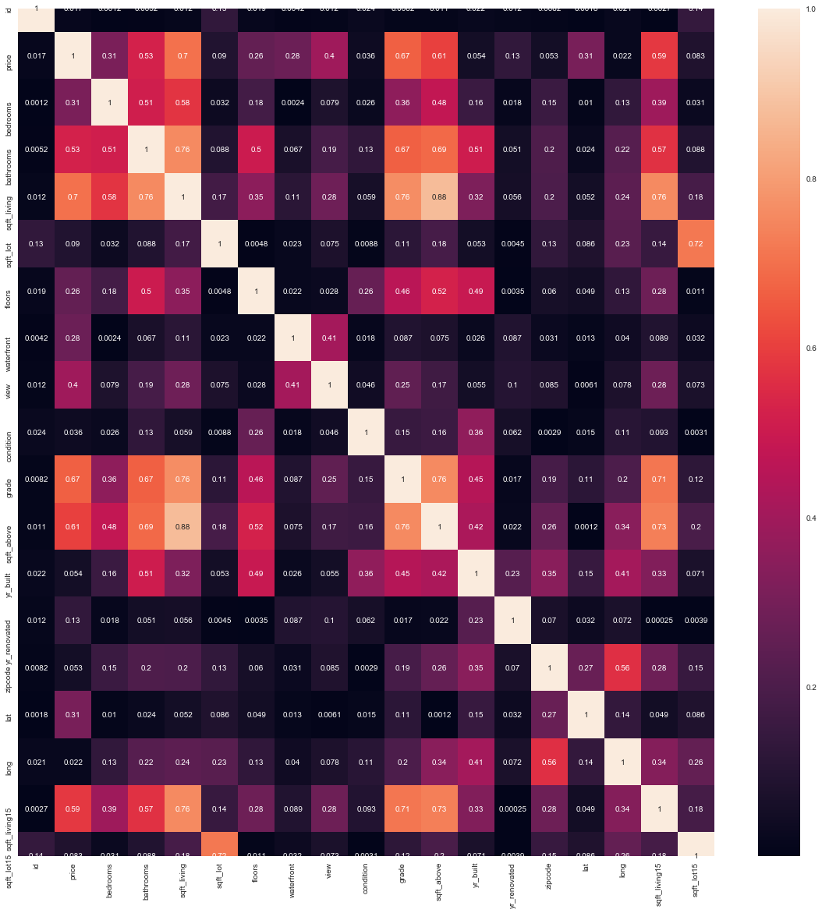
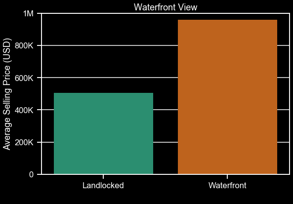

## Final Project Submission

Please fill out:
* Student name: Devin Belden
* Student pace: full time
* Scheduled project review date/time: Tue, Oct 29, 2019, 3:30 PM - 4:15 PM
* Instructor name: James Irving, Ph.D
* Blog post URL: Unknown

# Business Case

The purpose of this technical notebook is to explore the housing market in King County, Washington, so as to provide a healthy amount of information to prospective investors before or after they've invested in a property in the area. In short, the goal is to answer the question: "What features of a property can be manipulated such that the selling price is increased, and the investor's profit is maximized?" 

## Obtaining/Exploring Data
* As always, we must import packages before loading in the dataset


```python
import pandas as pd
import matplotlib.pyplot as plt
import matplotlib as mpl
import seaborn as sns
import numpy as np
%matplotlib inline
inline_rc = dict(mpl.rcParams)

plt.style.use('seaborn')

import statsmodels.api as sm
import statsmodels.formula.api as smf
from scipy.stats import normaltest as normtest # D'Agostino and Pearson's omnibus test
from scipy.stats import zscore

from collections import Counter
from sklearn.preprocessing import RobustScaler
from sklearn.preprocessing import MinMaxScaler
from sklearn.preprocessing import StandardScaler
```

    C:\Users\Devin\Anaconda3\envs\learn-env\lib\site-packages\ipykernel_launcher.py:7: MatplotlibDeprecationWarning: 
    The examples.directory rcparam was deprecated in Matplotlib 3.0 and will be removed in 3.2. In the future, examples will be found relative to the 'datapath' directory.
      import sys
    


```python
df = pd.read_csv('kc_house_data.csv')
display(df.head())
display(df.info())
```


<div>
<style scoped>
    .dataframe tbody tr th:only-of-type {
        vertical-align: middle;
    }

    .dataframe tbody tr th {
        vertical-align: top;
    }

    .dataframe thead th {
        text-align: right;
    }
</style>
<table border="1" class="dataframe">
  <thead>
    <tr style="text-align: right;">
      <th></th>
      <th>id</th>
      <th>date</th>
      <th>price</th>
      <th>bedrooms</th>
      <th>bathrooms</th>
      <th>sqft_living</th>
      <th>sqft_lot</th>
      <th>floors</th>
      <th>waterfront</th>
      <th>view</th>
      <th>...</th>
      <th>grade</th>
      <th>sqft_above</th>
      <th>sqft_basement</th>
      <th>yr_built</th>
      <th>yr_renovated</th>
      <th>zipcode</th>
      <th>lat</th>
      <th>long</th>
      <th>sqft_living15</th>
      <th>sqft_lot15</th>
    </tr>
  </thead>
  <tbody>
    <tr>
      <td>0</td>
      <td>7129300520</td>
      <td>10/13/2014</td>
      <td>221900.0</td>
      <td>3</td>
      <td>1.00</td>
      <td>1180</td>
      <td>5650</td>
      <td>1.0</td>
      <td>NaN</td>
      <td>0.0</td>
      <td>...</td>
      <td>7</td>
      <td>1180</td>
      <td>0.0</td>
      <td>1955</td>
      <td>0.0</td>
      <td>98178</td>
      <td>47.5112</td>
      <td>-122.257</td>
      <td>1340</td>
      <td>5650</td>
    </tr>
    <tr>
      <td>1</td>
      <td>6414100192</td>
      <td>12/9/2014</td>
      <td>538000.0</td>
      <td>3</td>
      <td>2.25</td>
      <td>2570</td>
      <td>7242</td>
      <td>2.0</td>
      <td>0.0</td>
      <td>0.0</td>
      <td>...</td>
      <td>7</td>
      <td>2170</td>
      <td>400.0</td>
      <td>1951</td>
      <td>1991.0</td>
      <td>98125</td>
      <td>47.7210</td>
      <td>-122.319</td>
      <td>1690</td>
      <td>7639</td>
    </tr>
    <tr>
      <td>2</td>
      <td>5631500400</td>
      <td>2/25/2015</td>
      <td>180000.0</td>
      <td>2</td>
      <td>1.00</td>
      <td>770</td>
      <td>10000</td>
      <td>1.0</td>
      <td>0.0</td>
      <td>0.0</td>
      <td>...</td>
      <td>6</td>
      <td>770</td>
      <td>0.0</td>
      <td>1933</td>
      <td>NaN</td>
      <td>98028</td>
      <td>47.7379</td>
      <td>-122.233</td>
      <td>2720</td>
      <td>8062</td>
    </tr>
    <tr>
      <td>3</td>
      <td>2487200875</td>
      <td>12/9/2014</td>
      <td>604000.0</td>
      <td>4</td>
      <td>3.00</td>
      <td>1960</td>
      <td>5000</td>
      <td>1.0</td>
      <td>0.0</td>
      <td>0.0</td>
      <td>...</td>
      <td>7</td>
      <td>1050</td>
      <td>910.0</td>
      <td>1965</td>
      <td>0.0</td>
      <td>98136</td>
      <td>47.5208</td>
      <td>-122.393</td>
      <td>1360</td>
      <td>5000</td>
    </tr>
    <tr>
      <td>4</td>
      <td>1954400510</td>
      <td>2/18/2015</td>
      <td>510000.0</td>
      <td>3</td>
      <td>2.00</td>
      <td>1680</td>
      <td>8080</td>
      <td>1.0</td>
      <td>0.0</td>
      <td>0.0</td>
      <td>...</td>
      <td>8</td>
      <td>1680</td>
      <td>0.0</td>
      <td>1987</td>
      <td>0.0</td>
      <td>98074</td>
      <td>47.6168</td>
      <td>-122.045</td>
      <td>1800</td>
      <td>7503</td>
    </tr>
  </tbody>
</table>
<p>5 rows × 21 columns</p>
</div>


    <class 'pandas.core.frame.DataFrame'>
    RangeIndex: 21597 entries, 0 to 21596
    Data columns (total 21 columns):
    id               21597 non-null int64
    date             21597 non-null object
    price            21597 non-null float64
    bedrooms         21597 non-null int64
    bathrooms        21597 non-null float64
    sqft_living      21597 non-null int64
    sqft_lot         21597 non-null int64
    floors           21597 non-null float64
    waterfront       19221 non-null float64
    view             21534 non-null float64
    condition        21597 non-null int64
    grade            21597 non-null int64
    sqft_above       21597 non-null int64
    sqft_basement    21597 non-null object
    yr_built         21597 non-null int64
    yr_renovated     17755 non-null float64
    zipcode          21597 non-null int64
    lat              21597 non-null float64
    long             21597 non-null float64
    sqft_living15    21597 non-null int64
    sqft_lot15       21597 non-null int64
    dtypes: float64(8), int64(11), object(2)
    memory usage: 3.5+ MB
    


    None


## Preliminary Exploration

Let's do a quick check for multicollinearity between the variables we've got right now. For the scope of this project, we'll say that anything correlated higher than 0.75 should be dealt with, usually by removing a column from our actionable data.

Not only will this give us an idea of which variables _not_ to use, but it will give us an idea of what variables are correlated with our target variable (price) so we'll also have a list of candidates for our final, actionable dataset.


```python
plt.figure(figsize=(20,20))
sns.heatmap(abs(df.corr()), annot=True);
```





So far, we can see that `sqft_living` is unacceptably highly correlated with a lot of other columns, including `bathrooms`, `sqft_above`, `sqft_living15`, and, for some reason, `grade`. For unknown reasons, `sqft_basement` is not included in our heatmap, but it's not a huge stretch of the imagination to think it might be highly collinear with `sqft_living` as well. For these reasons, it would behoove us to omit everything except `sqft_living`, as that gives the most information about the home's living space, and `grade`, because the idea that living space is correlated with the King County grading system seems out of left field. We'll keep `grade` for now, and do further exploratory analysis on this supposed collinearity in further steps.

For now, we'll also take a look at the distributions of the different columns to determine which transformations we'll need for continuous variables, as well as take a further look at categorical variables.


```python
df.hist(figsize=(15,15));
```


A few takeaways from this: 
* There is at least one outlier in the `bedrooms` column
* There are some outliers in the `price` column
* `sqft_living` has a positive skew

We'll use Z-score to eliminate outliers for `bedrooms` and `price`, and use a log transform on `sqft_living` in an effort to improve the skew.

To visually investigate and confirm the existence of outliers, we can use boxplots:


```python
plt.figure(figsize=(13,8))
sns.boxplot(x='bedrooms', data=df)
```


    <matplotlib.axes._subplots.AxesSubplot at 0x1a986812828>


```python
plt.figure(figsize=(13,8))
sns.boxplot(x='price', data=df)
```


    <matplotlib.axes._subplots.AxesSubplot at 0x1a986a1c278>


And violin plots to visualize skew:


```python
plt.figure(figsize=(13,8))
sns.violinplot(x='sqft_living', data=df)
```


    <matplotlib.axes._subplots.AxesSubplot at 0x1a9866bd2b0>


These graphs both prove the existence of outliers in `price` and `bedrooms`, and demonstrate a relatively high level of skew in the `sqft_living` column.

## Data Cleaning
* There are nan's and '?' placeholders in certain columns
* We'll transform yr_renovated into a categorical column while we're at it


```python
df.isna().sum()
```


    id                  0
    date                0
    price               0
    bedrooms            0
    bathrooms           0
    sqft_living         0
    sqft_lot            0
    floors              0
    waterfront       2376
    view               63
    condition           0
    grade               0
    sqft_above          0
    sqft_basement       0
    yr_built            0
    yr_renovated     3842
    zipcode             0
    lat                 0
    long                0
    sqft_living15       0
    sqft_lot15          0
    dtype: int64


```python
df['sqft_basement'].value_counts()
```


    0.0       12826
    ?           454
    600.0       217
    500.0       209
    700.0       208
              ...  
    2490.0        1
    2050.0        1
    2580.0        1
    508.0         1
    2196.0        1
    Name: sqft_basement, Length: 304, dtype: int64


```python
df_temp = df.copy()
df_temp['yr_renovated'].fillna(0, inplace=True)
df_temp['is_renovated'] = df_temp['yr_renovated'].map(lambda x: x!=0)
df_temp['waterfront'].fillna(0, inplace=True)
df_temp['waterfront'] = df_temp['waterfront'].astype(int)
df_temp['view'].fillna(0., inplace=True)
df_temp['view'] = df_temp['view'].astype(int)
df_temp.isna().sum()
```


    id               0
    date             0
    price            0
    bedrooms         0
    bathrooms        0
    sqft_living      0
    sqft_lot         0
    floors           0
    waterfront       0
    view             0
    condition        0
    grade            0
    sqft_above       0
    sqft_basement    0
    yr_built         0
    yr_renovated     0
    zipcode          0
    lat              0
    long             0
    sqft_living15    0
    sqft_lot15       0
    is_renovated     0
    dtype: int64


Additionally, we'll delete some of the columns deemed to be collinear in our temporary dataframe.


```python
df_temp.drop(['bathrooms', 'sqft_basement', 'sqft_living15', 'sqft_above'], axis=1, inplace=True)
```

Now that we've taken care of the nan's and placeholders, let's eliminate some outliers.

### Outlier Identification and Elimination, with Variable Transformation

As we saw from our boxplots, there are some outliers in the data that will lead to inaccurate conclusions if allowed to persist. Using Z-score calculation, we can catch and remove these outliers.

Our goal is to replace the values in the dataframe with the respective Z-score, and to create a new column for the Z-score of our target variable. This will allow us to build a linear model using the transformed columns, while keeping the raw, untransformed data in the `price` column.

Before that, though, we'll need to take care of the skew of some of the variables. These variables include `bedrooms`, `sqft_living`, `sqft_lot`, `sqft_lot15`. `long` has skew to it, but since all of the values are below zero, log transforming will not work.


```python
log_variables = ['bedrooms','sqft_living','sqft_lot','sqft_lot15']
```


```python
df_temp_log = pd.DataFrame([])
for variable in log_variables:
    df_temp_log[variable] = np.log(df_temp[variable])
df_temp_log.hist(figsize=(15,15));
```


The skew across these variables has been noticeably decreased. With some outlier elimination, we can use these transformed variables in our preliminary models. We'll go ahead and drop the untransformed variables in the working dataframe.


```python
df_temp.drop(['bedrooms','sqft_living','sqft_lot','sqft_lot15'], axis=1, inplace=True)
```


```python
df_temp = pd.concat([df_temp, df_temp_log], axis=1)
```


```python
df_temp.describe().round(3)
print(df_temp.columns)
```

    Index(['id', 'date', 'price', 'floors', 'waterfront', 'view', 'condition',
           'grade', 'yr_built', 'yr_renovated', 'zipcode', 'lat', 'long',
           'is_renovated', 'bedrooms', 'sqft_living', 'sqft_lot', 'sqft_lot15'],
          dtype='object')
    

Now we can go ahead and scale the data using Standardization. This will allow us to use Z-score to eliminate the outliers.


```python
scaler = StandardScaler()
```


```python
df_scaled = df_temp.copy()
```


```python
cols = ['floors','sqft_lot','bedrooms','sqft_living','sqft_lot15']
df_scaled[cols] = scaler.fit_transform(df_scaled[cols].values)
df_scaled['scaled_price'] = scaler.fit_transform(df_scaled['price'].values.reshape(-1,1))
df_scaled.describe().round(3)
```


<div>
<style scoped>
    .dataframe tbody tr th:only-of-type {
        vertical-align: middle;
    }

    .dataframe tbody tr th {
        vertical-align: top;
    }

    .dataframe thead th {
        text-align: right;
    }
</style>
<table border="1" class="dataframe">
  <thead>
    <tr style="text-align: right;">
      <th></th>
      <th>id</th>
      <th>price</th>
      <th>floors</th>
      <th>waterfront</th>
      <th>view</th>
      <th>condition</th>
      <th>grade</th>
      <th>yr_built</th>
      <th>yr_renovated</th>
      <th>zipcode</th>
      <th>lat</th>
      <th>long</th>
      <th>bedrooms</th>
      <th>sqft_living</th>
      <th>sqft_lot</th>
      <th>sqft_lot15</th>
      <th>scaled_price</th>
    </tr>
  </thead>
  <tbody>
    <tr>
      <td>count</td>
      <td>2.159700e+04</td>
      <td>21597.000</td>
      <td>21597.000</td>
      <td>21597.000</td>
      <td>21597.000</td>
      <td>21597.000</td>
      <td>21597.000</td>
      <td>21597.000</td>
      <td>21597.000</td>
      <td>21597.000</td>
      <td>21597.000</td>
      <td>21597.000</td>
      <td>21597.000</td>
      <td>21597.000</td>
      <td>21597.000</td>
      <td>21597.000</td>
      <td>21597.000</td>
    </tr>
    <tr>
      <td>mean</td>
      <td>4.580474e+09</td>
      <td>540296.574</td>
      <td>-0.000</td>
      <td>0.007</td>
      <td>0.233</td>
      <td>3.410</td>
      <td>7.658</td>
      <td>1971.000</td>
      <td>68.758</td>
      <td>98077.952</td>
      <td>47.560</td>
      <td>-122.214</td>
      <td>-0.000</td>
      <td>-0.000</td>
      <td>-0.000</td>
      <td>-0.000</td>
      <td>-0.000</td>
    </tr>
    <tr>
      <td>std</td>
      <td>2.876736e+09</td>
      <td>367368.140</td>
      <td>1.000</td>
      <td>0.082</td>
      <td>0.765</td>
      <td>0.651</td>
      <td>1.173</td>
      <td>29.375</td>
      <td>364.037</td>
      <td>53.513</td>
      <td>0.139</td>
      <td>0.141</td>
      <td>1.000</td>
      <td>1.000</td>
      <td>1.000</td>
      <td>1.000</td>
      <td>1.000</td>
    </tr>
    <tr>
      <td>min</td>
      <td>1.000102e+06</td>
      <td>78000.000</td>
      <td>-0.916</td>
      <td>0.000</td>
      <td>0.000</td>
      <td>1.000</td>
      <td>3.000</td>
      <td>1900.000</td>
      <td>0.000</td>
      <td>98001.000</td>
      <td>47.156</td>
      <td>-122.519</td>
      <td>-4.160</td>
      <td>-3.860</td>
      <td>-3.033</td>
      <td>-3.055</td>
      <td>-1.258</td>
    </tr>
    <tr>
      <td>25%</td>
      <td>2.123049e+09</td>
      <td>322000.000</td>
      <td>-0.916</td>
      <td>0.000</td>
      <td>0.000</td>
      <td>3.000</td>
      <td>7.000</td>
      <td>1951.000</td>
      <td>0.000</td>
      <td>98033.000</td>
      <td>47.471</td>
      <td>-122.328</td>
      <td>-0.280</td>
      <td>-0.673</td>
      <td>-0.515</td>
      <td>-0.521</td>
      <td>-0.594</td>
    </tr>
    <tr>
      <td>50%</td>
      <td>3.904930e+09</td>
      <td>450000.000</td>
      <td>0.011</td>
      <td>0.000</td>
      <td>0.000</td>
      <td>3.000</td>
      <td>7.000</td>
      <td>1975.000</td>
      <td>0.000</td>
      <td>98065.000</td>
      <td>47.572</td>
      <td>-122.231</td>
      <td>-0.280</td>
      <td>0.010</td>
      <td>-0.057</td>
      <td>-0.027</td>
      <td>-0.246</td>
    </tr>
    <tr>
      <td>75%</td>
      <td>7.308900e+09</td>
      <td>645000.000</td>
      <td>0.937</td>
      <td>0.000</td>
      <td>0.000</td>
      <td>4.000</td>
      <td>8.000</td>
      <td>1997.000</td>
      <td>0.000</td>
      <td>98118.000</td>
      <td>47.678</td>
      <td>-122.125</td>
      <td>0.736</td>
      <td>0.691</td>
      <td>0.318</td>
      <td>0.317</td>
      <td>0.285</td>
    </tr>
    <tr>
      <td>max</td>
      <td>9.900000e+09</td>
      <td>7700000.000</td>
      <td>3.717</td>
      <td>1.000</td>
      <td>4.000</td>
      <td>5.000</td>
      <td>13.000</td>
      <td>2015.000</td>
      <td>2015.000</td>
      <td>98199.000</td>
      <td>47.778</td>
      <td>-121.315</td>
      <td>8.189</td>
      <td>4.627</td>
      <td>5.906</td>
      <td>5.805</td>
      <td>19.490</td>
    </tr>
  </tbody>
</table>
</div>


```python
df_scaled['price_outliers'] = df_scaled['scaled_price'].apply(lambda x: abs(x) > 3)
df_scaled['floors_outliers'] = df_scaled['floors'].apply(lambda x: abs(x) > 3)
df_scaled['bed_outliers'] = df_scaled['bedrooms'].apply(lambda x: abs(x) > 3)
df_scaled['sqft_living_outliers'] = df_scaled['sqft_living'].apply(lambda x: abs(x) > 3)
df_scaled['sqft_lot_outliers'] = df_scaled['sqft_lot'].apply(lambda x: abs(x) > 3)
df_scaled['sqft_lot15_outliers'] = df_scaled['sqft_lot15'].apply(lambda x: abs(x) > 3)

#Now we group by the outlier columns and only get the rows that have False in all outlier categories:
df_scaled.groupby(['price_outliers', 'floors_outliers', 'bed_outliers', 'sqft_living_outliers', 
                   'sqft_lot_outliers', 'sqft_lot15_outliers']).get_group(
                    (False, False, False, False, False, False)).head()
```


<div>
<style scoped>
    .dataframe tbody tr th:only-of-type {
        vertical-align: middle;
    }

    .dataframe tbody tr th {
        vertical-align: top;
    }

    .dataframe thead th {
        text-align: right;
    }
</style>
<table border="1" class="dataframe">
  <thead>
    <tr style="text-align: right;">
      <th></th>
      <th>id</th>
      <th>date</th>
      <th>price</th>
      <th>floors</th>
      <th>waterfront</th>
      <th>view</th>
      <th>condition</th>
      <th>grade</th>
      <th>yr_built</th>
      <th>yr_renovated</th>
      <th>...</th>
      <th>sqft_living</th>
      <th>sqft_lot</th>
      <th>sqft_lot15</th>
      <th>scaled_price</th>
      <th>price_outliers</th>
      <th>floors_outliers</th>
      <th>bed_outliers</th>
      <th>sqft_living_outliers</th>
      <th>sqft_lot_outliers</th>
      <th>sqft_lot15_outliers</th>
    </tr>
  </thead>
  <tbody>
    <tr>
      <td>0</td>
      <td>7129300520</td>
      <td>10/13/2014</td>
      <td>221900.0</td>
      <td>-0.915552</td>
      <td>0</td>
      <td>0</td>
      <td>3</td>
      <td>7</td>
      <td>1955</td>
      <td>0.0</td>
      <td>...</td>
      <td>-1.125582</td>
      <td>-0.388439</td>
      <td>-0.395459</td>
      <td>-0.866716</td>
      <td>False</td>
      <td>False</td>
      <td>False</td>
      <td>False</td>
      <td>False</td>
      <td>False</td>
    </tr>
    <tr>
      <td>1</td>
      <td>6414100192</td>
      <td>12/9/2014</td>
      <td>538000.0</td>
      <td>0.937431</td>
      <td>0</td>
      <td>0</td>
      <td>3</td>
      <td>7</td>
      <td>1951</td>
      <td>1991.0</td>
      <td>...</td>
      <td>0.709463</td>
      <td>-0.113243</td>
      <td>-0.024288</td>
      <td>-0.006252</td>
      <td>False</td>
      <td>False</td>
      <td>False</td>
      <td>False</td>
      <td>False</td>
      <td>False</td>
    </tr>
    <tr>
      <td>2</td>
      <td>5631500400</td>
      <td>2/25/2015</td>
      <td>180000.0</td>
      <td>-0.915552</td>
      <td>0</td>
      <td>0</td>
      <td>3</td>
      <td>6</td>
      <td>1933</td>
      <td>0.0</td>
      <td>...</td>
      <td>-2.131943</td>
      <td>0.244481</td>
      <td>0.042037</td>
      <td>-0.980773</td>
      <td>False</td>
      <td>False</td>
      <td>False</td>
      <td>False</td>
      <td>False</td>
      <td>False</td>
    </tr>
    <tr>
      <td>3</td>
      <td>2487200875</td>
      <td>12/9/2014</td>
      <td>604000.0</td>
      <td>-0.915552</td>
      <td>0</td>
      <td>0</td>
      <td>5</td>
      <td>7</td>
      <td>1965</td>
      <td>0.0</td>
      <td>...</td>
      <td>0.070676</td>
      <td>-0.523926</td>
      <td>-0.545863</td>
      <td>0.173409</td>
      <td>False</td>
      <td>False</td>
      <td>False</td>
      <td>False</td>
      <td>False</td>
      <td>False</td>
    </tr>
    <tr>
      <td>4</td>
      <td>1954400510</td>
      <td>2/18/2015</td>
      <td>510000.0</td>
      <td>-0.915552</td>
      <td>0</td>
      <td>0</td>
      <td>3</td>
      <td>8</td>
      <td>1987</td>
      <td>0.0</td>
      <td>...</td>
      <td>-0.292732</td>
      <td>0.008140</td>
      <td>-0.046395</td>
      <td>-0.082471</td>
      <td>False</td>
      <td>False</td>
      <td>False</td>
      <td>False</td>
      <td>False</td>
      <td>False</td>
    </tr>
  </tbody>
</table>
<p>5 rows × 25 columns</p>
</div>


```python
#Here we give our groupby statement some permanence
df_scaled = df_scaled[(df_scaled['price_outliers'] == False)
                    & (df_scaled['floors_outliers'] == False)
                    & (df_scaled['bed_outliers'] == False) 
                    & (df_scaled['sqft_living_outliers'] == False) 
                    & (df_scaled['sqft_lot_outliers'] == False) 
                    & (df_scaled['sqft_lot15_outliers'] == False)]
df_scaled.describe().round(3)
```


<div>
<style scoped>
    .dataframe tbody tr th:only-of-type {
        vertical-align: middle;
    }

    .dataframe tbody tr th {
        vertical-align: top;
    }

    .dataframe thead th {
        text-align: right;
    }
</style>
<table border="1" class="dataframe">
  <thead>
    <tr style="text-align: right;">
      <th></th>
      <th>id</th>
      <th>price</th>
      <th>floors</th>
      <th>waterfront</th>
      <th>view</th>
      <th>condition</th>
      <th>grade</th>
      <th>yr_built</th>
      <th>yr_renovated</th>
      <th>zipcode</th>
      <th>lat</th>
      <th>long</th>
      <th>bedrooms</th>
      <th>sqft_living</th>
      <th>sqft_lot</th>
      <th>sqft_lot15</th>
      <th>scaled_price</th>
    </tr>
  </thead>
  <tbody>
    <tr>
      <td>count</td>
      <td>2.046200e+04</td>
      <td>20462.000</td>
      <td>20462.000</td>
      <td>20462.000</td>
      <td>20462.000</td>
      <td>20462.000</td>
      <td>20462.000</td>
      <td>20462.000</td>
      <td>20462.000</td>
      <td>20462.000</td>
      <td>20462.000</td>
      <td>20462.000</td>
      <td>20462.000</td>
      <td>20462.000</td>
      <td>20462.000</td>
      <td>20462.000</td>
      <td>20462.000</td>
    </tr>
    <tr>
      <td>mean</td>
      <td>4.652510e+09</td>
      <td>506319.837</td>
      <td>-0.010</td>
      <td>0.004</td>
      <td>0.199</td>
      <td>3.412</td>
      <td>7.608</td>
      <td>1970.969</td>
      <td>64.578</td>
      <td>98078.837</td>
      <td>47.561</td>
      <td>-122.217</td>
      <td>0.019</td>
      <td>-0.036</td>
      <td>-0.093</td>
      <td>-0.091</td>
      <td>-0.092</td>
    </tr>
    <tr>
      <td>std</td>
      <td>2.876473e+09</td>
      <td>258807.609</td>
      <td>0.998</td>
      <td>0.059</td>
      <td>0.696</td>
      <td>0.649</td>
      <td>1.088</td>
      <td>29.239</td>
      <td>353.194</td>
      <td>53.628</td>
      <td>0.139</td>
      <td>0.138</td>
      <td>0.910</td>
      <td>0.940</td>
      <td>0.845</td>
      <td>0.848</td>
      <td>0.705</td>
    </tr>
    <tr>
      <td>min</td>
      <td>1.000102e+06</td>
      <td>78000.000</td>
      <td>-0.916</td>
      <td>0.000</td>
      <td>0.000</td>
      <td>1.000</td>
      <td>4.000</td>
      <td>1900.000</td>
      <td>0.000</td>
      <td>98001.000</td>
      <td>47.156</td>
      <td>-122.511</td>
      <td>-1.712</td>
      <td>-2.968</td>
      <td>-2.927</td>
      <td>-2.884</td>
      <td>-1.258</td>
    </tr>
    <tr>
      <td>25%</td>
      <td>2.201501e+09</td>
      <td>320000.000</td>
      <td>-0.916</td>
      <td>0.000</td>
      <td>0.000</td>
      <td>3.000</td>
      <td>7.000</td>
      <td>1952.000</td>
      <td>0.000</td>
      <td>98033.000</td>
      <td>47.472</td>
      <td>-122.330</td>
      <td>-0.280</td>
      <td>-0.689</td>
      <td>-0.524</td>
      <td>-0.536</td>
      <td>-0.600</td>
    </tr>
    <tr>
      <td>50%</td>
      <td>4.022902e+09</td>
      <td>445600.000</td>
      <td>0.011</td>
      <td>0.000</td>
      <td>0.000</td>
      <td>3.000</td>
      <td>7.000</td>
      <td>1974.000</td>
      <td>0.000</td>
      <td>98070.000</td>
      <td>47.572</td>
      <td>-122.236</td>
      <td>-0.280</td>
      <td>-0.015</td>
      <td>-0.074</td>
      <td>-0.046</td>
      <td>-0.258</td>
    </tr>
    <tr>
      <td>75%</td>
      <td>7.399300e+09</td>
      <td>625187.500</td>
      <td>0.937</td>
      <td>0.000</td>
      <td>0.000</td>
      <td>4.000</td>
      <td>8.000</td>
      <td>1996.000</td>
      <td>0.000</td>
      <td>98118.000</td>
      <td>47.680</td>
      <td>-122.130</td>
      <td>0.736</td>
      <td>0.635</td>
      <td>0.263</td>
      <td>0.279</td>
      <td>0.231</td>
    </tr>
    <tr>
      <td>max</td>
      <td>9.900000e+09</td>
      <td>1640000.000</td>
      <td>2.790</td>
      <td>1.000</td>
      <td>4.000</td>
      <td>5.000</td>
      <td>12.000</td>
      <td>2015.000</td>
      <td>2015.000</td>
      <td>98199.000</td>
      <td>47.778</td>
      <td>-121.316</td>
      <td>2.713</td>
      <td>2.944</td>
      <td>2.997</td>
      <td>2.991</td>
      <td>2.994</td>
    </tr>
  </tbody>
</table>
</div>


```python
len(df_scaled)/len(df)
```


    0.9474464045932306


Using this technique, we've deleted slightly more than 5% of our total starting data, which is acceptable. Let's take another look at our correlation heatmap, as well as our histograms, in order to see if the distributions have been measurably improved by transformation and outlier removal.


```python
plt.figure(figsize=(20,20))
sns.heatmap(abs(df_scaled.drop(['price_outliers','floors_outliers','bed_outliers',
                                'sqft_living_outliers','sqft_lot_outliers','sqft_lot15_outliers'], 
                                axis=1).corr()), annot=True);
```


After removal, we can see that `sqft_lot15` is unacceptably highly correlated (>0.75) with `sqft_lot`. We'll drop the former, following in our earlier footsteps of removing `sqft_living15`. Additionally, the correlation between `grade` and `sqft_living` has fallen below our 0.75 threshold, but we will still use techniques to test this multicollinearity when working with our model in earnest.


```python
df_scaled.drop(['sqft_lot15'], axis=1, inplace=True)
```


```python
plt.figure(figsize=(13,8))
sns.boxplot(x='bedrooms', data=df_scaled)
```


    <matplotlib.axes._subplots.AxesSubplot at 0x1a98693c7b8>


```python
plt.figure(figsize=(13,8))
sns.boxplot(x='price', data=df_scaled)
```


    <matplotlib.axes._subplots.AxesSubplot at 0x1a98719b2e8>


```python
plt.figure(figsize=(13,8))
sns.violinplot(x='sqft_living', data=df_scaled)
```


    <matplotlib.axes._subplots.AxesSubplot at 0x1a987058940>


Judging by our new visualizations, the distributions of `price` and `bedrooms` have greatly improved, and the skew of `sqft_living` has noticeably fallen. If we need to further fix the skew of `sqft_living`, or of any other column, we can do so at a later point. For now, we can focus on our categorical data.

### Identifying and Transforming Categorical Data

We have some categorical variables for sure. Just by eyeballing it, `waterfront`, `view`, `condition`, `grade`, `is_renovated` (as expected), and `zipcode` could all be categorical. 


```python
df_scaled[['waterfront', 'view', 'condition', 'grade', 'is_renovated', 'zipcode']].describe()
```


<div>
<style scoped>
    .dataframe tbody tr th:only-of-type {
        vertical-align: middle;
    }

    .dataframe tbody tr th {
        vertical-align: top;
    }

    .dataframe thead th {
        text-align: right;
    }
</style>
<table border="1" class="dataframe">
  <thead>
    <tr style="text-align: right;">
      <th></th>
      <th>waterfront</th>
      <th>view</th>
      <th>condition</th>
      <th>grade</th>
      <th>zipcode</th>
    </tr>
  </thead>
  <tbody>
    <tr>
      <td>count</td>
      <td>20462.000000</td>
      <td>20462.000000</td>
      <td>20462.000000</td>
      <td>20462.000000</td>
      <td>20462.000000</td>
    </tr>
    <tr>
      <td>mean</td>
      <td>0.003519</td>
      <td>0.198954</td>
      <td>3.411983</td>
      <td>7.607712</td>
      <td>98078.837113</td>
    </tr>
    <tr>
      <td>std</td>
      <td>0.059216</td>
      <td>0.695769</td>
      <td>0.648502</td>
      <td>1.087720</td>
      <td>53.628372</td>
    </tr>
    <tr>
      <td>min</td>
      <td>0.000000</td>
      <td>0.000000</td>
      <td>1.000000</td>
      <td>4.000000</td>
      <td>98001.000000</td>
    </tr>
    <tr>
      <td>25%</td>
      <td>0.000000</td>
      <td>0.000000</td>
      <td>3.000000</td>
      <td>7.000000</td>
      <td>98033.000000</td>
    </tr>
    <tr>
      <td>50%</td>
      <td>0.000000</td>
      <td>0.000000</td>
      <td>3.000000</td>
      <td>7.000000</td>
      <td>98070.000000</td>
    </tr>
    <tr>
      <td>75%</td>
      <td>0.000000</td>
      <td>0.000000</td>
      <td>4.000000</td>
      <td>8.000000</td>
      <td>98118.000000</td>
    </tr>
    <tr>
      <td>max</td>
      <td>1.000000</td>
      <td>4.000000</td>
      <td>5.000000</td>
      <td>12.000000</td>
      <td>98199.000000</td>
    </tr>
  </tbody>
</table>
</div>


```python
df_scaled[['waterfront', 'view', 'condition', 'grade', 'is_renovated', 'zipcode']].nunique()
```


    waterfront       2
    view             5
    condition        5
    grade            9
    is_renovated     2
    zipcode         70
    dtype: int64


Judging by the relatively low number of unique values in each of these columns, as well as their integer nature, it's a fairly safe bet that they can be treated as categorical. Word of note: In discussing other columns with a lower number of unique values, such as `bedrooms` and `bathrooms`, we could indeed treat these as categorical as well. However, the decision to omit these two columns from the categorical list was twofold: 1) `bedrooms` is usually colloquially paired with `bathrooms` (e.g. "This is a 3-bed, 2.5-bath house"), and 2) the latter contains float values. 


```python
one_hot_columns = ['waterfront','view','condition','grade','is_renovated','zipcode']
```

We can one-hot-encode these columns in one step when creating the initial model. We'll do this by hand, as it is easier to remain cognizant of what is going on under the hood.


```python
waterfront_dummies = pd.get_dummies(df_scaled['waterfront'], prefix='wat', drop_first=True)
view_dummies = pd.get_dummies(df_scaled['view'], prefix='view', drop_first=True)
condition_dummies = pd.get_dummies(df_scaled['condition'], prefix='con', drop_first=True)
grade_dummies = pd.get_dummies(df_scaled['grade'], prefix='grad', drop_first=True)
is_renovated_dummies = pd.get_dummies(df_scaled['is_renovated'], prefix='ren', drop_first=True)
zipcode_dummies = pd.get_dummies(df_scaled['zipcode'], prefix='zip', drop_first=True)
```

Now, we'll add these columns to our scaled dataframe so we can run our preliminary model. 


```python
data = pd.concat([df_scaled, waterfront_dummies, view_dummies, condition_dummies, grade_dummies, 
                  is_renovated_dummies, zipcode_dummies], axis=1)
data.head()
```


<div>
<style scoped>
    .dataframe tbody tr th:only-of-type {
        vertical-align: middle;
    }

    .dataframe tbody tr th {
        vertical-align: top;
    }

    .dataframe thead th {
        text-align: right;
    }
</style>
<table border="1" class="dataframe">
  <thead>
    <tr style="text-align: right;">
      <th></th>
      <th>id</th>
      <th>date</th>
      <th>price</th>
      <th>floors</th>
      <th>waterfront</th>
      <th>view</th>
      <th>condition</th>
      <th>grade</th>
      <th>yr_built</th>
      <th>yr_renovated</th>
      <th>...</th>
      <th>zip_98146</th>
      <th>zip_98148</th>
      <th>zip_98155</th>
      <th>zip_98166</th>
      <th>zip_98168</th>
      <th>zip_98177</th>
      <th>zip_98178</th>
      <th>zip_98188</th>
      <th>zip_98198</th>
      <th>zip_98199</th>
    </tr>
  </thead>
  <tbody>
    <tr>
      <td>0</td>
      <td>7129300520</td>
      <td>10/13/2014</td>
      <td>221900.0</td>
      <td>-0.915552</td>
      <td>0</td>
      <td>0</td>
      <td>3</td>
      <td>7</td>
      <td>1955</td>
      <td>0.0</td>
      <td>...</td>
      <td>0</td>
      <td>0</td>
      <td>0</td>
      <td>0</td>
      <td>0</td>
      <td>0</td>
      <td>1</td>
      <td>0</td>
      <td>0</td>
      <td>0</td>
    </tr>
    <tr>
      <td>1</td>
      <td>6414100192</td>
      <td>12/9/2014</td>
      <td>538000.0</td>
      <td>0.937431</td>
      <td>0</td>
      <td>0</td>
      <td>3</td>
      <td>7</td>
      <td>1951</td>
      <td>1991.0</td>
      <td>...</td>
      <td>0</td>
      <td>0</td>
      <td>0</td>
      <td>0</td>
      <td>0</td>
      <td>0</td>
      <td>0</td>
      <td>0</td>
      <td>0</td>
      <td>0</td>
    </tr>
    <tr>
      <td>2</td>
      <td>5631500400</td>
      <td>2/25/2015</td>
      <td>180000.0</td>
      <td>-0.915552</td>
      <td>0</td>
      <td>0</td>
      <td>3</td>
      <td>6</td>
      <td>1933</td>
      <td>0.0</td>
      <td>...</td>
      <td>0</td>
      <td>0</td>
      <td>0</td>
      <td>0</td>
      <td>0</td>
      <td>0</td>
      <td>0</td>
      <td>0</td>
      <td>0</td>
      <td>0</td>
    </tr>
    <tr>
      <td>3</td>
      <td>2487200875</td>
      <td>12/9/2014</td>
      <td>604000.0</td>
      <td>-0.915552</td>
      <td>0</td>
      <td>0</td>
      <td>5</td>
      <td>7</td>
      <td>1965</td>
      <td>0.0</td>
      <td>...</td>
      <td>0</td>
      <td>0</td>
      <td>0</td>
      <td>0</td>
      <td>0</td>
      <td>0</td>
      <td>0</td>
      <td>0</td>
      <td>0</td>
      <td>0</td>
    </tr>
    <tr>
      <td>4</td>
      <td>1954400510</td>
      <td>2/18/2015</td>
      <td>510000.0</td>
      <td>-0.915552</td>
      <td>0</td>
      <td>0</td>
      <td>3</td>
      <td>8</td>
      <td>1987</td>
      <td>0.0</td>
      <td>...</td>
      <td>0</td>
      <td>0</td>
      <td>0</td>
      <td>0</td>
      <td>0</td>
      <td>0</td>
      <td>0</td>
      <td>0</td>
      <td>0</td>
      <td>0</td>
    </tr>
  </tbody>
</table>
<p>5 rows × 111 columns</p>
</div>


Let's drop the original columns that we just encoded, as well as a few other unhelpful columns, such as `id` and `date`.


```python
data.drop(one_hot_columns, axis=1, inplace=True)
data.drop(['id','date','yr_renovated','price_outliers','bed_outliers','sqft_living_outliers',
           'sqft_lot_outliers','sqft_lot15_outliers', 'scaled_price', 'floors_outliers'], axis=1, inplace=True)
```


```python
data.columns
```


    Index(['price', 'floors', 'yr_built', 'lat', 'long', 'bedrooms', 'sqft_living',
           'sqft_lot', 'wat_1', 'view_1', 'view_2', 'view_3', 'view_4', 'con_2',
           'con_3', 'con_4', 'con_5', 'grad_5', 'grad_6', 'grad_7', 'grad_8',
           'grad_9', 'grad_10', 'grad_11', 'grad_12', 'ren_True', 'zip_98002',
           'zip_98003', 'zip_98004', 'zip_98005', 'zip_98006', 'zip_98007',
           'zip_98008', 'zip_98010', 'zip_98011', 'zip_98014', 'zip_98019',
           'zip_98022', 'zip_98023', 'zip_98024', 'zip_98027', 'zip_98028',
           'zip_98029', 'zip_98030', 'zip_98031', 'zip_98032', 'zip_98033',
           'zip_98034', 'zip_98038', 'zip_98039', 'zip_98040', 'zip_98042',
           'zip_98045', 'zip_98052', 'zip_98053', 'zip_98055', 'zip_98056',
           'zip_98058', 'zip_98059', 'zip_98065', 'zip_98070', 'zip_98072',
           'zip_98074', 'zip_98075', 'zip_98077', 'zip_98092', 'zip_98102',
           'zip_98103', 'zip_98105', 'zip_98106', 'zip_98107', 'zip_98108',
           'zip_98109', 'zip_98112', 'zip_98115', 'zip_98116', 'zip_98117',
           'zip_98118', 'zip_98119', 'zip_98122', 'zip_98125', 'zip_98126',
           'zip_98133', 'zip_98136', 'zip_98144', 'zip_98146', 'zip_98148',
           'zip_98155', 'zip_98166', 'zip_98168', 'zip_98177', 'zip_98178',
           'zip_98188', 'zip_98198', 'zip_98199'],
          dtype='object')


### Preliminary Model

Let's create a preliminary model using OLS and every single column we've got. This will obviously sacrifice lots of interpretability for accuracy, but we just want a benchmark for how high our R-squared value is, just to ensure that we don't lose too much accuracy after whittling the list down to 4-7 features.


```python
from statsmodels.formula.api import ols

outcome = 'price'
x_cols = data.drop('price', axis=1)
predictors = '+'.join(x_cols)
formula = outcome + '~' + predictors
model = ols(formula=formula, data=data).fit()
model.summary()
```


<table class="simpletable">
<caption>OLS Regression Results</caption>
<tr>
  <th>Dep. Variable:</th>          <td>price</td>      <th>  R-squared:         </th>  <td>   0.839</td>  
</tr>
<tr>
  <th>Model:</th>                   <td>OLS</td>       <th>  Adj. R-squared:    </th>  <td>   0.838</td>  
</tr>
<tr>
  <th>Method:</th>             <td>Least Squares</td>  <th>  F-statistic:       </th>  <td>   1130.</td>  
</tr>
<tr>
  <th>Date:</th>             <td>Wed, 06 Nov 2019</td> <th>  Prob (F-statistic):</th>   <td>  0.00</td>   
</tr>
<tr>
  <th>Time:</th>                 <td>20:19:50</td>     <th>  Log-Likelihood:    </th> <td>-2.6537e+05</td>
</tr>
<tr>
  <th>No. Observations:</th>      <td> 20462</td>      <th>  AIC:               </th>  <td>5.309e+05</td> 
</tr>
<tr>
  <th>Df Residuals:</th>          <td> 20367</td>      <th>  BIC:               </th>  <td>5.317e+05</td> 
</tr>
<tr>
  <th>Df Model:</th>              <td>    94</td>      <th>                     </th>      <td> </td>     
</tr>
<tr>
  <th>Covariance Type:</th>      <td>nonrobust</td>    <th>                     </th>      <td> </td>     
</tr>
</table>
<table class="simpletable">
<tr>
       <td></td>          <th>coef</th>     <th>std err</th>      <th>t</th>      <th>P>|t|</th>  <th>[0.025</th>    <th>0.975]</th>  
</tr>
<tr>
  <th>Intercept</th>   <td>-2.443e+07</td> <td> 4.37e+06</td> <td>   -5.590</td> <td> 0.000</td> <td> -3.3e+07</td> <td>-1.59e+07</td>
</tr>
<tr>
  <th>floors</th>      <td> 4463.5691</td> <td> 1046.513</td> <td>    4.265</td> <td> 0.000</td> <td> 2412.319</td> <td> 6514.819</td>
</tr>
<tr>
  <th>yr_built</th>    <td> -157.1369</td> <td>   43.318</td> <td>   -3.628</td> <td> 0.000</td> <td> -242.043</td> <td>  -72.231</td>
</tr>
<tr>
  <th>lat</th>         <td> 1.018e+05</td> <td> 4.36e+04</td> <td>    2.333</td> <td> 0.020</td> <td> 1.63e+04</td> <td> 1.87e+05</td>
</tr>
<tr>
  <th>long</th>        <td>-1.645e+05</td> <td> 3.28e+04</td> <td>   -5.019</td> <td> 0.000</td> <td>-2.29e+05</td> <td>   -1e+05</td>
</tr>
<tr>
  <th>bedrooms</th>    <td>-2143.7228</td> <td> 1093.017</td> <td>   -1.961</td> <td> 0.050</td> <td>-4286.124</td> <td>   -1.321</td>
</tr>
<tr>
  <th>sqft_living</th> <td> 9.183e+04</td> <td> 1476.188</td> <td>   62.210</td> <td> 0.000</td> <td> 8.89e+04</td> <td> 9.47e+04</td>
</tr>
<tr>
  <th>sqft_lot</th>    <td> 2.593e+04</td> <td> 1358.108</td> <td>   19.094</td> <td> 0.000</td> <td> 2.33e+04</td> <td> 2.86e+04</td>
</tr>
<tr>
  <th>wat_1</th>       <td> 2.306e+05</td> <td> 1.44e+04</td> <td>   15.964</td> <td> 0.000</td> <td> 2.02e+05</td> <td> 2.59e+05</td>
</tr>
<tr>
  <th>view_1</th>      <td>  7.41e+04</td> <td> 6172.055</td> <td>   12.006</td> <td> 0.000</td> <td>  6.2e+04</td> <td> 8.62e+04</td>
</tr>
<tr>
  <th>view_2</th>      <td> 7.359e+04</td> <td> 3776.644</td> <td>   19.486</td> <td> 0.000</td> <td> 6.62e+04</td> <td>  8.1e+04</td>
</tr>
<tr>
  <th>view_3</th>      <td> 1.401e+05</td> <td> 5366.641</td> <td>   26.102</td> <td> 0.000</td> <td>  1.3e+05</td> <td> 1.51e+05</td>
</tr>
<tr>
  <th>view_4</th>      <td> 2.289e+05</td> <td> 8585.293</td> <td>   26.667</td> <td> 0.000</td> <td> 2.12e+05</td> <td> 2.46e+05</td>
</tr>
<tr>
  <th>con_2</th>       <td> 5.318e+04</td> <td> 2.31e+04</td> <td>    2.302</td> <td> 0.021</td> <td> 7899.807</td> <td> 9.85e+04</td>
</tr>
<tr>
  <th>con_3</th>       <td>  8.08e+04</td> <td> 2.15e+04</td> <td>    3.756</td> <td> 0.000</td> <td> 3.86e+04</td> <td> 1.23e+05</td>
</tr>
<tr>
  <th>con_4</th>       <td> 9.727e+04</td> <td> 2.15e+04</td> <td>    4.521</td> <td> 0.000</td> <td> 5.51e+04</td> <td> 1.39e+05</td>
</tr>
<tr>
  <th>con_5</th>       <td> 1.383e+05</td> <td> 2.16e+04</td> <td>    6.397</td> <td> 0.000</td> <td> 9.59e+04</td> <td> 1.81e+05</td>
</tr>
<tr>
  <th>grad_5</th>      <td>-1.751e+04</td> <td> 2.89e+04</td> <td>   -0.605</td> <td> 0.545</td> <td>-7.42e+04</td> <td> 3.92e+04</td>
</tr>
<tr>
  <th>grad_6</th>      <td>-3.234e+04</td> <td> 2.81e+04</td> <td>   -1.151</td> <td> 0.250</td> <td>-8.74e+04</td> <td> 2.27e+04</td>
</tr>
<tr>
  <th>grad_7</th>      <td>-2.731e+04</td> <td> 2.81e+04</td> <td>   -0.972</td> <td> 0.331</td> <td>-8.24e+04</td> <td> 2.78e+04</td>
</tr>
<tr>
  <th>grad_8</th>      <td> 1.847e+04</td> <td> 2.82e+04</td> <td>    0.655</td> <td> 0.513</td> <td>-3.68e+04</td> <td> 7.37e+04</td>
</tr>
<tr>
  <th>grad_9</th>      <td> 1.301e+05</td> <td> 2.84e+04</td> <td>    4.588</td> <td> 0.000</td> <td> 7.45e+04</td> <td> 1.86e+05</td>
</tr>
<tr>
  <th>grad_10</th>     <td> 2.418e+05</td> <td> 2.86e+04</td> <td>    8.463</td> <td> 0.000</td> <td> 1.86e+05</td> <td> 2.98e+05</td>
</tr>
<tr>
  <th>grad_11</th>     <td> 4.006e+05</td> <td> 2.92e+04</td> <td>   13.729</td> <td> 0.000</td> <td> 3.43e+05</td> <td> 4.58e+05</td>
</tr>
<tr>
  <th>grad_12</th>     <td> 5.763e+05</td> <td> 3.45e+04</td> <td>   16.697</td> <td> 0.000</td> <td> 5.09e+05</td> <td> 6.44e+05</td>
</tr>
<tr>
  <th>ren_True</th>    <td>  4.75e+04</td> <td> 4348.331</td> <td>   10.923</td> <td> 0.000</td> <td>  3.9e+04</td> <td>  5.6e+04</td>
</tr>
<tr>
  <th>zip_98002</th>   <td> 2.596e+04</td> <td> 9511.611</td> <td>    2.729</td> <td> 0.006</td> <td> 7318.355</td> <td> 4.46e+04</td>
</tr>
<tr>
  <th>zip_98003</th>   <td>-5475.5965</td> <td> 8440.541</td> <td>   -0.649</td> <td> 0.517</td> <td> -2.2e+04</td> <td> 1.11e+04</td>
</tr>
<tr>
  <th>zip_98004</th>   <td>   6.1e+05</td> <td> 1.63e+04</td> <td>   37.468</td> <td> 0.000</td> <td> 5.78e+05</td> <td> 6.42e+05</td>
</tr>
<tr>
  <th>zip_98005</th>   <td> 3.212e+05</td> <td>  1.7e+04</td> <td>   18.871</td> <td> 0.000</td> <td> 2.88e+05</td> <td> 3.55e+05</td>
</tr>
<tr>
  <th>zip_98006</th>   <td> 2.758e+05</td> <td>  1.4e+04</td> <td>   19.654</td> <td> 0.000</td> <td> 2.48e+05</td> <td> 3.03e+05</td>
</tr>
<tr>
  <th>zip_98007</th>   <td> 2.547e+05</td> <td> 1.75e+04</td> <td>   14.516</td> <td> 0.000</td> <td>  2.2e+05</td> <td> 2.89e+05</td>
</tr>
<tr>
  <th>zip_98008</th>   <td> 2.551e+05</td> <td> 1.69e+04</td> <td>   15.131</td> <td> 0.000</td> <td> 2.22e+05</td> <td> 2.88e+05</td>
</tr>
<tr>
  <th>zip_98010</th>   <td>  1.02e+05</td> <td> 1.56e+04</td> <td>    6.559</td> <td> 0.000</td> <td> 7.15e+04</td> <td> 1.32e+05</td>
</tr>
<tr>
  <th>zip_98011</th>   <td> 1.174e+05</td> <td> 2.18e+04</td> <td>    5.378</td> <td> 0.000</td> <td> 7.46e+04</td> <td>  1.6e+05</td>
</tr>
<tr>
  <th>zip_98014</th>   <td> 1.147e+05</td> <td> 2.57e+04</td> <td>    4.465</td> <td> 0.000</td> <td> 6.43e+04</td> <td> 1.65e+05</td>
</tr>
<tr>
  <th>zip_98019</th>   <td>  1.11e+05</td> <td> 2.41e+04</td> <td>    4.614</td> <td> 0.000</td> <td> 6.39e+04</td> <td> 1.58e+05</td>
</tr>
<tr>
  <th>zip_98022</th>   <td> 5.361e+04</td> <td> 1.37e+04</td> <td>    3.905</td> <td> 0.000</td> <td> 2.67e+04</td> <td> 8.05e+04</td>
</tr>
<tr>
  <th>zip_98023</th>   <td>-3.251e+04</td> <td> 7859.481</td> <td>   -4.137</td> <td> 0.000</td> <td>-4.79e+04</td> <td>-1.71e+04</td>
</tr>
<tr>
  <th>zip_98024</th>   <td> 1.732e+05</td> <td> 2.33e+04</td> <td>    7.431</td> <td> 0.000</td> <td> 1.28e+05</td> <td> 2.19e+05</td>
</tr>
<tr>
  <th>zip_98027</th>   <td> 2.148e+05</td> <td> 1.46e+04</td> <td>   14.729</td> <td> 0.000</td> <td> 1.86e+05</td> <td> 2.43e+05</td>
</tr>
<tr>
  <th>zip_98028</th>   <td> 1.011e+05</td> <td> 2.12e+04</td> <td>    4.768</td> <td> 0.000</td> <td> 5.96e+04</td> <td> 1.43e+05</td>
</tr>
<tr>
  <th>zip_98029</th>   <td> 2.576e+05</td> <td> 1.66e+04</td> <td>   15.485</td> <td> 0.000</td> <td> 2.25e+05</td> <td>  2.9e+05</td>
</tr>
<tr>
  <th>zip_98030</th>   <td> 2.033e+04</td> <td> 9407.543</td> <td>    2.161</td> <td> 0.031</td> <td> 1892.935</td> <td> 3.88e+04</td>
</tr>
<tr>
  <th>zip_98031</th>   <td> 2.573e+04</td> <td> 9828.751</td> <td>    2.618</td> <td> 0.009</td> <td> 6468.262</td> <td>  4.5e+04</td>
</tr>
<tr>
  <th>zip_98032</th>   <td>-5722.6600</td> <td> 1.12e+04</td> <td>   -0.511</td> <td> 0.610</td> <td>-2.77e+04</td> <td> 1.62e+04</td>
</tr>
<tr>
  <th>zip_98033</th>   <td> 3.356e+05</td> <td> 1.83e+04</td> <td>   18.364</td> <td> 0.000</td> <td>    3e+05</td> <td> 3.71e+05</td>
</tr>
<tr>
  <th>zip_98034</th>   <td> 1.704e+05</td> <td> 1.96e+04</td> <td>    8.703</td> <td> 0.000</td> <td> 1.32e+05</td> <td> 2.09e+05</td>
</tr>
<tr>
  <th>zip_98038</th>   <td> 8.237e+04</td> <td>  1.1e+04</td> <td>    7.493</td> <td> 0.000</td> <td> 6.08e+04</td> <td> 1.04e+05</td>
</tr>
<tr>
  <th>zip_98039</th>   <td> 8.021e+05</td> <td> 2.88e+04</td> <td>   27.840</td> <td> 0.000</td> <td> 7.46e+05</td> <td> 8.59e+05</td>
</tr>
<tr>
  <th>zip_98040</th>   <td> 4.685e+05</td> <td> 1.42e+04</td> <td>   32.925</td> <td> 0.000</td> <td> 4.41e+05</td> <td> 4.96e+05</td>
</tr>
<tr>
  <th>zip_98042</th>   <td> 3.534e+04</td> <td> 9221.869</td> <td>    3.833</td> <td> 0.000</td> <td> 1.73e+04</td> <td> 5.34e+04</td>
</tr>
<tr>
  <th>zip_98045</th>   <td> 1.728e+05</td> <td> 2.09e+04</td> <td>    8.268</td> <td> 0.000</td> <td> 1.32e+05</td> <td> 2.14e+05</td>
</tr>
<tr>
  <th>zip_98052</th>   <td> 2.475e+05</td> <td> 1.87e+04</td> <td>   13.238</td> <td> 0.000</td> <td> 2.11e+05</td> <td> 2.84e+05</td>
</tr>
<tr>
  <th>zip_98053</th>   <td> 2.588e+05</td> <td> 2.03e+04</td> <td>   12.760</td> <td> 0.000</td> <td> 2.19e+05</td> <td> 2.99e+05</td>
</tr>
<tr>
  <th>zip_98055</th>   <td> 4.692e+04</td> <td> 1.11e+04</td> <td>    4.239</td> <td> 0.000</td> <td> 2.52e+04</td> <td> 6.86e+04</td>
</tr>
<tr>
  <th>zip_98056</th>   <td> 9.857e+04</td> <td> 1.21e+04</td> <td>    8.135</td> <td> 0.000</td> <td> 7.48e+04</td> <td> 1.22e+05</td>
</tr>
<tr>
  <th>zip_98058</th>   <td> 4.466e+04</td> <td> 1.06e+04</td> <td>    4.229</td> <td> 0.000</td> <td>  2.4e+04</td> <td> 6.54e+04</td>
</tr>
<tr>
  <th>zip_98059</th>   <td>  1.22e+05</td> <td> 1.19e+04</td> <td>   10.228</td> <td> 0.000</td> <td> 9.86e+04</td> <td> 1.45e+05</td>
</tr>
<tr>
  <th>zip_98065</th>   <td> 1.888e+05</td> <td>  1.9e+04</td> <td>    9.940</td> <td> 0.000</td> <td> 1.52e+05</td> <td> 2.26e+05</td>
</tr>
<tr>
  <th>zip_98070</th>   <td> 1470.4620</td> <td> 1.58e+04</td> <td>    0.093</td> <td> 0.926</td> <td>-2.95e+04</td> <td> 3.25e+04</td>
</tr>
<tr>
  <th>zip_98072</th>   <td> 1.474e+05</td> <td> 2.19e+04</td> <td>    6.740</td> <td> 0.000</td> <td> 1.05e+05</td> <td>  1.9e+05</td>
</tr>
<tr>
  <th>zip_98074</th>   <td> 2.087e+05</td> <td> 1.78e+04</td> <td>   11.748</td> <td> 0.000</td> <td> 1.74e+05</td> <td> 2.44e+05</td>
</tr>
<tr>
  <th>zip_98075</th>   <td> 2.409e+05</td> <td> 1.71e+04</td> <td>   14.089</td> <td> 0.000</td> <td> 2.07e+05</td> <td> 2.74e+05</td>
</tr>
<tr>
  <th>zip_98077</th>   <td> 1.387e+05</td> <td> 2.28e+04</td> <td>    6.070</td> <td> 0.000</td> <td> 9.39e+04</td> <td> 1.83e+05</td>
</tr>
<tr>
  <th>zip_98092</th>   <td>-1828.4407</td> <td> 8678.041</td> <td>   -0.211</td> <td> 0.833</td> <td>-1.88e+04</td> <td> 1.52e+04</td>
</tr>
<tr>
  <th>zip_98102</th>   <td> 4.257e+05</td> <td> 1.87e+04</td> <td>   22.769</td> <td> 0.000</td> <td> 3.89e+05</td> <td> 4.62e+05</td>
</tr>
<tr>
  <th>zip_98103</th>   <td> 3.072e+05</td> <td> 1.76e+04</td> <td>   17.470</td> <td> 0.000</td> <td> 2.73e+05</td> <td> 3.42e+05</td>
</tr>
<tr>
  <th>zip_98105</th>   <td> 4.229e+05</td> <td> 1.81e+04</td> <td>   23.355</td> <td> 0.000</td> <td> 3.87e+05</td> <td> 4.58e+05</td>
</tr>
<tr>
  <th>zip_98106</th>   <td> 9.605e+04</td> <td> 1.29e+04</td> <td>    7.448</td> <td> 0.000</td> <td> 7.08e+04</td> <td> 1.21e+05</td>
</tr>
<tr>
  <th>zip_98107</th>   <td> 2.975e+05</td> <td> 1.81e+04</td> <td>   16.469</td> <td> 0.000</td> <td> 2.62e+05</td> <td> 3.33e+05</td>
</tr>
<tr>
  <th>zip_98108</th>   <td> 1.007e+05</td> <td> 1.42e+04</td> <td>    7.099</td> <td> 0.000</td> <td> 7.29e+04</td> <td> 1.28e+05</td>
</tr>
<tr>
  <th>zip_98109</th>   <td> 4.488e+05</td> <td> 1.86e+04</td> <td>   24.069</td> <td> 0.000</td> <td> 4.12e+05</td> <td> 4.85e+05</td>
</tr>
<tr>
  <th>zip_98112</th>   <td>  5.05e+05</td> <td> 1.67e+04</td> <td>   30.232</td> <td> 0.000</td> <td> 4.72e+05</td> <td> 5.38e+05</td>
</tr>
<tr>
  <th>zip_98115</th>   <td> 3.085e+05</td> <td> 1.79e+04</td> <td>   17.257</td> <td> 0.000</td> <td> 2.73e+05</td> <td> 3.44e+05</td>
</tr>
<tr>
  <th>zip_98116</th>   <td> 2.663e+05</td> <td> 1.44e+04</td> <td>   18.442</td> <td> 0.000</td> <td> 2.38e+05</td> <td> 2.95e+05</td>
</tr>
<tr>
  <th>zip_98117</th>   <td> 2.804e+05</td> <td> 1.81e+04</td> <td>   15.499</td> <td> 0.000</td> <td> 2.45e+05</td> <td> 3.16e+05</td>
</tr>
<tr>
  <th>zip_98118</th>   <td> 1.525e+05</td> <td> 1.26e+04</td> <td>   12.080</td> <td> 0.000</td> <td> 1.28e+05</td> <td> 1.77e+05</td>
</tr>
<tr>
  <th>zip_98119</th>   <td> 4.197e+05</td> <td> 1.76e+04</td> <td>   23.875</td> <td> 0.000</td> <td> 3.85e+05</td> <td> 4.54e+05</td>
</tr>
<tr>
  <th>zip_98122</th>   <td>  3.17e+05</td> <td> 1.57e+04</td> <td>   20.191</td> <td> 0.000</td> <td> 2.86e+05</td> <td> 3.48e+05</td>
</tr>
<tr>
  <th>zip_98125</th>   <td> 1.628e+05</td> <td> 1.93e+04</td> <td>    8.433</td> <td> 0.000</td> <td> 1.25e+05</td> <td> 2.01e+05</td>
</tr>
<tr>
  <th>zip_98126</th>   <td> 1.658e+05</td> <td> 1.33e+04</td> <td>   12.507</td> <td> 0.000</td> <td>  1.4e+05</td> <td> 1.92e+05</td>
</tr>
<tr>
  <th>zip_98133</th>   <td> 1.128e+05</td> <td>    2e+04</td> <td>    5.652</td> <td> 0.000</td> <td> 7.37e+04</td> <td> 1.52e+05</td>
</tr>
<tr>
  <th>zip_98136</th>   <td> 2.233e+05</td> <td> 1.36e+04</td> <td>   16.470</td> <td> 0.000</td> <td> 1.97e+05</td> <td>  2.5e+05</td>
</tr>
<tr>
  <th>zip_98144</th>   <td> 2.478e+05</td> <td> 1.46e+04</td> <td>   16.969</td> <td> 0.000</td> <td> 2.19e+05</td> <td> 2.76e+05</td>
</tr>
<tr>
  <th>zip_98146</th>   <td> 7.768e+04</td> <td>  1.2e+04</td> <td>    6.451</td> <td> 0.000</td> <td> 5.41e+04</td> <td> 1.01e+05</td>
</tr>
<tr>
  <th>zip_98148</th>   <td> 5.564e+04</td> <td>  1.6e+04</td> <td>    3.488</td> <td> 0.000</td> <td> 2.44e+04</td> <td> 8.69e+04</td>
</tr>
<tr>
  <th>zip_98155</th>   <td> 9.651e+04</td> <td> 2.08e+04</td> <td>    4.648</td> <td> 0.000</td> <td> 5.58e+04</td> <td> 1.37e+05</td>
</tr>
<tr>
  <th>zip_98166</th>   <td> 6.874e+04</td> <td>  1.1e+04</td> <td>    6.263</td> <td> 0.000</td> <td> 4.72e+04</td> <td> 9.03e+04</td>
</tr>
<tr>
  <th>zip_98168</th>   <td> 2.046e+04</td> <td> 1.16e+04</td> <td>    1.761</td> <td> 0.078</td> <td>-2313.598</td> <td> 4.32e+04</td>
</tr>
<tr>
  <th>zip_98177</th>   <td> 1.737e+05</td> <td> 2.08e+04</td> <td>    8.345</td> <td> 0.000</td> <td> 1.33e+05</td> <td> 2.15e+05</td>
</tr>
<tr>
  <th>zip_98178</th>   <td> 3.451e+04</td> <td>  1.2e+04</td> <td>    2.873</td> <td> 0.004</td> <td>  1.1e+04</td> <td> 5.81e+04</td>
</tr>
<tr>
  <th>zip_98188</th>   <td> 2.064e+04</td> <td> 1.21e+04</td> <td>    1.706</td> <td> 0.088</td> <td>-3079.345</td> <td> 4.44e+04</td>
</tr>
<tr>
  <th>zip_98198</th>   <td> 5547.8510</td> <td> 9214.132</td> <td>    0.602</td> <td> 0.547</td> <td>-1.25e+04</td> <td> 2.36e+04</td>
</tr>
<tr>
  <th>zip_98199</th>   <td> 3.359e+05</td> <td> 1.72e+04</td> <td>   19.579</td> <td> 0.000</td> <td> 3.02e+05</td> <td> 3.69e+05</td>
</tr>
</table>
<table class="simpletable">
<tr>
  <th>Omnibus:</th>       <td>3920.439</td> <th>  Durbin-Watson:     </th> <td>   1.977</td> 
</tr>
<tr>
  <th>Prob(Omnibus):</th>  <td> 0.000</td>  <th>  Jarque-Bera (JB):  </th> <td>21913.117</td>
</tr>
<tr>
  <th>Skew:</th>           <td> 0.809</td>  <th>  Prob(JB):          </th> <td>    0.00</td> 
</tr>
<tr>
  <th>Kurtosis:</th>       <td> 7.804</td>  <th>  Cond. No.          </th> <td>1.19e+07</td> 
</tr>
</table><br/><br/>Warnings:<br/>[1] Standard Errors assume that the covariance matrix of the errors is correctly specified.<br/>[2] The condition number is large, 1.19e+07. This might indicate that there are<br/>strong multicollinearity or other numerical problems.


Using every column, we get an adjusted R-squared of 0.838. Not bad! But this model is nigh impossible to understand with nearly one hundred columns, so let's whittle it down a bit to boost some interpretability. We'll use stepwise selection for this.


```python
import statsmodels.api as sm

def stepwise_selection(X, y, 
                       initial_list=[], 
                       threshold_in=0.01, 
                       threshold_out = 0.05, 
                       verbose=True):
    """ Perform a forward-backward feature selection 
    based on p-value from statsmodels.api.OLS
    Arguments:
        X - pandas.DataFrame with candidate features
        y - list-like with the target
        initial_list - list of features to start with (column names of X)
        threshold_in - include a feature if its p-value < threshold_in
        threshold_out - exclude a feature if its p-value > threshold_out
        verbose - whether to print the sequence of inclusions and exclusions
    Returns: list of selected features 
    Always set threshold_in < threshold_out to avoid infinite looping.
    See https://en.wikipedia.org/wiki/Stepwise_regression for the details
    """
    included = list(initial_list)
    while True:
        changed=False
        # forward step
        excluded = list(set(X.columns)-set(included))
        new_pval = pd.Series(index=excluded)
        for new_column in excluded:
            model = sm.OLS(y, sm.add_constant(pd.DataFrame(X[included+[new_column]]))).fit()
            new_pval[new_column] = model.pvalues[new_column]
        best_pval = new_pval.min()
        if best_pval < threshold_in:
            best_feature = new_pval.idxmin()
            included.append(best_feature)
            changed=True
            if verbose:
                print('Add  {:30} with p-value {:.6}'.format(best_feature, best_pval))

        # backward step
        model = sm.OLS(y, sm.add_constant(pd.DataFrame(X[included]))).fit()
        # use all coefs except intercept
        pvalues = model.pvalues.iloc[1:]
        worst_pval = pvalues.max() # null if pvalues is empty
        if worst_pval > threshold_out:
            changed=True
            worst_feature = pvalues.argmax()
            included.remove(worst_feature)
            if verbose:
                print('Drop {:30} with p-value {:.6}'.format(worst_feature, worst_pval))
        if not changed:
            break
    return included
```


```python
result = stepwise_selection(x_cols, data['price'], verbose=True)
print('resulting features:')
print(result)
```

    C:\Users\Devin\Anaconda3\envs\learn-env\lib\site-packages\numpy\core\fromnumeric.py:2389: FutureWarning: Method .ptp is deprecated and will be removed in a future version. Use numpy.ptp instead.
      return ptp(axis=axis, out=out, **kwargs)
    

    Add  grad_11                        with p-value 0.0
    Add  grad_7                         with p-value 0.0
    Add  grad_9                         with p-value 0.0
    Add  sqft_living                    with p-value 0.0
    Add  yr_built                       with p-value 0.0
    Add  grad_10                        with p-value 0.0
    Add  lat                            with p-value 0.0
    Add  zip_98004                      with p-value 0.0
    Add  zip_98040                      with p-value 3.27906e-213
    Add  grad_6                         with p-value 6.15738e-197
    Add  view_4                         with p-value 2.38816e-169
    Add  zip_98112                      with p-value 9.15358e-151
    Add  grad_12                        with p-value 1.50811e-150
    Add  zip_98155                      with p-value 3.78199e-109
    Add  zip_98133                      with p-value 1.11584e-103
    Add  view_3                         with p-value 2.9962e-102
    Add  zip_98028                      with p-value 1.64765e-100
    Add  zip_98039                      with p-value 7.53804e-85
    Add  view_2                         with p-value 2.05835e-79
    Add  zip_98011                      with p-value 1.49748e-72
    Add  zip_98019                      with p-value 1.45761e-78
    Add  zip_98034                      with p-value 2.41174e-83
    Add  zip_98072                      with p-value 3.59878e-90
    Add  zip_98125                      with p-value 4.94963e-93
    Add  zip_98077                      with p-value 1.78257e-84
    Add  zip_98177                      with p-value 4.75764e-77
    Add  con_5                          with p-value 2.93162e-58
    Add  zip_98119                      with p-value 2.978e-60
    Add  zip_98105                      with p-value 4.27998e-57
    Add  zip_98109                      with p-value 1.51443e-52
    Add  zip_98014                      with p-value 4.59882e-50
    Add  zip_98006                      with p-value 3.10946e-49
    Add  zip_98178                      with p-value 2.92864e-47
    Add  wat_1                          with p-value 5.75583e-50
    Add  zip_98022                      with p-value 1.69924e-45
    Add  zip_98168                      with p-value 1.43165e-42
    Add  zip_98102                      with p-value 3.12659e-41
    Add  zip_98199                      with p-value 1.69579e-43
    Add  zip_98116                      with p-value 1.57755e-37
    Add  view_1                         with p-value 1.0372e-34
    Add  zip_98005                      with p-value 8.97431e-33
    Add  zip_98033                      with p-value 5.80901e-34
    Add  zip_98122                      with p-value 1.15285e-35
    Add  zip_98136                      with p-value 1.97313e-26
    Add  zip_98058                      with p-value 5.76457e-23
    Add  sqft_lot                       with p-value 5.38886e-22
    Add  zip_98103                      with p-value 1.3943e-29
    Add  zip_98115                      with p-value 3.57839e-28
    Add  zip_98144                      with p-value 3.4845e-26
    Add  zip_98107                      with p-value 4.1206e-30
    Add  zip_98117                      with p-value 3.93645e-37
    Add  zip_98029                      with p-value 8.72587e-28
    Add  ren_True                       with p-value 5.67614e-24
    Add  zip_98027                      with p-value 3.14549e-24
    Add  con_4                          with p-value 7.0182e-23
    Add  zip_98126                      with p-value 3.26493e-19
    Drop yr_built                       with p-value 0.234651
    

    C:\Users\Devin\Anaconda3\envs\learn-env\lib\site-packages\ipykernel_launcher.py:45: FutureWarning: 
    The current behaviour of 'Series.argmax' is deprecated, use 'idxmax'
    instead.
    The behavior of 'argmax' will be corrected to return the positional
    maximum in the future. For now, use 'series.values.argmax' or
    'np.argmax(np.array(values))' to get the position of the maximum
    row.
    

    Add  zip_98008                      with p-value 2.58322e-18
    Add  zip_98075                      with p-value 3.95368e-15
    Add  zip_98007                      with p-value 3.67848e-15
    Add  zip_98118                      with p-value 1.73017e-12
    Add  zip_98052                      with p-value 1.77526e-10
    Add  zip_98053                      with p-value 1.63865e-09
    Add  zip_98074                      with p-value 8.97672e-08
    Drop zip_98177                      with p-value 0.895914
    Add  zip_98038                      with p-value 7.4095e-07
    Drop zip_98125                      with p-value 0.067957
    Add  zip_98059                      with p-value 9.80238e-07
    Add  zip_98065                      with p-value 6.58492e-07
    Add  zip_98010                      with p-value 1.67852e-06
    Add  grad_8                         with p-value 6.56981e-06
    Drop grad_7                         with p-value 0.154611
    Add  zip_98166                      with p-value 9.34036e-05
    Drop grad_6                         with p-value 0.428294
    Add  con_3                          with p-value 0.000121953
    Add  floors                         with p-value 0.00032129
    Add  yr_built                       with p-value 1.54803e-05
    Drop zip_98034                      with p-value 0.0719661
    Add  zip_98045                      with p-value 0.000153058
    Add  long                           with p-value 5.2135e-05
    Add  zip_98023                      with p-value 0.000176614
    Add  zip_98188                      with p-value 0.000346675
    Add  zip_98198                      with p-value 0.000321963
    Add  zip_98024                      with p-value 0.000446268
    Drop zip_98166                      with p-value 0.060927
    Add  zip_98032                      with p-value 0.000352752
    Add  zip_98070                      with p-value 0.00240886
    Add  zip_98056                      with p-value 0.00304843
    Add  zip_98002                      with p-value 0.00522047
    resulting features:
    ['grad_11', 'grad_9', 'sqft_living', 'grad_10', 'lat', 'zip_98004', 'zip_98040', 'view_4', 'zip_98112', 'grad_12', 'zip_98155', 'zip_98133', 'view_3', 'zip_98028', 'zip_98039', 'view_2', 'zip_98011', 'zip_98019', 'zip_98072', 'zip_98077', 'con_5', 'zip_98119', 'zip_98105', 'zip_98109', 'zip_98014', 'zip_98006', 'zip_98178', 'wat_1', 'zip_98022', 'zip_98168', 'zip_98102', 'zip_98199', 'zip_98116', 'view_1', 'zip_98005', 'zip_98033', 'zip_98122', 'zip_98136', 'zip_98058', 'sqft_lot', 'zip_98103', 'zip_98115', 'zip_98144', 'zip_98107', 'zip_98117', 'zip_98029', 'ren_True', 'zip_98027', 'con_4', 'zip_98126', 'zip_98008', 'zip_98075', 'zip_98007', 'zip_98118', 'zip_98052', 'zip_98053', 'zip_98074', 'zip_98038', 'zip_98059', 'zip_98065', 'zip_98010', 'grad_8', 'con_3', 'floors', 'yr_built', 'zip_98045', 'long', 'zip_98023', 'zip_98188', 'zip_98198', 'zip_98024', 'zip_98032', 'zip_98070', 'zip_98056', 'zip_98002']
    


```python
len(result)
```


    75


75 columns is barely fewer than what we started with, let's see if it made a big difference in our adjusted R-squared.


```python
outcome = 'price'
cols = result
predictors = '+'.join(cols)
formula = outcome + '~' + predictors
model = ols(formula=formula, data=data).fit()
model.summary()
```


<table class="simpletable">
<caption>OLS Regression Results</caption>
<tr>
  <th>Dep. Variable:</th>          <td>price</td>      <th>  R-squared:         </th>  <td>   0.838</td>  
</tr>
<tr>
  <th>Model:</th>                   <td>OLS</td>       <th>  Adj. R-squared:    </th>  <td>   0.838</td>  
</tr>
<tr>
  <th>Method:</th>             <td>Least Squares</td>  <th>  F-statistic:       </th>  <td>   1408.</td>  
</tr>
<tr>
  <th>Date:</th>             <td>Wed, 06 Nov 2019</td> <th>  Prob (F-statistic):</th>   <td>  0.00</td>   
</tr>
<tr>
  <th>Time:</th>                 <td>20:31:07</td>     <th>  Log-Likelihood:    </th> <td>-2.6543e+05</td>
</tr>
<tr>
  <th>No. Observations:</th>      <td> 20462</td>      <th>  AIC:               </th>  <td>5.310e+05</td> 
</tr>
<tr>
  <th>Df Residuals:</th>          <td> 20386</td>      <th>  BIC:               </th>  <td>5.316e+05</td> 
</tr>
<tr>
  <th>Df Model:</th>              <td>    75</td>      <th>                     </th>      <td> </td>     
</tr>
<tr>
  <th>Covariance Type:</th>      <td>nonrobust</td>    <th>                     </th>      <td> </td>     
</tr>
</table>
<table class="simpletable">
<tr>
       <td></td>          <th>coef</th>     <th>std err</th>      <th>t</th>      <th>P>|t|</th>  <th>[0.025</th>    <th>0.975]</th>  
</tr>
<tr>
  <th>Intercept</th>   <td>-4.174e+07</td> <td> 2.09e+06</td> <td>  -19.975</td> <td> 0.000</td> <td>-4.58e+07</td> <td>-3.76e+07</td>
</tr>
<tr>
  <th>grad_11</th>     <td> 4.279e+05</td> <td> 7343.154</td> <td>   58.269</td> <td> 0.000</td> <td> 4.13e+05</td> <td> 4.42e+05</td>
</tr>
<tr>
  <th>grad_9</th>      <td> 1.576e+05</td> <td> 3091.161</td> <td>   50.976</td> <td> 0.000</td> <td> 1.52e+05</td> <td> 1.64e+05</td>
</tr>
<tr>
  <th>sqft_living</th> <td>  9.05e+04</td> <td> 1159.509</td> <td>   78.047</td> <td> 0.000</td> <td> 8.82e+04</td> <td> 9.28e+04</td>
</tr>
<tr>
  <th>grad_10</th>     <td> 2.697e+05</td> <td> 4459.998</td> <td>   60.477</td> <td> 0.000</td> <td> 2.61e+05</td> <td> 2.78e+05</td>
</tr>
<tr>
  <th>lat</th>         <td> 4.908e+05</td> <td> 1.02e+04</td> <td>   47.927</td> <td> 0.000</td> <td> 4.71e+05</td> <td> 5.11e+05</td>
</tr>
<tr>
  <th>zip_98004</th>   <td> 4.879e+05</td> <td> 7332.374</td> <td>   66.546</td> <td> 0.000</td> <td> 4.74e+05</td> <td> 5.02e+05</td>
</tr>
<tr>
  <th>zip_98040</th>   <td> 3.674e+05</td> <td> 7128.731</td> <td>   51.535</td> <td> 0.000</td> <td> 3.53e+05</td> <td> 3.81e+05</td>
</tr>
<tr>
  <th>view_4</th>      <td> 2.304e+05</td> <td> 8580.964</td> <td>   26.850</td> <td> 0.000</td> <td> 2.14e+05</td> <td> 2.47e+05</td>
</tr>
<tr>
  <th>zip_98112</th>   <td> 3.784e+05</td> <td> 7545.617</td> <td>   50.143</td> <td> 0.000</td> <td> 3.64e+05</td> <td> 3.93e+05</td>
</tr>
<tr>
  <th>grad_12</th>     <td> 6.065e+05</td> <td> 1.98e+04</td> <td>   30.580</td> <td> 0.000</td> <td> 5.68e+05</td> <td> 6.45e+05</td>
</tr>
<tr>
  <th>zip_98155</th>   <td>-8.002e+04</td> <td> 5828.270</td> <td>  -13.729</td> <td> 0.000</td> <td>-9.14e+04</td> <td>-6.86e+04</td>
</tr>
<tr>
  <th>zip_98133</th>   <td>-5.541e+04</td> <td> 5609.128</td> <td>   -9.878</td> <td> 0.000</td> <td>-6.64e+04</td> <td>-4.44e+04</td>
</tr>
<tr>
  <th>view_3</th>      <td> 1.415e+05</td> <td> 5371.165</td> <td>   26.348</td> <td> 0.000</td> <td> 1.31e+05</td> <td> 1.52e+05</td>
</tr>
<tr>
  <th>zip_98028</th>   <td>-7.537e+04</td> <td> 6983.399</td> <td>  -10.792</td> <td> 0.000</td> <td>-8.91e+04</td> <td>-6.17e+04</td>
</tr>
<tr>
  <th>zip_98039</th>   <td> 6.757e+05</td> <td> 2.47e+04</td> <td>   27.337</td> <td> 0.000</td> <td> 6.27e+05</td> <td> 7.24e+05</td>
</tr>
<tr>
  <th>view_2</th>      <td> 7.449e+04</td> <td> 3778.715</td> <td>   19.713</td> <td> 0.000</td> <td> 6.71e+04</td> <td> 8.19e+04</td>
</tr>
<tr>
  <th>zip_98011</th>   <td>-5.925e+04</td> <td> 8290.483</td> <td>   -7.147</td> <td> 0.000</td> <td>-7.55e+04</td> <td> -4.3e+04</td>
</tr>
<tr>
  <th>zip_98019</th>   <td>-6.102e+04</td> <td> 1.05e+04</td> <td>   -5.820</td> <td> 0.000</td> <td>-8.16e+04</td> <td>-4.05e+04</td>
</tr>
<tr>
  <th>zip_98072</th>   <td>-2.826e+04</td> <td> 7764.217</td> <td>   -3.639</td> <td> 0.000</td> <td>-4.35e+04</td> <td> -1.3e+04</td>
</tr>
<tr>
  <th>zip_98077</th>   <td>-3.516e+04</td> <td> 9510.499</td> <td>   -3.697</td> <td> 0.000</td> <td>-5.38e+04</td> <td>-1.65e+04</td>
</tr>
<tr>
  <th>con_5</th>       <td> 9.208e+04</td> <td> 8557.278</td> <td>   10.761</td> <td> 0.000</td> <td> 7.53e+04</td> <td> 1.09e+05</td>
</tr>
<tr>
  <th>zip_98119</th>   <td> 2.894e+05</td> <td> 8475.998</td> <td>   34.139</td> <td> 0.000</td> <td> 2.73e+05</td> <td> 3.06e+05</td>
</tr>
<tr>
  <th>zip_98105</th>   <td> 2.819e+05</td> <td> 7790.494</td> <td>   36.186</td> <td> 0.000</td> <td> 2.67e+05</td> <td> 2.97e+05</td>
</tr>
<tr>
  <th>zip_98109</th>   <td> 3.202e+05</td> <td> 1.08e+04</td> <td>   29.568</td> <td> 0.000</td> <td> 2.99e+05</td> <td> 3.41e+05</td>
</tr>
<tr>
  <th>zip_98014</th>   <td>-3.393e+04</td> <td> 1.42e+04</td> <td>   -2.396</td> <td> 0.017</td> <td>-6.17e+04</td> <td>-6167.759</td>
</tr>
<tr>
  <th>zip_98006</th>   <td> 1.747e+05</td> <td> 5644.717</td> <td>   30.941</td> <td> 0.000</td> <td> 1.64e+05</td> <td> 1.86e+05</td>
</tr>
<tr>
  <th>zip_98178</th>   <td>-4.357e+04</td> <td> 6730.421</td> <td>   -6.473</td> <td> 0.000</td> <td>-5.68e+04</td> <td>-3.04e+04</td>
</tr>
<tr>
  <th>wat_1</th>       <td> 2.343e+05</td> <td> 1.44e+04</td> <td>   16.242</td> <td> 0.000</td> <td> 2.06e+05</td> <td> 2.63e+05</td>
</tr>
<tr>
  <th>zip_98022</th>   <td> 8.828e+04</td> <td> 9253.786</td> <td>    9.540</td> <td> 0.000</td> <td> 7.01e+04</td> <td> 1.06e+05</td>
</tr>
<tr>
  <th>zip_98168</th>   <td>-5.341e+04</td> <td> 6739.584</td> <td>   -7.924</td> <td> 0.000</td> <td>-6.66e+04</td> <td>-4.02e+04</td>
</tr>
<tr>
  <th>zip_98102</th>   <td> 2.976e+05</td> <td>  1.1e+04</td> <td>   26.971</td> <td> 0.000</td> <td> 2.76e+05</td> <td> 3.19e+05</td>
</tr>
<tr>
  <th>zip_98199</th>   <td> 2.028e+05</td> <td> 6766.687</td> <td>   29.971</td> <td> 0.000</td> <td>  1.9e+05</td> <td> 2.16e+05</td>
</tr>
<tr>
  <th>zip_98116</th>   <td> 1.616e+05</td> <td> 6512.906</td> <td>   24.816</td> <td> 0.000</td> <td> 1.49e+05</td> <td> 1.74e+05</td>
</tr>
<tr>
  <th>view_1</th>      <td> 7.541e+04</td> <td> 6175.128</td> <td>   12.212</td> <td> 0.000</td> <td> 6.33e+04</td> <td> 8.75e+04</td>
</tr>
<tr>
  <th>zip_98005</th>   <td> 2.004e+05</td> <td> 8710.811</td> <td>   23.008</td> <td> 0.000</td> <td> 1.83e+05</td> <td> 2.17e+05</td>
</tr>
<tr>
  <th>zip_98033</th>   <td> 1.873e+05</td> <td> 5974.162</td> <td>   31.352</td> <td> 0.000</td> <td> 1.76e+05</td> <td> 1.99e+05</td>
</tr>
<tr>
  <th>zip_98122</th>   <td> 1.975e+05</td> <td> 6846.339</td> <td>   28.853</td> <td> 0.000</td> <td> 1.84e+05</td> <td> 2.11e+05</td>
</tr>
<tr>
  <th>zip_98136</th>   <td> 1.325e+05</td> <td> 7134.180</td> <td>   18.573</td> <td> 0.000</td> <td> 1.19e+05</td> <td> 1.46e+05</td>
</tr>
<tr>
  <th>zip_98058</th>   <td>-1.305e+04</td> <td> 5503.318</td> <td>   -2.371</td> <td> 0.018</td> <td>-2.38e+04</td> <td>-2263.055</td>
</tr>
<tr>
  <th>sqft_lot</th>    <td> 2.603e+04</td> <td> 1342.740</td> <td>   19.388</td> <td> 0.000</td> <td> 2.34e+04</td> <td> 2.87e+04</td>
</tr>
<tr>
  <th>zip_98103</th>   <td> 1.627e+05</td> <td> 5260.147</td> <td>   30.939</td> <td> 0.000</td> <td> 1.52e+05</td> <td> 1.73e+05</td>
</tr>
<tr>
  <th>zip_98115</th>   <td>   1.6e+05</td> <td> 5090.573</td> <td>   31.438</td> <td> 0.000</td> <td>  1.5e+05</td> <td>  1.7e+05</td>
</tr>
<tr>
  <th>zip_98144</th>   <td> 1.374e+05</td> <td> 6276.140</td> <td>   21.893</td> <td> 0.000</td> <td> 1.25e+05</td> <td>  1.5e+05</td>
</tr>
<tr>
  <th>zip_98107</th>   <td> 1.557e+05</td> <td> 7204.384</td> <td>   21.617</td> <td> 0.000</td> <td> 1.42e+05</td> <td>  1.7e+05</td>
</tr>
<tr>
  <th>zip_98117</th>   <td> 1.318e+05</td> <td> 5424.779</td> <td>   24.299</td> <td> 0.000</td> <td> 1.21e+05</td> <td> 1.42e+05</td>
</tr>
<tr>
  <th>zip_98029</th>   <td> 1.554e+05</td> <td> 7685.354</td> <td>   20.220</td> <td> 0.000</td> <td>  1.4e+05</td> <td>  1.7e+05</td>
</tr>
<tr>
  <th>ren_True</th>    <td> 4.796e+04</td> <td> 4348.094</td> <td>   11.030</td> <td> 0.000</td> <td> 3.94e+04</td> <td> 5.65e+04</td>
</tr>
<tr>
  <th>zip_98027</th>   <td> 1.266e+05</td> <td> 6758.033</td> <td>   18.734</td> <td> 0.000</td> <td> 1.13e+05</td> <td>  1.4e+05</td>
</tr>
<tr>
  <th>con_4</th>       <td> 5.099e+04</td> <td> 8251.208</td> <td>    6.180</td> <td> 0.000</td> <td> 3.48e+04</td> <td> 6.72e+04</td>
</tr>
<tr>
  <th>zip_98126</th>   <td> 7.167e+04</td> <td> 6241.334</td> <td>   11.484</td> <td> 0.000</td> <td> 5.94e+04</td> <td> 8.39e+04</td>
</tr>
<tr>
  <th>zip_98008</th>   <td> 1.318e+05</td> <td> 7178.546</td> <td>   18.367</td> <td> 0.000</td> <td> 1.18e+05</td> <td> 1.46e+05</td>
</tr>
<tr>
  <th>zip_98075</th>   <td> 1.276e+05</td> <td> 7393.162</td> <td>   17.264</td> <td> 0.000</td> <td> 1.13e+05</td> <td> 1.42e+05</td>
</tr>
<tr>
  <th>zip_98007</th>   <td> 1.332e+05</td> <td> 9314.855</td> <td>   14.300</td> <td> 0.000</td> <td> 1.15e+05</td> <td> 1.51e+05</td>
</tr>
<tr>
  <th>zip_98118</th>   <td> 5.774e+04</td> <td> 5097.513</td> <td>   11.326</td> <td> 0.000</td> <td> 4.77e+04</td> <td> 6.77e+04</td>
</tr>
<tr>
  <th>zip_98052</th>   <td>  9.89e+04</td> <td> 5803.593</td> <td>   17.041</td> <td> 0.000</td> <td> 8.75e+04</td> <td>  1.1e+05</td>
</tr>
<tr>
  <th>zip_98053</th>   <td>   1.1e+05</td> <td> 7581.973</td> <td>   14.503</td> <td> 0.000</td> <td> 9.51e+04</td> <td> 1.25e+05</td>
</tr>
<tr>
  <th>zip_98074</th>   <td> 8.166e+04</td> <td> 6818.077</td> <td>   11.978</td> <td> 0.000</td> <td> 6.83e+04</td> <td>  9.5e+04</td>
</tr>
<tr>
  <th>zip_98038</th>   <td> 5.519e+04</td> <td> 5995.547</td> <td>    9.206</td> <td> 0.000</td> <td> 4.34e+04</td> <td> 6.69e+04</td>
</tr>
<tr>
  <th>zip_98059</th>   <td> 4.654e+04</td> <td> 5506.096</td> <td>    8.453</td> <td> 0.000</td> <td> 3.58e+04</td> <td> 5.73e+04</td>
</tr>
<tr>
  <th>zip_98065</th>   <td> 9.594e+04</td> <td> 9343.701</td> <td>   10.268</td> <td> 0.000</td> <td> 7.76e+04</td> <td> 1.14e+05</td>
</tr>
<tr>
  <th>zip_98010</th>   <td> 8.851e+04</td> <td> 1.25e+04</td> <td>    7.070</td> <td> 0.000</td> <td>  6.4e+04</td> <td> 1.13e+05</td>
</tr>
<tr>
  <th>grad_8</th>      <td> 4.595e+04</td> <td> 2077.518</td> <td>   22.117</td> <td> 0.000</td> <td> 4.19e+04</td> <td>    5e+04</td>
</tr>
<tr>
  <th>con_3</th>       <td> 3.395e+04</td> <td> 8224.925</td> <td>    4.127</td> <td> 0.000</td> <td> 1.78e+04</td> <td> 5.01e+04</td>
</tr>
<tr>
  <th>floors</th>      <td> 4737.6140</td> <td> 1044.139</td> <td>    4.537</td> <td> 0.000</td> <td> 2691.017</td> <td> 6784.211</td>
</tr>
<tr>
  <th>yr_built</th>    <td> -150.4907</td> <td>   41.522</td> <td>   -3.624</td> <td> 0.000</td> <td> -231.877</td> <td>  -69.105</td>
</tr>
<tr>
  <th>zip_98045</th>   <td> 1.016e+05</td> <td> 1.15e+04</td> <td>    8.838</td> <td> 0.000</td> <td> 7.91e+04</td> <td> 1.24e+05</td>
</tr>
<tr>
  <th>long</th>        <td>-1.557e+05</td> <td> 1.76e+04</td> <td>   -8.866</td> <td> 0.000</td> <td> -1.9e+05</td> <td>-1.21e+05</td>
</tr>
<tr>
  <th>zip_98023</th>   <td>-3.459e+04</td> <td> 5793.937</td> <td>   -5.969</td> <td> 0.000</td> <td>-4.59e+04</td> <td>-2.32e+04</td>
</tr>
<tr>
  <th>zip_98188</th>   <td>-3.605e+04</td> <td> 9119.605</td> <td>   -3.953</td> <td> 0.000</td> <td>-5.39e+04</td> <td>-1.82e+04</td>
</tr>
<tr>
  <th>zip_98198</th>   <td>-2.876e+04</td> <td> 6733.387</td> <td>   -4.271</td> <td> 0.000</td> <td> -4.2e+04</td> <td>-1.56e+04</td>
</tr>
<tr>
  <th>zip_98024</th>   <td> 7.172e+04</td> <td> 1.66e+04</td> <td>    4.321</td> <td> 0.000</td> <td> 3.92e+04</td> <td> 1.04e+05</td>
</tr>
<tr>
  <th>zip_98032</th>   <td>-3.331e+04</td> <td> 9565.917</td> <td>   -3.483</td> <td> 0.000</td> <td>-5.21e+04</td> <td>-1.46e+04</td>
</tr>
<tr>
  <th>zip_98070</th>   <td>-4.154e+04</td> <td> 1.35e+04</td> <td>   -3.073</td> <td> 0.002</td> <td> -6.8e+04</td> <td> -1.5e+04</td>
</tr>
<tr>
  <th>zip_98056</th>   <td> 1.743e+04</td> <td> 5601.741</td> <td>    3.112</td> <td> 0.002</td> <td> 6452.748</td> <td> 2.84e+04</td>
</tr>
<tr>
  <th>zip_98002</th>   <td> 2.192e+04</td> <td> 7846.791</td> <td>    2.793</td> <td> 0.005</td> <td> 6538.938</td> <td> 3.73e+04</td>
</tr>
</table>
<table class="simpletable">
<tr>
  <th>Omnibus:</th>       <td>3888.331</td> <th>  Durbin-Watson:     </th> <td>   1.975</td> 
</tr>
<tr>
  <th>Prob(Omnibus):</th>  <td> 0.000</td>  <th>  Jarque-Bera (JB):  </th> <td>21623.368</td>
</tr>
<tr>
  <th>Skew:</th>           <td> 0.803</td>  <th>  Prob(JB):          </th> <td>    0.00</td> 
</tr>
<tr>
  <th>Kurtosis:</th>       <td> 7.773</td>  <th>  Cond. No.          </th> <td>5.66e+06</td> 
</tr>
</table><br/><br/>Warnings:<br/>[1] Standard Errors assume that the covariance matrix of the errors is correctly specified.<br/>[2] The condition number is large, 5.66e+06. This might indicate that there are<br/>strong multicollinearity or other numerical problems.


As we suspected, zero change in our adjusted R-squared. There are clearly too many features to interpret the model in any meaningful way, so let's run Regressive Feature Elimination instead.

### Feature Selection with RFE


```python
from sklearn.feature_selection import RFE
from sklearn.linear_model import LinearRegression

linreg = LinearRegression()
selector = RFE(linreg, n_features_to_select=1)
selector = selector.fit(x_cols.drop(['lat','long'], axis=1), data['price'])
selector.ranking_
```


    array([89, 92, 91, 42, 80, 22, 58, 57, 17,  7, 68, 67, 66, 63, 79, 70, 69,
           81, 12,  5,  3,  1, 64, 84, 88,  4, 15, 19, 29, 26, 61, 47, 60, 59,
           90, 77, 45, 35, 48, 33, 86, 82, 87, 16, 39, 74,  2,  6, 85, 50, 27,
           28, 72, 56, 75, 52, 49, 62, 37, 36, 31, 38, 78, 13, 20, 11, 53, 23,
           54,  9,  8, 18, 25, 24, 43, 10, 21, 40, 41, 44, 34, 32, 55, 65, 46,
           51, 71, 30, 73, 76, 83, 14])


```python
x_cols.drop(['lat','long'], axis=1).columns
```


    Index(['floors', 'yr_built', 'bedrooms', 'sqft_living', 'sqft_lot', 'wat_1',
           'view_1', 'view_2', 'view_3', 'view_4', 'con_2', 'con_3', 'con_4',
           'con_5', 'grad_5', 'grad_6', 'grad_7', 'grad_8', 'grad_9', 'grad_10',
           'grad_11', 'grad_12', 'ren_True', 'zip_98002', 'zip_98003', 'zip_98004',
           'zip_98005', 'zip_98006', 'zip_98007', 'zip_98008', 'zip_98010',
           'zip_98011', 'zip_98014', 'zip_98019', 'zip_98022', 'zip_98023',
           'zip_98024', 'zip_98027', 'zip_98028', 'zip_98029', 'zip_98030',
           'zip_98031', 'zip_98032', 'zip_98033', 'zip_98034', 'zip_98038',
           'zip_98039', 'zip_98040', 'zip_98042', 'zip_98045', 'zip_98052',
           'zip_98053', 'zip_98055', 'zip_98056', 'zip_98058', 'zip_98059',
           'zip_98065', 'zip_98070', 'zip_98072', 'zip_98074', 'zip_98075',
           'zip_98077', 'zip_98092', 'zip_98102', 'zip_98103', 'zip_98105',
           'zip_98106', 'zip_98107', 'zip_98108', 'zip_98109', 'zip_98112',
           'zip_98115', 'zip_98116', 'zip_98117', 'zip_98118', 'zip_98119',
           'zip_98122', 'zip_98125', 'zip_98126', 'zip_98133', 'zip_98136',
           'zip_98144', 'zip_98146', 'zip_98148', 'zip_98155', 'zip_98166',
           'zip_98168', 'zip_98177', 'zip_98178', 'zip_98188', 'zip_98198',
           'zip_98199'],
          dtype='object')


Note: We've dropped `lat` and `long` due to those being geographical and, therefore, not necessarily continuous *or* categorical.


```python
import operator

rankings = list(zip(selector.ranking_,x_cols.drop(['lat','long'],axis=1).columns))
rankings.sort(key=operator.itemgetter(0))
rankings
```


    [(1, 'grad_12'),
     (2, 'zip_98039'),
     (3, 'grad_11'),
     (4, 'zip_98004'),
     (5, 'grad_10'),
     (6, 'zip_98040'),
     (7, 'view_4'),
     (8, 'zip_98112'),
     (9, 'zip_98109'),
     (10, 'zip_98119'),
     (11, 'zip_98105'),
     (12, 'grad_9'),
     (13, 'zip_98102'),
     (14, 'zip_98199'),
     (15, 'zip_98005'),
     (16, 'zip_98033'),
     (17, 'view_3'),
     (18, 'zip_98115'),
     (19, 'zip_98006'),
     (20, 'zip_98103'),
     (21, 'zip_98122'),
     (22, 'wat_1'),
     (23, 'zip_98107'),
     (24, 'zip_98117'),
     (25, 'zip_98116'),
     (26, 'zip_98008'),
     (27, 'zip_98052'),
     (28, 'zip_98053'),
     (29, 'zip_98007'),
     (30, 'zip_98177'),
     (31, 'zip_98075'),
     (32, 'zip_98144'),
     (33, 'zip_98029'),
     (34, 'zip_98136'),
     (35, 'zip_98027'),
     (36, 'zip_98074'),
     (37, 'zip_98072'),
     (38, 'zip_98077'),
     (39, 'zip_98034'),
     (40, 'zip_98125'),
     (41, 'zip_98126'),
     (42, 'sqft_living'),
     (43, 'zip_98118'),
     (44, 'zip_98133'),
     (45, 'zip_98024'),
     (46, 'zip_98155'),
     (47, 'zip_98011'),
     (48, 'zip_98028'),
     (49, 'zip_98065'),
     (50, 'zip_98045'),
     (51, 'zip_98166'),
     (52, 'zip_98059'),
     (53, 'zip_98106'),
     (54, 'zip_98108'),
     (55, 'zip_98146'),
     (56, 'zip_98056'),
     (57, 'view_2'),
     (58, 'view_1'),
     (59, 'zip_98019'),
     (60, 'zip_98014'),
     (61, 'zip_98010'),
     (62, 'zip_98070'),
     (63, 'con_5'),
     (64, 'ren_True'),
     (65, 'zip_98148'),
     (66, 'con_4'),
     (67, 'con_3'),
     (68, 'con_2'),
     (69, 'grad_7'),
     (70, 'grad_6'),
     (71, 'zip_98168'),
     (72, 'zip_98055'),
     (73, 'zip_98178'),
     (74, 'zip_98038'),
     (75, 'zip_98058'),
     (76, 'zip_98188'),
     (77, 'zip_98023'),
     (78, 'zip_98092'),
     (79, 'grad_5'),
     (80, 'sqft_lot'),
     (81, 'grad_8'),
     (82, 'zip_98031'),
     (83, 'zip_98198'),
     (84, 'zip_98002'),
     (85, 'zip_98042'),
     (86, 'zip_98030'),
     (87, 'zip_98032'),
     (88, 'zip_98003'),
     (89, 'floors'),
     (90, 'zip_98022'),
     (91, 'bedrooms'),
     (92, 'yr_built')]


At this point, we have a decision to make. The more ZIP codes we choose to include in our model (i.e. the more of our ranked list we choose to tap), the more unique non-ZIP columns we'll have to use. We need to pick the amount of the list that will give us a robust model while still keeping the amount of information digestible. 

Fortuitously, we can use an elbow plot to find the point at which further addition of columns gives diminishing returns.


```python
r_squared = []
for x in range(1, len(x_cols.drop(['lat','long'], axis=1).columns)):
    selector = RFE(linreg, n_features_to_select=x)
    selector.fit(x_cols.drop(['lat','long'], axis=1), data['price'])
    linreg.fit(x_cols[x_cols.drop(['lat','long'], axis=1).columns[selector.support_]], data['price'])
    r_sq = linreg.score(x_cols[x_cols.drop(['lat','long'], axis=1).columns[selector.support_]], data['price'])
    r_squared.append(r_sq)
```


```python
r_squared
```


    [0.016540694159059566,
     0.02321281213053561,
     0.0986046957810548,
     0.14282229378828593,
     0.274915016509809,
     0.3035872953091885,
     0.32789593697514907,
     0.35311640726108784,
     0.3606693246326652,
     0.37256427055219976,
     0.38584953216309126,
     0.5070222869939089,
     0.5109168875503166,
     0.5221840767381837,
     0.5278915190680215,
     0.5407794970692507,
     0.5527385838602075,
     0.5665008435714265,
     0.5759802689398975,
     0.5885320850132498,
     0.5947044198929401,
     0.5958267542193751,
     0.6009769444681101,
     0.6121218005475036,
     0.6183613602773269,
     0.6236625505415794,
     0.6344922344789712,
     0.6415720873603918,
     0.6443851914687286,
     0.6488264845940839,
     0.6546760285481064,
     0.6599599910357878,
     0.6645177522674428,
     0.6682548104315419,
     0.6735314023583839,
     0.6792321755401233,
     0.6823036674105285,
     0.6842983377137433,
     0.6896738805321876,
     0.6934239244197733,
     0.695167164544396,
     0.7948031801576981,
     0.7981552752975956,
     0.8016219550909861,
     0.8019454478524756,
     0.8048097589297891,
     0.8059304657875204,
     0.8075965431025772,
     0.8089224297069461,
     0.8096327059878049,
     0.8105800737763577,
     0.812484009839574,
     0.8139247206743653,
     0.8147769378469814,
     0.8161103350146685,
     0.8181971312742573,
     0.8220395284572526,
     0.8234917317322024,
     0.824198867253935,
     0.8245319854147196,
     0.8247766047992386,
     0.8249798377651856,
     0.8277429266535107,
     0.8289679973515568,
     0.8290655105732545,
     0.8299470966617805,
     0.8300289021359308,
     0.830051936876667,
     0.8324581025508038,
     0.8332346969783487,
     0.8334121349140583,
     0.833580919601399,
     0.8337527298990302,
     0.8341725380198706,
     0.8345144982429504,
     0.8346285448923311,
     0.8348212778253775,
     0.8349660954881587,
     0.8350259535110616,
     0.8385345290797941,
     0.8385360303529678,
     0.8385626573014058,
     0.8385954315071934,
     0.8386079285223942,
     0.838646073161361,
     0.8386690032509906,
     0.8386694691530056,
     0.838670055641309,
     0.8387424390612889,
     0.8387428869267283,
     0.8387694666197326]


```python
plt.figure(figsize=(13,8))
plt.xlabel('Number of Features')
plt.xlim(0,100)
plt.ylabel('R-squared')
plt.ylim(0,1)
plt.title('R-squared Value as Feature Count Increases')
plt.plot(range(1, len(x_cols.drop(['lat','long'], axis=1).columns)), r_squared)
```


    [<matplotlib.lines.Line2D at 0x1a999738cf8>]


It looks like we can stop adding columns once we've crested that last big jump right after 40. Taking another look at our `r_squared` list, we can see that this happens after exactly 42 columns.


```python
columns_final = [rank[1] for rank in rankings[:42]]
columns_final
```


    ['grad_12',
     'zip_98039',
     'grad_11',
     'zip_98004',
     'grad_10',
     'zip_98040',
     'view_4',
     'zip_98112',
     'zip_98109',
     'zip_98119',
     'zip_98105',
     'grad_9',
     'zip_98102',
     'zip_98199',
     'zip_98005',
     'zip_98033',
     'view_3',
     'zip_98115',
     'zip_98006',
     'zip_98103',
     'zip_98122',
     'wat_1',
     'zip_98107',
     'zip_98117',
     'zip_98116',
     'zip_98008',
     'zip_98052',
     'zip_98053',
     'zip_98007',
     'zip_98177',
     'zip_98075',
     'zip_98144',
     'zip_98029',
     'zip_98136',
     'zip_98027',
     'zip_98074',
     'zip_98072',
     'zip_98077',
     'zip_98034',
     'zip_98125',
     'zip_98126',
     'sqft_living']


This list of columns is comprised of five unique features of King County home sales: the square footage of the living space, a waterfront view, a high level of interest in the property (>2 views), a high construction grade from King County (>8), and a collection of high-value ZIP codes. 

Let's see how this collection of features does in our new model.


```python
outcome = 'price'
predictors = '+'.join(columns_final)
formula = outcome + '~' + predictors
model = ols(formula=formula, data=data).fit()
model.summary()
```


<table class="simpletable">
<caption>OLS Regression Results</caption>
<tr>
  <th>Dep. Variable:</th>          <td>price</td>      <th>  R-squared:         </th>  <td>   0.795</td>  
</tr>
<tr>
  <th>Model:</th>                   <td>OLS</td>       <th>  Adj. R-squared:    </th>  <td>   0.794</td>  
</tr>
<tr>
  <th>Method:</th>             <td>Least Squares</td>  <th>  F-statistic:       </th>  <td>   1883.</td>  
</tr>
<tr>
  <th>Date:</th>             <td>Wed, 06 Nov 2019</td> <th>  Prob (F-statistic):</th>   <td>  0.00</td>   
</tr>
<tr>
  <th>Time:</th>                 <td>20:36:26</td>     <th>  Log-Likelihood:    </th> <td>-2.6787e+05</td>
</tr>
<tr>
  <th>No. Observations:</th>      <td> 20462</td>      <th>  AIC:               </th>  <td>5.358e+05</td> 
</tr>
<tr>
  <th>Df Residuals:</th>          <td> 20419</td>      <th>  BIC:               </th>  <td>5.362e+05</td> 
</tr>
<tr>
  <th>Df Model:</th>              <td>    42</td>      <th>                     </th>      <td> </td>     
</tr>
<tr>
  <th>Covariance Type:</th>      <td>nonrobust</td>    <th>                     </th>      <td> </td>     
</tr>
</table>
<table class="simpletable">
<tr>
       <td></td>          <th>coef</th>     <th>std err</th>      <th>t</th>      <th>P>|t|</th>  <th>[0.025</th>    <th>0.975]</th>  
</tr>
<tr>
  <th>Intercept</th>   <td> 3.511e+05</td> <td> 1245.370</td> <td>  281.937</td> <td> 0.000</td> <td> 3.49e+05</td> <td> 3.54e+05</td>
</tr>
<tr>
  <th>grad_12</th>     <td> 5.703e+05</td> <td> 2.21e+04</td> <td>   25.797</td> <td> 0.000</td> <td> 5.27e+05</td> <td> 6.14e+05</td>
</tr>
<tr>
  <th>zip_98039</th>   <td> 7.939e+05</td> <td> 2.77e+04</td> <td>   28.667</td> <td> 0.000</td> <td>  7.4e+05</td> <td> 8.48e+05</td>
</tr>
<tr>
  <th>grad_11</th>     <td> 3.954e+05</td> <td> 7795.779</td> <td>   50.726</td> <td> 0.000</td> <td>  3.8e+05</td> <td> 4.11e+05</td>
</tr>
<tr>
  <th>zip_98004</th>   <td> 5.734e+05</td> <td> 7870.496</td> <td>   72.858</td> <td> 0.000</td> <td> 5.58e+05</td> <td> 5.89e+05</td>
</tr>
<tr>
  <th>grad_10</th>     <td>  2.32e+05</td> <td> 4436.397</td> <td>   52.300</td> <td> 0.000</td> <td> 2.23e+05</td> <td> 2.41e+05</td>
</tr>
<tr>
  <th>zip_98040</th>   <td>  4.48e+05</td> <td> 7758.577</td> <td>   57.741</td> <td> 0.000</td> <td> 4.33e+05</td> <td> 4.63e+05</td>
</tr>
<tr>
  <th>view_4</th>      <td> 2.423e+05</td> <td> 9600.465</td> <td>   25.238</td> <td> 0.000</td> <td> 2.23e+05</td> <td> 2.61e+05</td>
</tr>
<tr>
  <th>zip_98112</th>   <td> 4.691e+05</td> <td> 7952.769</td> <td>   58.988</td> <td> 0.000</td> <td> 4.54e+05</td> <td> 4.85e+05</td>
</tr>
<tr>
  <th>zip_98109</th>   <td> 4.239e+05</td> <td> 1.17e+04</td> <td>   36.102</td> <td> 0.000</td> <td> 4.01e+05</td> <td> 4.47e+05</td>
</tr>
<tr>
  <th>zip_98119</th>   <td> 3.968e+05</td> <td> 8936.151</td> <td>   44.402</td> <td> 0.000</td> <td> 3.79e+05</td> <td> 4.14e+05</td>
</tr>
<tr>
  <th>zip_98105</th>   <td> 3.907e+05</td> <td> 8246.504</td> <td>   47.377</td> <td> 0.000</td> <td> 3.75e+05</td> <td> 4.07e+05</td>
</tr>
<tr>
  <th>grad_9</th>      <td> 1.236e+05</td> <td> 2872.803</td> <td>   43.034</td> <td> 0.000</td> <td> 1.18e+05</td> <td> 1.29e+05</td>
</tr>
<tr>
  <th>zip_98102</th>   <td> 3.809e+05</td> <td>  1.2e+04</td> <td>   31.756</td> <td> 0.000</td> <td> 3.57e+05</td> <td> 4.04e+05</td>
</tr>
<tr>
  <th>zip_98199</th>   <td> 3.244e+05</td> <td> 6887.684</td> <td>   47.097</td> <td> 0.000</td> <td> 3.11e+05</td> <td> 3.38e+05</td>
</tr>
<tr>
  <th>zip_98005</th>   <td> 2.866e+05</td> <td> 9332.382</td> <td>   30.707</td> <td> 0.000</td> <td> 2.68e+05</td> <td> 3.05e+05</td>
</tr>
<tr>
  <th>zip_98033</th>   <td> 2.959e+05</td> <td> 5940.555</td> <td>   49.806</td> <td> 0.000</td> <td> 2.84e+05</td> <td> 3.08e+05</td>
</tr>
<tr>
  <th>view_3</th>      <td> 1.435e+05</td> <td> 5947.722</td> <td>   24.122</td> <td> 0.000</td> <td> 1.32e+05</td> <td> 1.55e+05</td>
</tr>
<tr>
  <th>zip_98115</th>   <td>  2.75e+05</td> <td> 5040.119</td> <td>   54.566</td> <td> 0.000</td> <td> 2.65e+05</td> <td> 2.85e+05</td>
</tr>
<tr>
  <th>zip_98006</th>   <td> 2.304e+05</td> <td> 5674.959</td> <td>   40.606</td> <td> 0.000</td> <td> 2.19e+05</td> <td> 2.42e+05</td>
</tr>
<tr>
  <th>zip_98103</th>   <td> 2.738e+05</td> <td> 5006.696</td> <td>   54.696</td> <td> 0.000</td> <td> 2.64e+05</td> <td> 2.84e+05</td>
</tr>
<tr>
  <th>zip_98122</th>   <td> 2.726e+05</td> <td> 7168.019</td> <td>   38.029</td> <td> 0.000</td> <td> 2.59e+05</td> <td> 2.87e+05</td>
</tr>
<tr>
  <th>wat_1</th>       <td> 2.569e+05</td> <td> 1.59e+04</td> <td>   16.137</td> <td> 0.000</td> <td> 2.26e+05</td> <td> 2.88e+05</td>
</tr>
<tr>
  <th>zip_98107</th>   <td> 2.694e+05</td> <td> 7399.314</td> <td>   36.408</td> <td> 0.000</td> <td> 2.55e+05</td> <td> 2.84e+05</td>
</tr>
<tr>
  <th>zip_98117</th>   <td> 2.574e+05</td> <td> 5194.106</td> <td>   49.561</td> <td> 0.000</td> <td> 2.47e+05</td> <td> 2.68e+05</td>
</tr>
<tr>
  <th>zip_98116</th>   <td> 2.433e+05</td> <td> 6663.801</td> <td>   36.515</td> <td> 0.000</td> <td>  2.3e+05</td> <td> 2.56e+05</td>
</tr>
<tr>
  <th>zip_98008</th>   <td> 1.994e+05</td> <td> 7167.272</td> <td>   27.822</td> <td> 0.000</td> <td> 1.85e+05</td> <td> 2.13e+05</td>
</tr>
<tr>
  <th>zip_98052</th>   <td> 1.908e+05</td> <td> 5084.911</td> <td>   37.527</td> <td> 0.000</td> <td> 1.81e+05</td> <td> 2.01e+05</td>
</tr>
<tr>
  <th>zip_98053</th>   <td> 1.827e+05</td> <td> 6366.414</td> <td>   28.703</td> <td> 0.000</td> <td>  1.7e+05</td> <td> 1.95e+05</td>
</tr>
<tr>
  <th>zip_98007</th>   <td> 1.983e+05</td> <td> 9966.075</td> <td>   19.894</td> <td> 0.000</td> <td> 1.79e+05</td> <td> 2.18e+05</td>
</tr>
<tr>
  <th>zip_98177</th>   <td> 1.828e+05</td> <td> 7639.078</td> <td>   23.934</td> <td> 0.000</td> <td> 1.68e+05</td> <td> 1.98e+05</td>
</tr>
<tr>
  <th>zip_98075</th>   <td> 1.623e+05</td> <td> 6580.993</td> <td>   24.656</td> <td> 0.000</td> <td> 1.49e+05</td> <td> 1.75e+05</td>
</tr>
<tr>
  <th>zip_98144</th>   <td> 1.979e+05</td> <td> 6631.533</td> <td>   29.842</td> <td> 0.000</td> <td> 1.85e+05</td> <td> 2.11e+05</td>
</tr>
<tr>
  <th>zip_98029</th>   <td> 1.603e+05</td> <td> 6735.748</td> <td>   23.799</td> <td> 0.000</td> <td> 1.47e+05</td> <td> 1.74e+05</td>
</tr>
<tr>
  <th>zip_98136</th>   <td> 2.009e+05</td> <td> 7469.641</td> <td>   26.900</td> <td> 0.000</td> <td> 1.86e+05</td> <td> 2.16e+05</td>
</tr>
<tr>
  <th>zip_98027</th>   <td> 1.351e+05</td> <td> 6247.691</td> <td>   21.631</td> <td> 0.000</td> <td> 1.23e+05</td> <td> 1.47e+05</td>
</tr>
<tr>
  <th>zip_98074</th>   <td> 1.358e+05</td> <td> 5885.183</td> <td>   23.069</td> <td> 0.000</td> <td> 1.24e+05</td> <td> 1.47e+05</td>
</tr>
<tr>
  <th>zip_98072</th>   <td> 1.143e+05</td> <td> 7395.463</td> <td>   15.457</td> <td> 0.000</td> <td> 9.98e+04</td> <td> 1.29e+05</td>
</tr>
<tr>
  <th>zip_98077</th>   <td> 1.097e+05</td> <td> 9033.304</td> <td>   12.143</td> <td> 0.000</td> <td>  9.2e+04</td> <td> 1.27e+05</td>
</tr>
<tr>
  <th>zip_98034</th>   <td> 1.238e+05</td> <td> 5209.843</td> <td>   23.768</td> <td> 0.000</td> <td> 1.14e+05</td> <td> 1.34e+05</td>
</tr>
<tr>
  <th>zip_98125</th>   <td> 1.337e+05</td> <td> 5969.604</td> <td>   22.389</td> <td> 0.000</td> <td> 1.22e+05</td> <td> 1.45e+05</td>
</tr>
<tr>
  <th>zip_98126</th>   <td> 1.364e+05</td> <td> 6486.757</td> <td>   21.027</td> <td> 0.000</td> <td> 1.24e+05</td> <td> 1.49e+05</td>
</tr>
<tr>
  <th>sqft_living</th> <td> 1.081e+05</td> <td> 1085.665</td> <td>   99.573</td> <td> 0.000</td> <td> 1.06e+05</td> <td>  1.1e+05</td>
</tr>
</table>
<table class="simpletable">
<tr>
  <th>Omnibus:</th>       <td>3381.823</td> <th>  Durbin-Watson:     </th> <td>   1.989</td> 
</tr>
<tr>
  <th>Prob(Omnibus):</th>  <td> 0.000</td>  <th>  Jarque-Bera (JB):  </th> <td>11775.368</td>
</tr>
<tr>
  <th>Skew:</th>           <td> 0.822</td>  <th>  Prob(JB):          </th> <td>    0.00</td> 
</tr>
<tr>
  <th>Kurtosis:</th>       <td> 6.333</td>  <th>  Cond. No.          </th> <td>    34.3</td> 
</tr>
</table><br/><br/>Warnings:<br/>[1] Standard Errors assume that the covariance matrix of the errors is correctly specified.


### Last Check for Multicollinearity

Using 42 columns gives us an adjusted R-squared of 0.794. At this point, we need to do one last check for multicollinearity, between `grade` and `sqft_living`. One at a time, we'll be temporarily removing both from our model. If our R-squared goes down measurably after this, we know that there is no real multicollinearity between the two columns. However, if R-squared stays relatively close to 0.794, we can safely remove one of the columns.


```python
indices = [0,2,4,11]
final_minus_grade = [i for j, i in enumerate(columns_final) if j not in indices]

outcome = 'price'
predictors = '+'.join(final_minus_grade)
formula = outcome + '~' + predictors
model = ols(formula=formula, data=data).fit()
model.summary()
```


<table class="simpletable">
<caption>OLS Regression Results</caption>
<tr>
  <th>Dep. Variable:</th>          <td>price</td>      <th>  R-squared:         </th>  <td>   0.739</td>  
</tr>
<tr>
  <th>Model:</th>                   <td>OLS</td>       <th>  Adj. R-squared:    </th>  <td>   0.739</td>  
</tr>
<tr>
  <th>Method:</th>             <td>Least Squares</td>  <th>  F-statistic:       </th>  <td>   1523.</td>  
</tr>
<tr>
  <th>Date:</th>             <td>Wed, 06 Nov 2019</td> <th>  Prob (F-statistic):</th>   <td>  0.00</td>   
</tr>
<tr>
  <th>Time:</th>                 <td>20:36:31</td>     <th>  Log-Likelihood:    </th> <td>-2.7032e+05</td>
</tr>
<tr>
  <th>No. Observations:</th>      <td> 20462</td>      <th>  AIC:               </th>  <td>5.407e+05</td> 
</tr>
<tr>
  <th>Df Residuals:</th>          <td> 20423</td>      <th>  BIC:               </th>  <td>5.410e+05</td> 
</tr>
<tr>
  <th>Df Model:</th>              <td>    38</td>      <th>                     </th>      <td> </td>     
</tr>
<tr>
  <th>Covariance Type:</th>      <td>nonrobust</td>    <th>                     </th>      <td> </td>     
</tr>
</table>
<table class="simpletable">
<tr>
       <td></td>          <th>coef</th>     <th>std err</th>      <th>t</th>      <th>P>|t|</th>  <th>[0.025</th>    <th>0.975]</th>  
</tr>
<tr>
  <th>Intercept</th>   <td> 3.726e+05</td> <td> 1347.794</td> <td>  276.416</td> <td> 0.000</td> <td>  3.7e+05</td> <td> 3.75e+05</td>
</tr>
<tr>
  <th>zip_98039</th>   <td> 7.937e+05</td> <td> 3.12e+04</td> <td>   25.426</td> <td> 0.000</td> <td> 7.33e+05</td> <td> 8.55e+05</td>
</tr>
<tr>
  <th>zip_98004</th>   <td> 5.982e+05</td> <td> 8860.357</td> <td>   67.514</td> <td> 0.000</td> <td> 5.81e+05</td> <td> 6.16e+05</td>
</tr>
<tr>
  <th>zip_98040</th>   <td> 5.012e+05</td> <td> 8702.076</td> <td>   57.600</td> <td> 0.000</td> <td> 4.84e+05</td> <td> 5.18e+05</td>
</tr>
<tr>
  <th>view_4</th>      <td> 2.896e+05</td> <td> 1.08e+04</td> <td>   26.816</td> <td> 0.000</td> <td> 2.68e+05</td> <td> 3.11e+05</td>
</tr>
<tr>
  <th>zip_98112</th>   <td> 4.984e+05</td> <td> 8946.962</td> <td>   55.707</td> <td> 0.000</td> <td> 4.81e+05</td> <td> 5.16e+05</td>
</tr>
<tr>
  <th>zip_98109</th>   <td> 4.433e+05</td> <td> 1.32e+04</td> <td>   33.501</td> <td> 0.000</td> <td> 4.17e+05</td> <td> 4.69e+05</td>
</tr>
<tr>
  <th>zip_98119</th>   <td> 4.137e+05</td> <td> 1.01e+04</td> <td>   41.100</td> <td> 0.000</td> <td> 3.94e+05</td> <td> 4.33e+05</td>
</tr>
<tr>
  <th>zip_98105</th>   <td> 4.021e+05</td> <td> 9292.083</td> <td>   43.271</td> <td> 0.000</td> <td> 3.84e+05</td> <td>  4.2e+05</td>
</tr>
<tr>
  <th>zip_98102</th>   <td> 4.201e+05</td> <td> 1.35e+04</td> <td>   31.118</td> <td> 0.000</td> <td> 3.94e+05</td> <td> 4.47e+05</td>
</tr>
<tr>
  <th>zip_98199</th>   <td> 3.458e+05</td> <td> 7754.144</td> <td>   44.597</td> <td> 0.000</td> <td> 3.31e+05</td> <td> 3.61e+05</td>
</tr>
<tr>
  <th>zip_98005</th>   <td> 3.115e+05</td> <td> 1.05e+04</td> <td>   29.637</td> <td> 0.000</td> <td> 2.91e+05</td> <td> 3.32e+05</td>
</tr>
<tr>
  <th>zip_98033</th>   <td> 3.224e+05</td> <td> 6681.197</td> <td>   48.253</td> <td> 0.000</td> <td> 3.09e+05</td> <td> 3.35e+05</td>
</tr>
<tr>
  <th>view_3</th>      <td> 1.774e+05</td> <td> 6684.832</td> <td>   26.533</td> <td> 0.000</td> <td> 1.64e+05</td> <td>  1.9e+05</td>
</tr>
<tr>
  <th>zip_98115</th>   <td> 2.741e+05</td> <td> 5681.759</td> <td>   48.245</td> <td> 0.000</td> <td> 2.63e+05</td> <td> 2.85e+05</td>
</tr>
<tr>
  <th>zip_98006</th>   <td> 2.836e+05</td> <td> 6333.055</td> <td>   44.780</td> <td> 0.000</td> <td> 2.71e+05</td> <td> 2.96e+05</td>
</tr>
<tr>
  <th>zip_98103</th>   <td> 2.773e+05</td> <td> 5643.955</td> <td>   49.124</td> <td> 0.000</td> <td> 2.66e+05</td> <td> 2.88e+05</td>
</tr>
<tr>
  <th>zip_98122</th>   <td> 2.867e+05</td> <td> 8075.788</td> <td>   35.503</td> <td> 0.000</td> <td> 2.71e+05</td> <td> 3.03e+05</td>
</tr>
<tr>
  <th>wat_1</th>       <td> 2.352e+05</td> <td> 1.79e+04</td> <td>   13.111</td> <td> 0.000</td> <td>    2e+05</td> <td>  2.7e+05</td>
</tr>
<tr>
  <th>zip_98107</th>   <td> 2.735e+05</td> <td> 8341.237</td> <td>   32.784</td> <td> 0.000</td> <td> 2.57e+05</td> <td>  2.9e+05</td>
</tr>
<tr>
  <th>zip_98117</th>   <td> 2.635e+05</td> <td> 5854.484</td> <td>   45.009</td> <td> 0.000</td> <td> 2.52e+05</td> <td> 2.75e+05</td>
</tr>
<tr>
  <th>zip_98116</th>   <td> 2.509e+05</td> <td> 7510.944</td> <td>   33.402</td> <td> 0.000</td> <td> 2.36e+05</td> <td> 2.66e+05</td>
</tr>
<tr>
  <th>zip_98008</th>   <td> 1.923e+05</td> <td> 8079.008</td> <td>   23.808</td> <td> 0.000</td> <td> 1.77e+05</td> <td> 2.08e+05</td>
</tr>
<tr>
  <th>zip_98052</th>   <td> 2.107e+05</td> <td> 5720.529</td> <td>   36.827</td> <td> 0.000</td> <td> 1.99e+05</td> <td> 2.22e+05</td>
</tr>
<tr>
  <th>zip_98053</th>   <td>  2.02e+05</td> <td> 7168.505</td> <td>   28.184</td> <td> 0.000</td> <td> 1.88e+05</td> <td> 2.16e+05</td>
</tr>
<tr>
  <th>zip_98007</th>   <td> 2.164e+05</td> <td> 1.12e+04</td> <td>   19.270</td> <td> 0.000</td> <td> 1.94e+05</td> <td> 2.38e+05</td>
</tr>
<tr>
  <th>zip_98177</th>   <td> 1.839e+05</td> <td> 8610.541</td> <td>   21.362</td> <td> 0.000</td> <td> 1.67e+05</td> <td> 2.01e+05</td>
</tr>
<tr>
  <th>zip_98075</th>   <td> 2.359e+05</td> <td> 7293.847</td> <td>   32.337</td> <td> 0.000</td> <td> 2.22e+05</td> <td>  2.5e+05</td>
</tr>
<tr>
  <th>zip_98144</th>   <td> 1.991e+05</td> <td> 7475.489</td> <td>   26.640</td> <td> 0.000</td> <td> 1.84e+05</td> <td> 2.14e+05</td>
</tr>
<tr>
  <th>zip_98029</th>   <td> 1.832e+05</td> <td> 7575.079</td> <td>   24.188</td> <td> 0.000</td> <td> 1.68e+05</td> <td> 1.98e+05</td>
</tr>
<tr>
  <th>zip_98136</th>   <td> 2.071e+05</td> <td> 8419.663</td> <td>   24.602</td> <td> 0.000</td> <td> 1.91e+05</td> <td> 2.24e+05</td>
</tr>
<tr>
  <th>zip_98027</th>   <td> 1.592e+05</td> <td> 7032.388</td> <td>   22.642</td> <td> 0.000</td> <td> 1.45e+05</td> <td> 1.73e+05</td>
</tr>
<tr>
  <th>zip_98074</th>   <td> 1.917e+05</td> <td> 6569.168</td> <td>   29.181</td> <td> 0.000</td> <td> 1.79e+05</td> <td> 2.05e+05</td>
</tr>
<tr>
  <th>zip_98072</th>   <td> 1.346e+05</td> <td> 8331.304</td> <td>   16.155</td> <td> 0.000</td> <td> 1.18e+05</td> <td> 1.51e+05</td>
</tr>
<tr>
  <th>zip_98077</th>   <td> 1.871e+05</td> <td> 1.01e+04</td> <td>   18.509</td> <td> 0.000</td> <td> 1.67e+05</td> <td> 2.07e+05</td>
</tr>
<tr>
  <th>zip_98034</th>   <td> 1.277e+05</td> <td> 5872.662</td> <td>   21.742</td> <td> 0.000</td> <td> 1.16e+05</td> <td> 1.39e+05</td>
</tr>
<tr>
  <th>zip_98125</th>   <td> 1.289e+05</td> <td> 6729.015</td> <td>   19.161</td> <td> 0.000</td> <td> 1.16e+05</td> <td> 1.42e+05</td>
</tr>
<tr>
  <th>zip_98126</th>   <td> 1.469e+05</td> <td> 7310.559</td> <td>   20.092</td> <td> 0.000</td> <td> 1.33e+05</td> <td> 1.61e+05</td>
</tr>
<tr>
  <th>sqft_living</th> <td> 1.452e+05</td> <td> 1067.371</td> <td>  136.060</td> <td> 0.000</td> <td> 1.43e+05</td> <td> 1.47e+05</td>
</tr>
</table>
<table class="simpletable">
<tr>
  <th>Omnibus:</th>       <td>4125.634</td> <th>  Durbin-Watson:     </th> <td>   1.988</td> 
</tr>
<tr>
  <th>Prob(Omnibus):</th>  <td> 0.000</td>  <th>  Jarque-Bera (JB):  </th> <td>12882.348</td>
</tr>
<tr>
  <th>Skew:</th>           <td> 1.035</td>  <th>  Prob(JB):          </th> <td>    0.00</td> 
</tr>
<tr>
  <th>Kurtosis:</th>       <td> 6.290</td>  <th>  Cond. No.          </th> <td>    34.1</td> 
</tr>
</table><br/><br/>Warnings:<br/>[1] Standard Errors assume that the covariance matrix of the errors is correctly specified.


There is a small change in our adjusted R-squared post removal. However, this change is not small enough to justify removal of the `grade` feature, and touching on renovation when discussing home sales is good business practice. Just in case, let's see what happens if we drop `sqft_living`.


```python
outcome = 'price'
predictors = '+'.join(columns_final[:41])
formula = outcome + '~' + predictors
model = ols(formula=formula, data=data).fit()
model.summary()
```


<table class="simpletable">
<caption>OLS Regression Results</caption>
<tr>
  <th>Dep. Variable:</th>          <td>price</td>      <th>  R-squared:         </th>  <td>   0.695</td>  
</tr>
<tr>
  <th>Model:</th>                   <td>OLS</td>       <th>  Adj. R-squared:    </th>  <td>   0.695</td>  
</tr>
<tr>
  <th>Method:</th>             <td>Least Squares</td>  <th>  F-statistic:       </th>  <td>   1136.</td>  
</tr>
<tr>
  <th>Date:</th>             <td>Wed, 06 Nov 2019</td> <th>  Prob (F-statistic):</th>   <td>  0.00</td>   
</tr>
<tr>
  <th>Time:</th>                 <td>19:05:58</td>     <th>  Log-Likelihood:    </th> <td>-2.7191e+05</td>
</tr>
<tr>
  <th>No. Observations:</th>      <td> 20462</td>      <th>  AIC:               </th>  <td>5.439e+05</td> 
</tr>
<tr>
  <th>Df Residuals:</th>          <td> 20420</td>      <th>  BIC:               </th>  <td>5.442e+05</td> 
</tr>
<tr>
  <th>Df Model:</th>              <td>    41</td>      <th>                     </th>      <td> </td>     
</tr>
<tr>
  <th>Covariance Type:</th>      <td>nonrobust</td>    <th>                     </th>      <td> </td>     
</tr>
</table>
<table class="simpletable">
<tr>
      <td></td>         <th>coef</th>     <th>std err</th>      <th>t</th>      <th>P>|t|</th>  <th>[0.025</th>    <th>0.975]</th>  
</tr>
<tr>
  <th>Intercept</th> <td> 3.207e+05</td> <td> 1471.359</td> <td>  217.932</td> <td> 0.000</td> <td> 3.18e+05</td> <td> 3.24e+05</td>
</tr>
<tr>
  <th>grad_12</th>   <td> 7.809e+05</td> <td> 2.68e+04</td> <td>   29.117</td> <td> 0.000</td> <td> 7.28e+05</td> <td> 8.33e+05</td>
</tr>
<tr>
  <th>zip_98039</th> <td> 8.314e+05</td> <td> 3.38e+04</td> <td>   24.634</td> <td> 0.000</td> <td> 7.65e+05</td> <td> 8.98e+05</td>
</tr>
<tr>
  <th>grad_11</th>   <td> 5.893e+05</td> <td> 9200.392</td> <td>   64.055</td> <td> 0.000</td> <td> 5.71e+05</td> <td> 6.07e+05</td>
</tr>
<tr>
  <th>zip_98004</th> <td> 5.967e+05</td> <td> 9588.368</td> <td>   62.237</td> <td> 0.000</td> <td> 5.78e+05</td> <td> 6.16e+05</td>
</tr>
<tr>
  <th>grad_10</th>   <td> 3.824e+05</td> <td> 5084.203</td> <td>   75.212</td> <td> 0.000</td> <td> 3.72e+05</td> <td> 3.92e+05</td>
</tr>
<tr>
  <th>zip_98040</th> <td>  4.87e+05</td> <td> 9444.165</td> <td>   51.562</td> <td> 0.000</td> <td> 4.68e+05</td> <td> 5.05e+05</td>
</tr>
<tr>
  <th>view_4</th>    <td> 2.926e+05</td> <td> 1.17e+04</td> <td>   25.041</td> <td> 0.000</td> <td>  2.7e+05</td> <td> 3.16e+05</td>
</tr>
<tr>
  <th>zip_98112</th> <td> 4.735e+05</td> <td> 9692.742</td> <td>   48.850</td> <td> 0.000</td> <td> 4.54e+05</td> <td> 4.92e+05</td>
</tr>
<tr>
  <th>zip_98109</th> <td> 4.146e+05</td> <td> 1.43e+04</td> <td>   28.974</td> <td> 0.000</td> <td> 3.87e+05</td> <td> 4.43e+05</td>
</tr>
<tr>
  <th>zip_98119</th> <td> 3.802e+05</td> <td> 1.09e+04</td> <td>   34.918</td> <td> 0.000</td> <td> 3.59e+05</td> <td> 4.02e+05</td>
</tr>
<tr>
  <th>zip_98105</th> <td> 3.865e+05</td> <td> 1.01e+04</td> <td>   38.451</td> <td> 0.000</td> <td> 3.67e+05</td> <td> 4.06e+05</td>
</tr>
<tr>
  <th>grad_9</th>    <td> 2.356e+05</td> <td> 3222.180</td> <td>   73.107</td> <td> 0.000</td> <td> 2.29e+05</td> <td> 2.42e+05</td>
</tr>
<tr>
  <th>zip_98102</th> <td> 3.464e+05</td> <td> 1.46e+04</td> <td>   23.703</td> <td> 0.000</td> <td> 3.18e+05</td> <td> 3.75e+05</td>
</tr>
<tr>
  <th>zip_98199</th> <td>   3.2e+05</td> <td> 8394.588</td> <td>   38.125</td> <td> 0.000</td> <td> 3.04e+05</td> <td> 3.36e+05</td>
</tr>
<tr>
  <th>zip_98005</th> <td> 3.316e+05</td> <td> 1.14e+04</td> <td>   29.190</td> <td> 0.000</td> <td> 3.09e+05</td> <td> 3.54e+05</td>
</tr>
<tr>
  <th>zip_98033</th> <td> 3.095e+05</td> <td> 7238.476</td> <td>   42.755</td> <td> 0.000</td> <td> 2.95e+05</td> <td> 3.24e+05</td>
</tr>
<tr>
  <th>view_3</th>    <td>  1.95e+05</td> <td> 7221.639</td> <td>   27.001</td> <td> 0.000</td> <td> 1.81e+05</td> <td> 2.09e+05</td>
</tr>
<tr>
  <th>zip_98115</th> <td> 2.667e+05</td> <td> 6142.092</td> <td>   43.425</td> <td> 0.000</td> <td> 2.55e+05</td> <td> 2.79e+05</td>
</tr>
<tr>
  <th>zip_98006</th> <td> 2.653e+05</td> <td> 6903.489</td> <td>   38.433</td> <td> 0.000</td> <td> 2.52e+05</td> <td> 2.79e+05</td>
</tr>
<tr>
  <th>zip_98103</th> <td> 2.462e+05</td> <td> 6092.789</td> <td>   40.404</td> <td> 0.000</td> <td> 2.34e+05</td> <td> 2.58e+05</td>
</tr>
<tr>
  <th>zip_98122</th> <td> 2.482e+05</td> <td> 8731.310</td> <td>   28.422</td> <td> 0.000</td> <td> 2.31e+05</td> <td> 2.65e+05</td>
</tr>
<tr>
  <th>wat_1</th>     <td> 2.311e+05</td> <td> 1.94e+04</td> <td>   11.914</td> <td> 0.000</td> <td> 1.93e+05</td> <td> 2.69e+05</td>
</tr>
<tr>
  <th>zip_98107</th> <td> 2.306e+05</td> <td> 9005.817</td> <td>   25.604</td> <td> 0.000</td> <td> 2.13e+05</td> <td> 2.48e+05</td>
</tr>
<tr>
  <th>zip_98117</th> <td> 2.314e+05</td> <td> 6322.607</td> <td>   36.602</td> <td> 0.000</td> <td> 2.19e+05</td> <td> 2.44e+05</td>
</tr>
<tr>
  <th>zip_98116</th> <td> 2.245e+05</td> <td> 8118.614</td> <td>   27.652</td> <td> 0.000</td> <td> 2.09e+05</td> <td>  2.4e+05</td>
</tr>
<tr>
  <th>zip_98008</th> <td> 2.188e+05</td> <td> 8732.300</td> <td>   25.055</td> <td> 0.000</td> <td> 2.02e+05</td> <td> 2.36e+05</td>
</tr>
<tr>
  <th>zip_98052</th> <td>  2.21e+05</td> <td> 6186.516</td> <td>   35.721</td> <td> 0.000</td> <td> 2.09e+05</td> <td> 2.33e+05</td>
</tr>
<tr>
  <th>zip_98053</th> <td> 2.195e+05</td> <td> 7746.377</td> <td>   28.334</td> <td> 0.000</td> <td> 2.04e+05</td> <td> 2.35e+05</td>
</tr>
<tr>
  <th>zip_98007</th> <td>  2.15e+05</td> <td> 1.21e+04</td> <td>   17.701</td> <td> 0.000</td> <td> 1.91e+05</td> <td> 2.39e+05</td>
</tr>
<tr>
  <th>zip_98177</th> <td> 2.029e+05</td> <td> 9307.333</td> <td>   21.796</td> <td> 0.000</td> <td> 1.85e+05</td> <td> 2.21e+05</td>
</tr>
<tr>
  <th>zip_98075</th> <td> 2.069e+05</td> <td> 8002.355</td> <td>   25.851</td> <td> 0.000</td> <td> 1.91e+05</td> <td> 2.23e+05</td>
</tr>
<tr>
  <th>zip_98144</th> <td>  1.84e+05</td> <td> 8080.767</td> <td>   22.770</td> <td> 0.000</td> <td> 1.68e+05</td> <td>    2e+05</td>
</tr>
<tr>
  <th>zip_98029</th> <td> 1.763e+05</td> <td> 8207.247</td> <td>   21.478</td> <td> 0.000</td> <td>  1.6e+05</td> <td> 1.92e+05</td>
</tr>
<tr>
  <th>zip_98136</th> <td> 1.695e+05</td> <td> 9095.922</td> <td>   18.636</td> <td> 0.000</td> <td> 1.52e+05</td> <td> 1.87e+05</td>
</tr>
<tr>
  <th>zip_98027</th> <td> 1.685e+05</td> <td> 7603.775</td> <td>   22.160</td> <td> 0.000</td> <td> 1.54e+05</td> <td> 1.83e+05</td>
</tr>
<tr>
  <th>zip_98074</th> <td> 1.599e+05</td> <td> 7166.814</td> <td>   22.311</td> <td> 0.000</td> <td> 1.46e+05</td> <td> 1.74e+05</td>
</tr>
<tr>
  <th>zip_98072</th> <td> 1.446e+05</td> <td> 9006.028</td> <td>   16.053</td> <td> 0.000</td> <td> 1.27e+05</td> <td> 1.62e+05</td>
</tr>
<tr>
  <th>zip_98077</th> <td> 1.395e+05</td> <td>  1.1e+04</td> <td>   12.680</td> <td> 0.000</td> <td> 1.18e+05</td> <td> 1.61e+05</td>
</tr>
<tr>
  <th>zip_98034</th> <td> 1.274e+05</td> <td> 6349.642</td> <td>   20.064</td> <td> 0.000</td> <td> 1.15e+05</td> <td>  1.4e+05</td>
</tr>
<tr>
  <th>zip_98125</th> <td> 1.181e+05</td> <td> 7273.299</td> <td>   16.236</td> <td> 0.000</td> <td> 1.04e+05</td> <td> 1.32e+05</td>
</tr>
<tr>
  <th>zip_98126</th> <td> 8.517e+04</td> <td> 7881.194</td> <td>   10.806</td> <td> 0.000</td> <td> 6.97e+04</td> <td> 1.01e+05</td>
</tr>
</table>
<table class="simpletable">
<tr>
  <th>Omnibus:</th>       <td>2936.533</td> <th>  Durbin-Watson:     </th> <td>   1.985</td>
</tr>
<tr>
  <th>Prob(Omnibus):</th>  <td> 0.000</td>  <th>  Jarque-Bera (JB):  </th> <td>7256.658</td>
</tr>
<tr>
  <th>Skew:</th>           <td> 0.818</td>  <th>  Prob(JB):          </th> <td>    0.00</td>
</tr>
<tr>
  <th>Kurtosis:</th>       <td> 5.415</td>  <th>  Cond. No.          </th> <td>    34.2</td>
</tr>
</table><br/><br/>Warnings:<br/>[1] Standard Errors assume that the covariance matrix of the errors is correctly specified.


Our adjusted R-squared went down by 0.1, which is large enough by itself to justify keeping `sqft_living` in the model. There is the additional factor that the square footage of the home is, like the housing grade, worth talking about when discussing real estate renovation. 

### Model Validation

Now that we've got our model, we can use K-fold validation.


```python
from sklearn.model_selection import train_test_split

X_train, X_test, y_train, y_test = train_test_split(data[columns_final], data['price'], test_size=0.2)
print(len(X_train), len(X_test), len(y_train), len(y_test))
```

    16369 4093 16369 4093
    


```python
linreg = LinearRegression()
linreg.fit(X_train, y_train)

y_hat_train = linreg.predict(X_train)
y_hat_test = linreg.predict(X_test)
```


```python
train_residuals = y_hat_train - y_train
test_residuals = y_hat_test - y_test
```


```python
mse_train = np.sum((y_train-y_hat_train)**2)/len(y_train)
mse_test = np.sum((y_test-y_hat_test)**2)/len(y_test)
print('Train Mean Squared Error:', mse_train)
print('Test Mean Squared Error:', mse_test)
print('Train RMSE:', np.sqrt(mse_train))
print('Test RMSE:', np.sqrt(mse_test))
```

    Train Mean Squared Error: 13658934738.216331
    Test Mean Squared Error: 14180497917.57638
    Train RMSE: 116871.44535007827
    Test RMSE: 119081.89584305575
    


```python
from sklearn.model_selection import cross_val_score

cv_5_results  = np.mean(cross_val_score(linreg, data[columns_final], data['price'], cv=5,  scoring='r2'))
cv_10_results = np.mean(cross_val_score(linreg, data[columns_final], data['price'], cv=10, scoring='r2'))
cv_20_results = np.mean(cross_val_score(linreg, data[columns_final], data['price'], cv=20, scoring='r2'))
```


```python
print(cv_5_results)
print(cv_10_results)
print(cv_20_results)
```

    0.7920336120902414
    0.7916646614408366
    0.7919274037102296
    

Looks like our R-squared is consistent across all validation tests. 

# Conclusion

As we have seen from our model, 79% of the price of a house can be predicted from just five features: ZIP code, King County housing grade, size of living space, the home's view count before selling, and whether or not the home is by the water. Specifically, the model recommends the following:

* Buy homes in certain ZIP codes over others.
* Increase the King County housing grade to at least 9.
* Increase the size of the living space.
* Buy houses that are near or on the waterfront.
* Increase interest in the property. Specifically, 3 views or more will increase selling price.

### Extra: Creating Visualizations of Features

This is an extra section wherein the raw code for the graphs in the non-technical presentation is housed.


```python
plt.style.use('dark_background')

sns.set_context('talk')
f, ax = plt.subplots(figsize=(9,6))
ax = sns.stripplot(x=df_scaled['zipcode'], y=df_scaled['price'], size=1, palette='Set3')
ax.set_xlabel('Zipcode', fontname='Arial')
ax.set_xticks([])
ax.set_ylim(0,1200000)
ax.set_ylabel('Price', fontname='Arial')
ax.set_title('Zipcode', fontname='Arial')
```


    Text(0.5, 1.0, 'Zipcode')


```python
f, ax = plt.subplots(figsize=(9,6))
ax = sns.regplot(x='sqft_living', y='price', data=df, color='mediumseagreen', scatter_kws={'s':4}, 
            line_kws={'linewidth':3,'linestyle':'dashed','color':'orange'})
ax.set_xlim(0,5000)
ax.set_ylim(0,1200000)
ax.set_xlabel('Area (sqft)', fontname='Arial')
ax.set_ylabel('Price (USD)', fontname='Arial')
ax.set_yticklabels(['0','200K','400K','600K','800K','1M','1.2M'])
ax.set_title('Living Space', fontname='Arial')
```


    Text(0.5, 1.0, 'Living Space')


```python
f, ax = plt.subplots(figsize=(9,6))
ax = sns.stripplot(x=df_scaled['grade'], y=df_scaled['price'], size=1, palette='Set3')
ax.set_ylim(0,1600000)
ax.set_xlabel('Grade', fontname='Arial')
ax.set_ylabel('Price (USD)', fontname='Arial')
ax.set_yticklabels(['0','200K','400K','600K','800K','1M','1.2M','1.4M','1.6M'])
ax.set_title('Housing Grade', fontname='Arial')
```


    Text(0.5, 1.0, 'Housing Grade')


```python
f, ax = plt.subplots(figsize=(9,6))
ax = sns.barplot(x=df_scaled['waterfront'], y=df_scaled['price'], palette='Dark2', errwidth=0)
ax.set_ylim(0,1000000)
ax.set_xlabel(' ', fontname='Arial')
ax.set_xticklabels(['Landlocked','Waterfront'])
ax.set_ylabel('Average Selling Price (USD)', fontname='Arial')
ax.set_yticklabels(['0','200K','400K','600K','800K','1M'])
ax.set_title('Waterfront View', fontname='Arial')
```


    Text(0.5, 1.0, 'Waterfront View')





```python
df_scaled.groupby('waterfront')['price'].mean()
```


    waterfront
    0    504717.119225
    1    960200.694444
    Name: price, dtype: float64


```python
f, ax = plt.subplots(figsize=(9,6))
ax = sns.barplot(x=df_scaled['view'], y=df_scaled['price'], palette='Set1', errwidth=0)
ax.set_ylim(0,1000000)
ax.set_xlabel('View Count', fontname='Arial')
ax.set_ylabel('Average Selling Price (USD)', fontname='Arial')
ax.set_yticklabels(['0','200K','400K','600K','800K','1M'])
ax.set_title('Number of Viewings', fontname='Arial')
```


    Text(0.5, 1.0, 'Number of Viewings')


```python
df_scaled.groupby('view')['price'].mean()
```


    view
    0    481222.315995
    1    706498.930233
    2    709593.089953
    3    839074.502415
    4    981717.573529
    Name: price, dtype: float64


